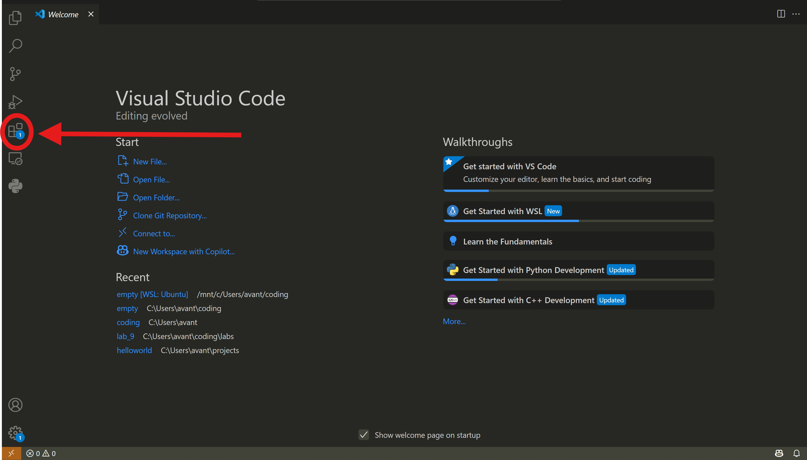
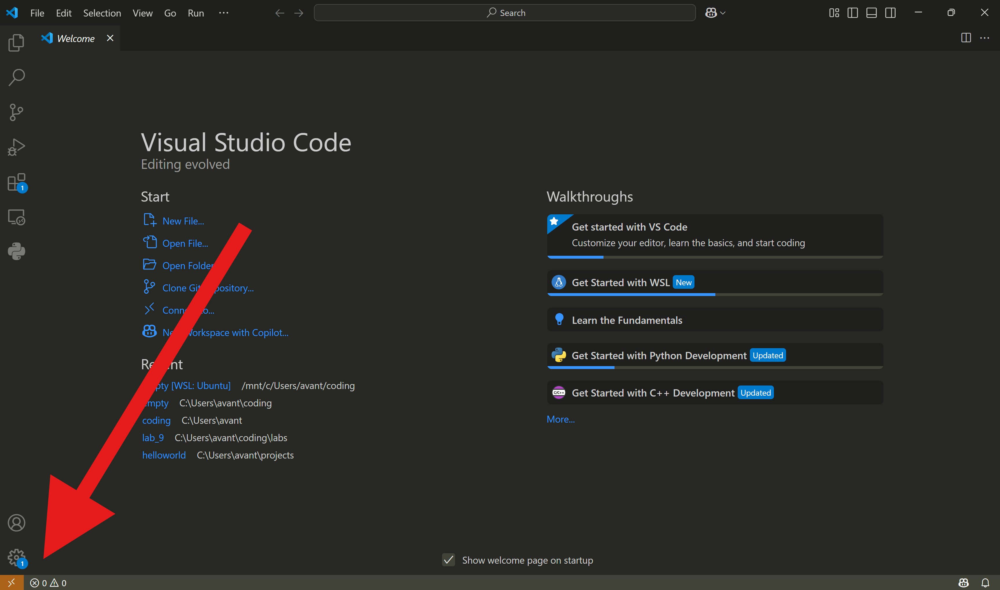
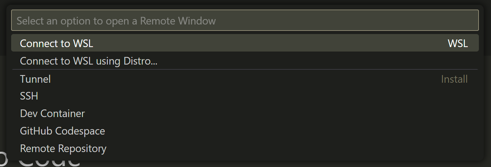
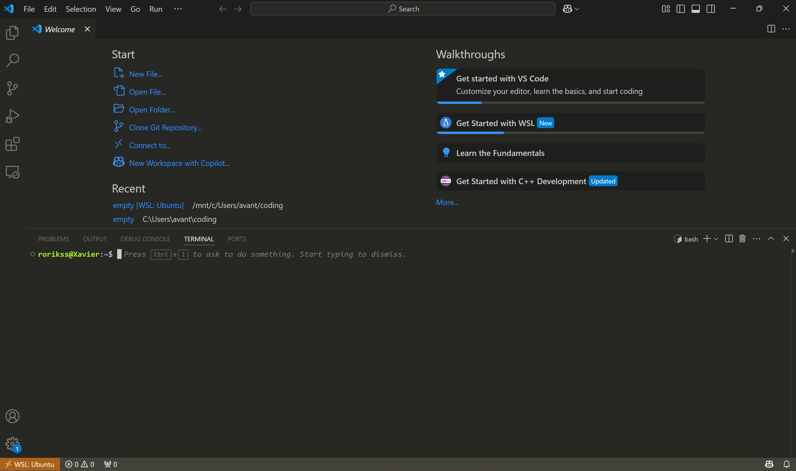
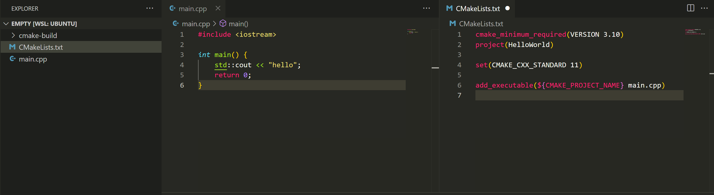
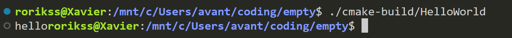
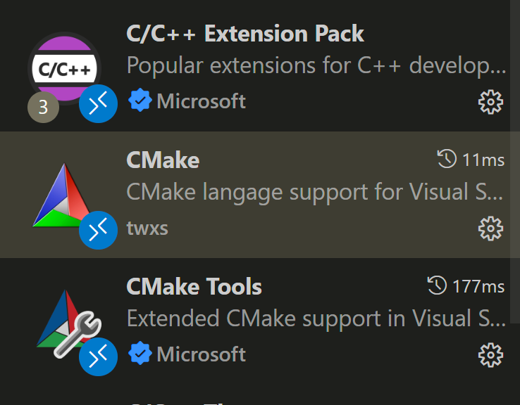

Вообще для разработки, сборки и запуска своих проектов вы можете просто накатить себе любой дистрибутив Linux, или же установить себе виртуальную ОС, используя WSL или же VirtualBox. В данном туториале мы рассмотрим, как установить WSL, как подключить его к Visual Studio Code и как собирать и запускать свои проекты в нём. Поехали!

> Туториал будет максимально простым, без лишних подробностей, рассчитанным на «чайников». Просто инструкция по установке и пробный запуск, ничего лишнего и пугающего в данном туториале не будет. Так что не обижайтесь, если вам было недостаточно интересно.

## 1. Установка WSL

Заходим в Microsoft Store, ищем WSL, устанавливаем. Проще выбирать дистрибутив Ubuntu (дальнейшие шаги в туториале полагаются на это), но в целом всё на ваш вкус.

## 2. Установите VS Code и расширения

Тут всё просто. Устанавливать [вот тут](https://code.visualstudio.com/download).

Чтобы установить расширение, тыкаем на кубики слева на экране, в поиске ищем нужное расширение.

{fig-alt="Окно VS Code с открытой панелью Extensions и строкой поиска"}

Нам нужно вот расширение для WSL, как на скрине.

{fig-alt="Страница расширения Visual Studio Code WSL от Microsoft с кнопками Disable и Uninstall"}

> Примечание: 1) к WSL можно подключаться и по SSH; 2) в целом в описании расширения есть и руководство по дальнейшей установке, если вам будет понятнее.

## 3. Подключаемся к WSL

Связать VS Code и WSL вы можете несколькими способами.

### 3.1 Через терминал WSL

Откройте WSL и напишите:

```sh
code
```

### 3.2 Через сам VS Code

Открываем VS Code и тыкаем сюда:

{fig-alt="Стартовый экран VS Code, стрелка указывает на кнопку удалённого подключения в левом нижнем углу"}

И выбираем «Connect to WSL»:

{fig-alt="Выпадающее меню Select an option to open a Remote Window с выбранным пунктом Connect to WSL"}

Та-да, у нас есть терминал Linux, который примаунтен к файловой системе Windows, что в целом супер удобно для дальнейшей разработки. ✨

> Примечание: если терминал не открылся сам, то сверху выберите «Terminal» → «New Terminal».

Выглядит это примерно вот так (смотри скрин ниже). Заметим, что слева снизу теперь отображается «WSL: Ubuntu» в оранжевом прямоугольничке.

{fig-alt="Окно VS Code с открытым терминалом Ubuntu и индикатором WSL: Ubuntu в строке состояния"}

Теперь тут можно создавать папки и файлы или же открывать готовые.

Если что, ваша ФС скорее всего будет доступна под `mnt` (ака mount). Например, в моём случае путь до моего проекта с путём на Винде `C:\Users\avant\empty` можно найти на Ubuntu тут: `/mnt/c/Users/avant/empty`.

## 4. Установка компилятора и CMake

Чтобы собирать и запускать проектики, нам с вами понадобится компилятор и инструмент для автоматизации сборки — CMake.

Для установки CMake в терминал пишем:

```sh
sudo apt install cmake
```

- где `sudo` значит, что мы выполняем команду от суперпользователя (скорее всего вас попросит ввести пин/пароль);
- `apt` — установщик.

Компилятор вы можете установить любой (gcc, clang etc.). Команда для установки аналогичная:

```sh
sudo apt install clang
```

Теперь можно запустить свой код!

Описывать создание проектика тут не буду, ведь туториал не про это. Если интересно, я тестирую на таком проекте:

{fig-alt="Окно VS Code с деревом проекта из main.cpp и CMakeLists.txt и их содержимым"}

Можете скопипастить и потыкать, если со своим пока сложно.

```{.cpp filename="main.cpp"}

```

```{.cmake filename="CMakeLists.txt"}

```

Для индексации проекта и скачивания зависимостей исполняем команду:

```sh
cmake -S . -B <dir_name>
```

- где `<dir_name>` — имя директории, куда CMake будет писать свои служебные файлы и бинари.

Для сборки проекта:

```sh
cmake --build <dir_name> --target <target>
```

- где `<target>` — ваше имя таргета для сборки (имя проекта), берём из CMake.

Для запуска:

```sh
./<dir_name>/<target>
```

(только с вашим путём до исполняемого файла)

Выведет вот такое (в моём случае `dir_name` = «cmake-build», `target` = «HelloWorld»):

{fig-alt="Терминал WSL: запуск ./cmake-build/HelloWorld выводит hello"}

> Примечание: выполнять команды нужно из корня проекта.

В целом, это и есть необходимый стартовый минимум для того, чтобы вы могли комфортно писать, запускать и тестировать свои лабораторные. В дальнейшем для удобства советую установить расширения VS Code для C++ и CMake.

{fig-alt="Список установленных расширений VS Code: C/C++ Extension Pack, CMake и CMake Tools"}

> Создано [@Rorikss](https://t.me/Rorikss) при поддержке [@AbubiB0ba](https://t.me/AbubiB0ba), с вопросами и предложениями писать туда же. Надеюсь, помогло 🙂

::: {.article-source}
Оригинал статьи: <https://rorikss.yonote.ru/share/afc6d692-f756-423a-a255-ef51dc17d9a8>
:::
