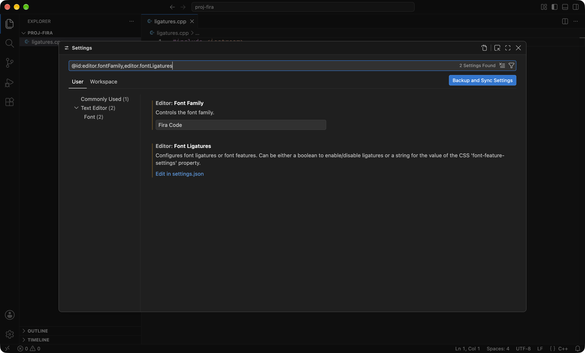

[Fira Code](https://github.com/tonsky/FiraCode) — моноширинный шрифт для кода с лигатурами: последовательности вроде `!=`, `->`, `<=` и `::` рисуются одним слитным знаком. Файл при этом не меняется, в нём по-прежнему лежат два символа. Меняется только то, как редактор их показывает.

## Кому это нужно и что даёт

Тем, кто читает и пишет код по несколько часов подряд, то есть всем на курсе, начиная с первой лабораторной.

Что вы получаете:

- Операторы читаются с одного взгляда. `!=` и `==`, `<=` и `<`, `->` и `-` в обычном шрифте различаются на одну чёрточку, и в длинном условии это легко пропустить. В Fira Code они выглядят как разные знаки: `≠`, `⩽`, `→`.
- Шрифт делался под код: перечёркнутый ноль, чтобы не путать с буквой `O`, различимые `l`, `1` и `I`, все знаки одной ширины, поэтому выравнивание в таблицах и комментариях сохраняется.
- Это бесплатно и занимает пять минут.

Чего это не даёт: скорость компиляции, оценка за лабораторную и вообще всё, кроме отрисовки текста, остаются прежними. Это удобство чтения, не требование курса. Если текущий шрифт вас устраивает, можно ничего не ставить.

Одно предупреждение. Пока вы учите синтаксис, лигатуры могут сбивать: на экране `→`, а в файле `-` и `>`, и набирать надо именно их. Если мешает, оставьте шрифт, но выключите лигатуры, ниже написано как.

Один и тот же файл в шрифте по умолчанию и в Fira Code с лигатурами:

{fig-alt="Фрагмент кода C++ в редакторе VS Code со стандартным шрифтом Menlo"}

{fig-alt="Тот же фрагмент кода C++ в шрифте Fira Code с включёнными лигатурами"}

## Установка шрифта

### macOS

Через [Homebrew](https://brew.sh/), если он у вас уже стоит после [установки окружения](01-setup-macos.md):

```sh
brew install --cask font-fira-code
```

Без Homebrew: скачайте архив `Fira_Code_v6.2.zip` со [страницы релизов](https://github.com/tonsky/FiraCode/releases/latest), распакуйте, откройте папку `ttf`, выделите все файлы, откройте их двойным кликом и нажмите «Установить» в окне Шрифтов (Font Book). Достаточно одного `FiraCode-Regular.ttf`, остальные файлы — начертания другой толщины.

### Linux

Пакет есть в репозиториях основных дистрибутивов:

```sh
sudo apt install fonts-firacode      # Ubuntu, Debian
sudo dnf install fira-code-fonts     # Fedora
sudo pacman -S ttf-fira-code         # Arch
```

Если в вашем дистрибутиве пакета нет, поставьте шрифт вручную в свою домашнюю папку:

```sh
mkdir -p ~/.local/share/fonts
cd ~/.local/share/fonts
curl -LO https://github.com/tonsky/FiraCode/releases/download/6.2/Fira_Code_v6.2.zip
unzip -o Fira_Code_v6.2.zip 'ttf/*'
fc-cache -f
```

Проверка, что система видит шрифт:

```sh
fc-list | grep -i "fira code"
```

Команда должна напечатать несколько строк с путями к файлам `FiraCode-*.ttf`.

## Настройка VS Code

Нужны две настройки: имя шрифта и включение лигатур. Их можно задать через окно настроек или напрямую в `settings.json`, результат один.

### Через окно настроек

Откройте настройки: `Cmd+,` на macOS, `Ctrl+,` на Linux. В строке поиска наберите `editor.fontFamily` и впишите `Fira Code` в поле **Editor: Font Family**. Затем найдите `editor.fontLigatures`: у этой настройки нет галочки, только ссылка **Edit in settings.json**. Нажмите её и поставьте значение `true`.

{fig-alt="Окно настроек VS Code, отфильтрованное по editor.fontFamily и editor.fontLigatures"}

### Через settings.json

Откройте палитру команд (`Cmd+Shift+P` на macOS, `Ctrl+Shift+P` на Linux), выберите **Preferences: Open User Settings (JSON)** и добавьте две строки:

```json
{
    "editor.fontFamily": "'Fira Code', Menlo, Monaco, 'Courier New', monospace",
    "editor.fontLigatures": true
}
```

Через запятую перечислены запасные шрифты: если Fira Code на машине нет, VS Code молча возьмёт следующий из списка, а не покажет пустоту. Это удобно, когда `settings.json` синхронизируется между компьютерами.

Изменения применяются сразу. Если шрифт был установлен, когда VS Code уже был запущен, и в редакторе ничего не поменялось, перезапустите VS Code целиком: на macOS через `Cmd+Q`, а не закрытием окна.

### Если лигатуры мешают

Оставьте шрифт и выключите только их:

```json
"editor.fontLigatures": false
```

Встроенный терминал VS Code берёт шрифт редактора, но лигатуры в нём включаются отдельной настройкой `terminal.integrated.fontLigatures.enabled`. По умолчанию она выключена, и для терминала это нормально.

## Ссылки

- [Fira Code на GitHub](https://github.com/tonsky/FiraCode): описание, примеры лигатур, ответы на вопросы.
- [Страница релизов](https://github.com/tonsky/FiraCode/releases/latest): архив со шрифтом для ручной установки.
- [Инструкция по VS Code](https://github.com/tonsky/FiraCode/wiki/VS-Code-Instructions) и [инструкции для Linux](https://github.com/tonsky/FiraCode/wiki/Linux-instructions) из вики проекта.
- [font-fira-code в Homebrew](https://formulae.brew.sh/cask/font-fira-code).
- [Настройки VS Code](https://code.visualstudio.com/docs/configure/settings): где лежит `settings.json` и как он устроен.
