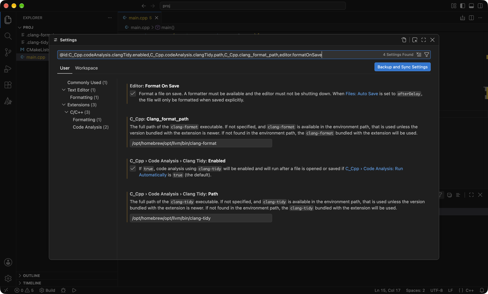
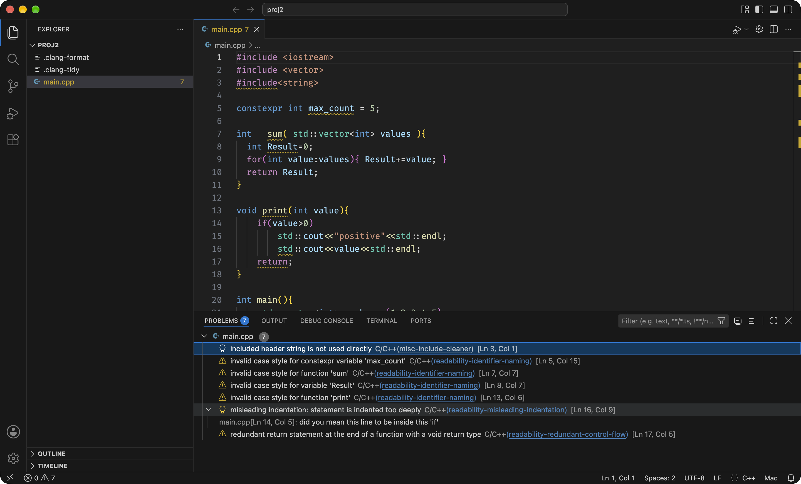
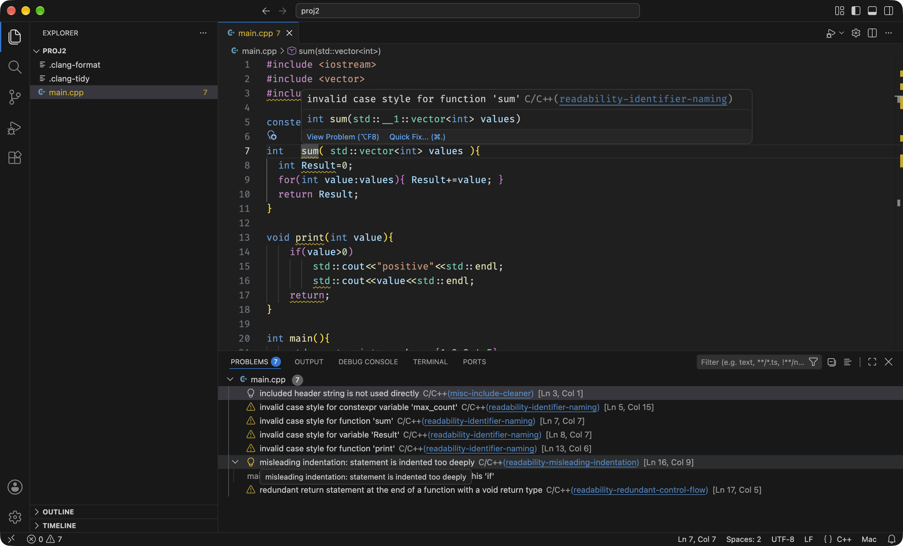
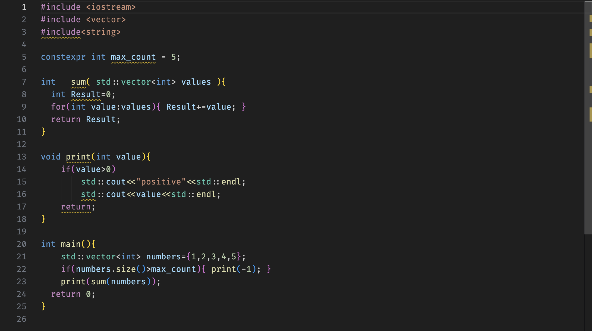
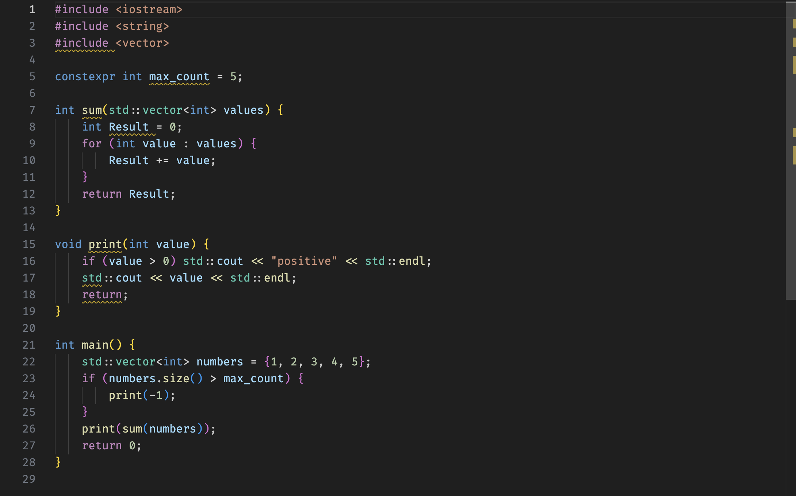

[clang-format](https://clang.llvm.org/docs/ClangFormat.html) переформатирует код по заданным правилам: отступы, пробелы, переносы строк, порядок `#include`. [clang-tidy](https://clang.llvm.org/extra/clang-tidy/) читает код и находит в нём то, что компилятор пропускает: имена не по соглашению, лишний `#include`, отступ, который врёт о структуре кода, и ещё несколько сотен проверок. Оба инструмента — часть LLVM, того же проекта, что и компилятор Clang, которым собираются лабораторные.

## Кому это нужно и что даёт

Всем, кто сдаёт лабораторные на курсе, потому что стиль на курсе проверяется автоматически. CI в репозитории лабораторной запускает clang-tidy с конфигом курса и считает предупреждения. Пороги в конфиге CI: 9, 6, 3 и 0 предупреждений, при 9 и больше проверка не проходит. Тот же clang-tidy с тем же конфигом можно запустить у себя в редакторе и увидеть все эти предупреждения до того, как их увидит CI и проверяющий.

От clang-tidy:

- Замечания CI видны сразу в редакторе, с подчёркиванием и объяснением, а не через несколько минут в логе pull request'а.
- Для многих проверок есть исправление в один клик, включая переименование по соглашению об именах.
- Каждое предупреждение ссылается на страницу с объяснением, почему так лучше.

От clang-format:

- Замечания по пробелам, отступам и скобкам исчезают из ревью полностью. Их делает инструмент, и придраться становится не к чему.
- Вы перестаёте выравнивать код руками. Форматирование срабатывает при сохранении файла.
- В pull request'е diff показывает только изменения по смыслу, а не переставленные пробелы.

Кому это не нужно: если вы пишете в CLion, оба инструмента там уже встроены и подхватывают те же файлы `.clang-format` и `.clang-tidy` из корня проекта. Отдельно ничего ставить не надо, полезны только разделы про конфиги.

## Что должно быть установлено

VS Code и расширение **C/C++ Extension Pack** из статьи [про установку окружения](01-setup.md). Расширение уже содержит свои копии clang-format и clang-tidy, поэтому после включения они заработают и без остального.

Тем не менее системные версии стоит поставить. Во-первых, чтобы запускать их из терминала: прогнать весь проект перед пушем так же, как это делает CI. Во-вторых, чтобы в редакторе и в терминале была одна и та же версия.

CI курса использует clang-tidy версии 21. Homebrew и репозитории дистрибутивов дают другую версию, обычно новее. Для проверок из конфига курса это не важно, они есть во всех версиях последних лет. Если хотите ровно ту же, на Ubuntu и Debian её можно поставить со скриптом с [apt.llvm.org](https://apt.llvm.org/), тогда команды будут называться `clang-tidy-21` и `clang-format-21`.

### macOS

Тот же пакет, что ставился при [установке окружения](01-setup-macos.md):

```sh
brew install llvm
```

Homebrew не добавляет его в `PATH`, бинарники лежат в `$(brew --prefix llvm)/bin`: это `/opt/homebrew/opt/llvm/bin` на Apple Silicon и `/usr/local/opt/llvm/bin` на Intel. Если вы уже добавили эту папку в `PATH` по инструкции из той статьи, команды доступны по короткому имени. Проверка:

```sh
$(brew --prefix llvm)/bin/clang-format --version
$(brew --prefix llvm)/bin/clang-tidy --version
```

В Homebrew есть и отдельная формула `clang-format`, но clang-tidy в ней нет, так что проще поставить `llvm` целиком.

### Linux

```sh
sudo apt install clang-format clang-tidy   # Ubuntu, Debian
sudo dnf install clang-tools-extra         # Fedora
sudo pacman -S clang                       # Arch
```

Пакеты попадают в `/usr/bin`, то есть сразу в `PATH`. Проверка:

```sh
clang-format --version
clang-tidy --version
```

## Конфиги курса

Оба инструмента ищут настройки в файлах `.clang-tidy` и `.clang-format`: начиная с папки, где лежит исходник, и поднимаясь вверх по дереву до первого найденного. Ниже конфиги, с которыми работает курс. Положите их в корень репозитория лабораторной, рядом с `CMakeLists.txt`, и закоммитьте.

### .clang-tidy

Конфиг взят из CI лабораторных: в репозитории это файл `.github/workflows/cicd.yml`, поле `tidy-config`. CI передаёт его clang-tidy напрямую, файл `.clang-tidy` из репозитория он не читает. Поэтому локальный файл нужен только вам, чтобы редактор и терминал проверяли ровно то же, что и CI. Скопируйте содержимое `tidy-config` без изменений, а если конфиг в CI обновят, обновите и файл.

```{.yaml filename=".clang-tidy"}

```

Что здесь написано:

- `-*` в начале `Checks` выключает все проверки, дальше перечислены те, что включаются обратно. Никаких групп через `*`, только конкретный список.
- `readability-identifier-naming` с блоком `CheckOptions` — соглашение об именах: пространства имён и переменные в `lower_case`, классы, функции и параметры шаблонов в `CamelCase`, поля классов с суффиксом `_`, константы и значения `enum` в `CamelCase` с префиксом `k`: `kMaxCount`. Именно так написан шаблонный код лабораторных.
- `misc-include-cleaner` требует, чтобы каждый `#include` использовался, а всё, что используется, было подключено напрямую, а не через другой заголовок.
- `readability-misleading-indentation` ловит отступ, который выглядит как тело `if`, но им не является. `readability-redundant-control-flow` — лишний `return;` в конце `void`-функции. Остальные проверки из списка срабатывают редко, их описания есть в [списке проверок](https://clang.llvm.org/extra/clang-tidy/checks/list.html).

### .clang-format

CI форматирование не проверяет, но шаблонный код лабораторных отформатирован в стиле Google с отступом в четыре пробела и строкой до 80 символов, и проверяющий увидит, если ваш код выглядит иначе. Конфиг из двух строк:

```{.yaml filename=".clang-format"}

```

`BasedOnStyle: Google` берёт готовый стиль целиком, `IndentWidth: 4` меняет в нём два пробела на четыре. Всё, что не переопределено, остаётся гугловским: скобка на той же строке, `char* str`, отсортированные `#include`, `case` с отступом внутри `switch`. Полный список опций в [документации по стилю](https://clang.llvm.org/docs/ClangFormatStyleOptions.html), а что именно скрыто за `Google`, печатает `clang-format -style=google -dump-config`.

## Проектно или глобально

Есть два уровня, и у конфигов инструментов, и у настроек VS Code.

**Конфиги в корне проекта.** `.clang-tidy` и `.clang-format` лежат рядом с `CMakeLists.txt` и коммитятся. Правила едут вместе с репозиторием, у всех, кто его откроет, они одинаковые. Так и нужно делать для лабораторных.

**Конфиги в домашней папке.** Те же файлы можно положить в `~/.clang-tidy` и `~/.clang-format`. Никакой магии в этом пути нет: оба инструмента идут от файла вверх по папкам, а домашняя папка — родитель всех ваших проектов. Поэтому любой файл под `~`, у которого нет своего конфига выше по дереву, получит домашний. Если у проекта есть собственный `.clang-format`, он найдётся раньше и победит. Это удобно для черновиков и экспериментов вне репозиториев: в `~/scratch/test.cpp` форматирование будет тем же, что в лабораторной.

**Настройки VS Code** тоже двух уровней. Пользовательские (**User**) лежат в `settings.json` профиля и действуют во всех проектах. Настройки рабочей области (**Workspace**) лежат в `.vscode/settings.json` в корне проекта и действуют только в нём, их можно коммитить. В окне настроек это вкладки User и Workspace, а команды **Preferences: Open User Settings (JSON)** и **Preferences: Open Workspace Settings (JSON)** открывают соответствующий файл. В шаблоне лабораторных `.vscode/settings.json` уже есть, там настройки CMake Tools, это и есть уровень проекта.

Куда что класть:

- Пути к бинарникам (`C_Cpp.clang_format_path`, `C_Cpp.codeAnalysis.clangTidy.path`) зависят от машины, им место в пользовательских настройках. В `.vscode/settings.json` они сломают проект у всех, у кого llvm лежит в другом месте.
- Включение clang-tidy и `formatOnSave` можно держать где угодно. Пользовательские настройки проще: включил один раз и забыл.
- Если не хочется класть конфиги в домашнюю папку, у расширения есть запасные значения на случай, когда файл не найден: `C_Cpp.clang_format_fallbackStyle` и `C_Cpp.codeAnalysis.clangTidy.fallbackConfig`. Они действуют только в VS Code, терминал о них не знает:

```json
{
    "C_Cpp.clang_format_fallbackStyle": "{ BasedOnStyle: Google, IndentWidth: 4 }"
}
```

## Подключение к VS Code

Откройте палитру команд (`Cmd+Shift+P` на macOS, `Ctrl+Shift+P` на Linux), выберите **Preferences: Open User Settings (JSON)** и добавьте:

```json
{
    "C_Cpp.clang_format_path": "/opt/homebrew/opt/llvm/bin/clang-format",
    "C_Cpp.codeAnalysis.clangTidy.enabled": true,
    "C_Cpp.codeAnalysis.clangTidy.path": "/opt/homebrew/opt/llvm/bin/clang-tidy",
    "[cpp]": {
        "editor.defaultFormatter": "ms-vscode.cpptools",
        "editor.formatOnSave": true
    }
}
```

Пути указаны для macOS на Apple Silicon. На Intel замените `/opt/homebrew/opt/llvm/bin` на `/usr/local/opt/llvm/bin`, на Linux — на `/usr/bin`. Строки с путями можно и убрать: тогда расширение возьмёт бинарник из `PATH`, а если не найдёт или его собственная копия новее, то свою.

Что делает каждая строка:

- `C_Cpp.clang_format_path` и `C_Cpp.codeAnalysis.clangTidy.path` — какими бинарниками пользоваться.
- `C_Cpp.codeAnalysis.clangTidy.enabled` включает clang-tidy. По умолчанию он выключен.
- `editor.defaultFormatter` внутри `[cpp]` говорит, что файлы C++ форматирует расширение C/C++. Без этого VS Code при первом форматировании спросит, какой форматтер выбрать, если их несколько.
- `editor.formatOnSave` запускает форматирование при каждом сохранении.

Те же настройки в окне настроек:

{fig-alt="Окно настроек VS Code, отфильтрованное по настройкам clang-format и clang-tidy расширения C/C++"}

## Как этим пользоваться

Дальше примеры на специально небрежно написанном файле. Он компилируется, но нарушает соглашение об именах, подключает лишний заголовок, содержит обманчивый отступ и лишний `return`, то есть всё, на что настроен конфиг курса:

```{.cpp filename="main.cpp"}

```

### Анализ

clang-tidy запускается сам, когда вы открываете или сохраняете файл. Результат появляется двумя способами: жёлтое подчёркивание в коде и список в панели **Problems** (`Cmd+Shift+M` на macOS, `Ctrl+Shift+M` на Linux). В скобках после текста — имя проверки, оно же ссылка на её документацию. На этом файле их семь, столько же насчитает CI:

{fig-alt="Окно VS Code: код с подчёркиваниями и панель Problems со списком предупреждений clang-tidy"}

Наведите курсор на подчёркнутое место, и появится текст предупреждения с кнопкой **Quick Fix** (`Cmd+.` на macOS, `Ctrl+.` на Linux). Для проверок, у которых есть автоматическое исправление, оно применяется одним нажатием. Переименование по соглашению об именах — как раз такая проверка: `sum` станет `Sum` и в объявлении, и во всех вызовах.

{fig-alt="Редактор VS Code с открытой подсказкой clang-tidy над именем функции sum"}

Запустить анализ вручную можно из палитры: **C/C++: Run Code Analysis on Active File**, на всех открытых файлах или на всём проекте.

### Форматирование

`Shift+Option+F` на macOS, `Ctrl+Shift+I` на Linux, либо команда **Format Document** из палитры. При включённом `editor.formatOnSave` достаточно просто сохранить файл.

До:

{fig-alt="Редактор VS Code с неотформатированным кодом C++"}

После:

{fig-alt="Редактор VS Code с тем же кодом после clang-format"}

Обратите внимание на функцию `print`. Форматтер не чинит логику, он только делает её видимой: `std::cout << "positive"` уехал на строку с `if`, а второй `std::cout` встал на уровень функции, потому что в `if` без скобок он никогда и не входил. Предупреждение про обманчивый отступ после этого пропадёт, а поведение программы не изменится, и это повод поставить скобки.

### Из терминала

Отформатировать файл на месте и только проверить, не меняя:

```sh
clang-format -i main.cpp
clang-format --dry-run --Werror main.cpp
```

Вторая команда молчит и возвращает `0`, если файл уже отформатирован, иначе печатает первое расхождение и возвращает `1`. Её удобно запускать перед `git commit`.

clang-tidy нужно знать, с какими флагами компилируется файл. Для одного файла флаги пишутся после `--`:

```sh
clang-tidy main.cpp -- -std=c++20
```

Начало вывода для файла из примера, дальше ещё четыре предупреждения в том же виде:

```
main.cpp:3:1: warning: included header string is not used directly [misc-include-cleaner]
    3 | #include<string>
      | ^~~~~~~~~~~~~~~~
main.cpp:5:15: warning: invalid case style for constexpr variable 'max_count' [readability-identifier-naming]
    5 | constexpr int max_count = 5;
      |               ^~~~~~~~~
      |               kMaxCount
main.cpp:7:7: warning: invalid case style for function 'sum' [readability-identifier-naming]
    7 | int   sum( std::vector<int> values ){
      |       ^~~
      |       Sum
```

Для проекта на CMake флаги удобнее не перечислять руками, а взять из сборки. `CMakeLists.txt` лабораторных уже включает `CMAKE_EXPORT_COMPILE_COMMANDS`, так что после обычного `cmake -B build` в папке сборки лежит `compile_commands.json`. Дальше либо один файл через `-p`, либо весь проект через `run-clang-tidy`, который ставится вместе с clang-tidy. Второй вариант — ровно то, что делает CI:

```sh
cmake -B build
clang-tidy -p build hello_world/bin/main.cpp
run-clang-tidy -p build -header-filter=.
```

На macOS, если вы не добавляли Homebrew LLVM в `PATH`, во всех командах выше нужен полный путь: `$(brew --prefix llvm)/bin/clang-tidy`.

## Если что-то не работает

- **Форматирование ничего не меняет.** Проверьте, что в корне проекта лежит `.clang-format` и что VS Code открыл именно эту папку, а не файл отдельно. Если при форматировании появился вопрос о выборе форматтера, выберите C/C++ и добавьте `editor.defaultFormatter` из раздела выше.
- **clang-tidy жалуется, что не находит заголовки.** Он не знает, где искать `#include` вашего проекта. В VS Code проект на CMake достаточно один раз сконфигурировать через расширение CMake Tools из того же пакета: пути расширение C/C++ возьмёт оттуда. В терминале передайте папку сборки через `-p`.
- **В редакторе предупреждений больше, чем в CI.** Проверьте, что `.clang-tidy` совпадает с `tidy-config` из `cicd.yml`, и что выше по дереву, например в домашней папке, не лежит другой `.clang-tidy` с более широким списком проверок.

## Ссылки

- [clang-format](https://clang.llvm.org/docs/ClangFormat.html) и [все опции стиля](https://clang.llvm.org/docs/ClangFormatStyleOptions.html).
- [clang-tidy](https://clang.llvm.org/extra/clang-tidy/) и [список проверок](https://clang.llvm.org/extra/clang-tidy/checks/list.html).
- [Форматирование в расширении C/C++ для VS Code](https://code.visualstudio.com/docs/cpp/cpp-ide) и [C/C++ Extension Pack](https://marketplace.visualstudio.com/items?itemName=ms-vscode.cpptools-extension-pack).
- [Настройки VS Code](https://code.visualstudio.com/docs/configure/settings): пользовательские и рабочей области.
- [llvm в Homebrew](https://formulae.brew.sh/formula/llvm) и [apt.llvm.org](https://apt.llvm.org/) для конкретной версии на Ubuntu и Debian.
