::: {.content-visible unless-format="revealjs"}

[Открыть слайды](../slides/lectures/03-pointers-arrays.html){.btn .btn-outline-primary target="_blank"}

:::

## 1. Указатели и адреса памяти

:::: {.columns}
::: {.column width="65%"}

- Указатель — переменная, диапазон значений которой состоит из адресов ячеек памяти и специального значения – нулевого адреса
- Указатель «указывает» хранящимся внутри него адресом на ячейку памяти, к которой с его помощью можно обратиться
- Значение нулевого адреса (нулевое значение указателя) используется только для обозначения того, что указатель в данный момент не указывает ни на какую ячейку памяти
- Тип задаёт, на то что он указывает: `int*` — на `int`.

:::
::: {.column width="35%"}

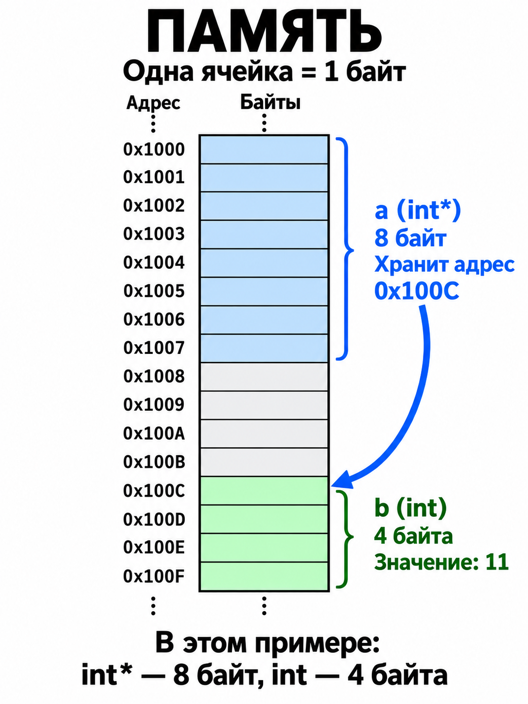{height=560 style="max-height:560px" fig-align="center" fig-alt="Каждая ячейка памяти — один байт со своим адресом. В этом примере указатель a занимает восемь ячеек с адресами 0x1000–0x1007 и хранит адрес 0x100C. По этому адресу начинается объект b со значением 11, занимающий четыре ячейки 0x100C–0x100F. Значения подписаны у целых блоков, а не внутри отдельных байтов."}

:::
::::

## Операторы `&` и `*`

- `&` — **оператор взятия адреса**: `&object` возвращает адрес объекта.
- `*` — **оператор разыменования**: `*pointer` даёт доступ к объекту по адресу.

:::: {.columns}
::: {.column width="58%"}

```{.cpp filename="pointer-operators.cpp" code-line-numbers="6-8"}

```

[{.godbolt-link-image width="32"}][godbolt-03-pointer-operators]{aria-label="Open in Compiler Explorer"}

:::
::: {.column width="42%"}

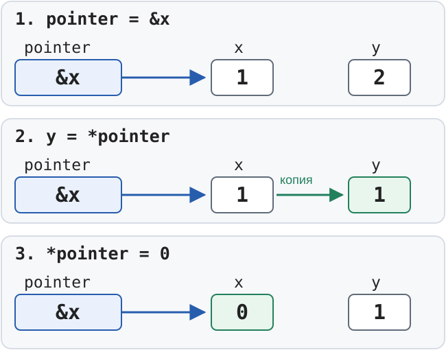{height=350 fig-align="center" fig-alt="Три шага: pointer хранит адрес x; y получает копию значения x; запись через pointer меняет x, но не y"}

:::
::::

## Адреса объектов разных типов

```{.cpp filename="object-addresses.cpp"}

```

[{.godbolt-link-image width="32"}][godbolt-03-object-addresses]{aria-label="Open in Compiler Explorer"}

- У объекта можно получить адрес оператором &
- Числовые значения адресов не являются частью логики программы: они могут меняться между запусками, сборками, платформами и даже при изменении оптимизаций

## Тип, размер и безопасность указателя

- Тип указателя определяет доступ к объекту и шаг адресной арифметики.
- Размер указателя определяется реализацией и ABI. На большинстве распространённых 64-битных платформ указатели на объекты занимают 8 байт, но стандарт C++ этого не гарантирует; размер указателей на функции также не обязан совпадать с размером указателей на объекты.

```{.cpp filename="pointer-sizes.cpp"}

```

[{.godbolt-link-image width="32"}][godbolt-03-pointer-sizes]{aria-label="Open in Compiler Explorer"}

Разыменование нулевого, неинициализированного или недействительного указателя — **неопределённое поведение**.

## Адрес самого указателя

Указатель тоже является объектом и имеет собственный адрес. Поэтому выражения `pointer` и `&pointer` обозначают разные значения:

```{.cpp filename="pointer-addresses.cpp"}

```

[{.godbolt-link-image width="32"}][godbolt-03-pointer-addresses]{aria-label="Open in Compiler Explorer"}

Первые два адреса будут одинаковыми: `pointer` указывает на `value`. Третий адрес относится к ячейке, в которой хранится сам указатель.

## Указатель на константу и константный указатель

```{.cpp filename="const-pointers.cpp"}

```

- `const int*` — **указатель на константу**: адрес можно менять, объект через указатель — нельзя.
- `int* const` — **константный указатель**: адрес задан при инициализации и не меняется, объект через указатель менять можно.
- `const int* const` — **константный указатель на константу**: нельзя менять ни адрес, ни объект через указатель.

Сам `x` в примере остаётся изменяемым: `const` у типа объекта запрещает запись только **через этот указатель**.

## Указатели на указатели


```{.cpp filename="multi-level-pointers.cpp"}

```

[{.godbolt-link-image width="32"}][godbolt-03-multi-level-pointers]{aria-label="Open in Compiler Explorer"}

## Нулевой указатель: `nullptr`, `0` и `NULL`

- `nullptr` — **литерал нулевого указателя**.
- Его тип — `std::nullptr_t`, а не целочисленный тип.
- Обозначает отсутствие объекта.
- При выборе перегрузки не смешивается с целыми числами.
- В новом коде используем **`nullptr`** вместо `0` и `NULL`.

## `NULL` vs `nullptr`: перегрузка функций


```{.cpp filename="nullptr-overload.cpp" code-line-numbers="13-15"}

```

[{.godbolt-link-image width="32"}][godbolt-03-nullptr-overload]{aria-label="Open in Compiler Explorer"}

## Висячий указатель (dangling pointer)


```{.cpp filename="dangling-pointer.cpp" code-line-numbers="3-5,9-10"}

```

[{.godbolt-link-image width="32"}][godbolt-03-dangling-pointer]{aria-label="Open in Compiler Explorer"}

- `local` существует только до выхода из `Make`.
- После возврата указатель становится **висячим**: время жизни `local` закончилось.
- Разыменование такого указателя — **неопределённое поведение**.

::: {.notes}

В Compiler Explorer включён `-Werror=return-stack-address`: Clang останавливает сборку на возврате адреса локальной переменной. Это пример для чтения диагностики и исправления ошибки, а не для запуска.

Время хранения локальной переменной: [стандарт C++, automatic storage duration](https://eel.is/c++draft/basic.stc.auto).

:::

## Адрес не продлевает жизнь объекта

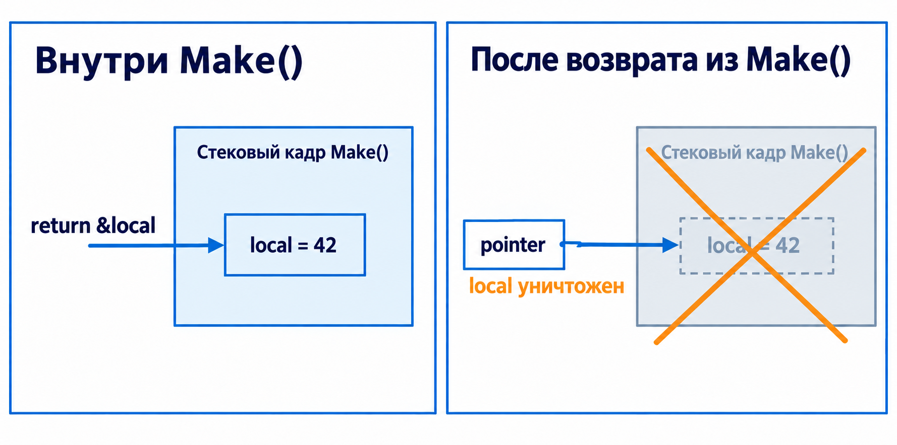{height=390 fig-align="center" fig-alt="Внутри Make локальная переменная local существует и хранит 42. После возврата из Make время жизни local закончилось, а pointer хранит недействительный адрес этого объекта."}

- Хранить адрес объекта и владеть его временем жизни — разные вещи.
- Проверка на `nullptr` **не доказывает**, что объект ещё существует.
- Для этого примера правильное решение — вернуть само число по значению.

## Указатель на `int`

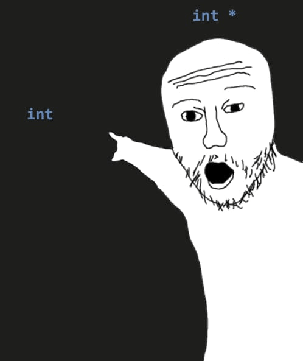{height=500 fig-align="center" fig-alt="int* указывает на int"}

## Указатель на указатель

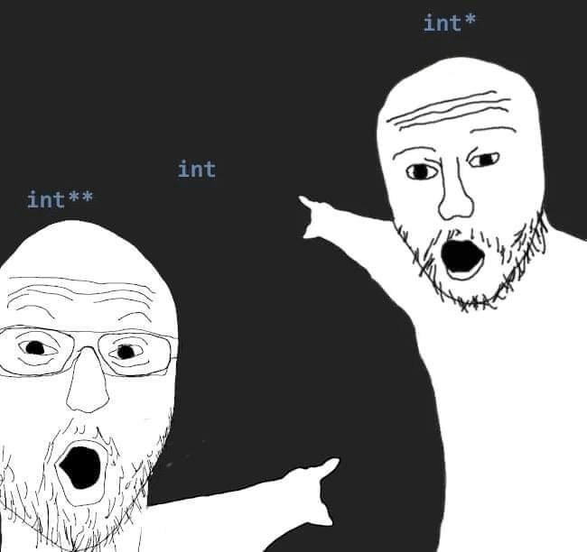{height=500 fig-align="center" fig-alt="int** указывает на int*, который указывает на int"}

## Разыменование указателя

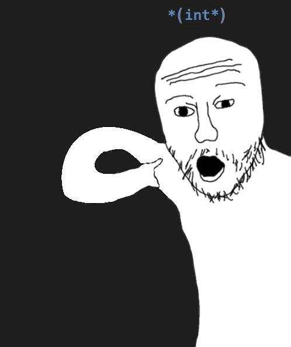{height=500 fig-align="center" fig-alt="Разыменование указателя: *(int*)"}

## Семантика указателей

- **Копирование указателя копирует адрес**, а не объект: после `q = p` оба указывают на один объект.
- **Изменение через указатель меняет общий объект**: результат `*q = 42` виден и через `*p`.
- **Смена адреса меняет только сам указатель**: после `q = &other` указатель `p` по-прежнему указывает на прежний объект.
- **Указатель может не указывать на объект**: для этого используем `nullptr`; разыменовывать его нельзя.
- **Обычный указатель сам не управляет временем жизни объекта**: не продлевает его жизнь и не уничтожает объект при выходе из области видимости. За время жизни отвечает код, который управляет объектом.

::: {.notes}

В примерах на слайде предполагаются обычные изменяемые указатели `int*`, указывающие на живой объект `int`, и другой живой объект `int other`. Квалификаторы `const` могут запрещать смену адреса или запись через указатель, как на предыдущем слайде про `const`.

:::

## 2. Передача объектов через указатели

При передаче по значению функция меняет свои копии. Исходные переменные сохраняют значения:

```{.cpp filename="swap-by-value.cpp"}

```

[{.godbolt-link-image width="32"}][godbolt-03-swap-by-value]{aria-label="Open in Compiler Explorer"}

## Обмен значений через указатели

Чтобы изменить объекты вызывающего кода, передаём их адреса:

:::: {.columns}
::: {.column width="55%"}

```{.cpp filename="swap-through-pointers.cpp"}

```

[{.godbolt-link-image width="32"}][godbolt-03-swap-pointers]{aria-label="Open in Compiler Explorer"}

:::
::: {.column width="45%"}

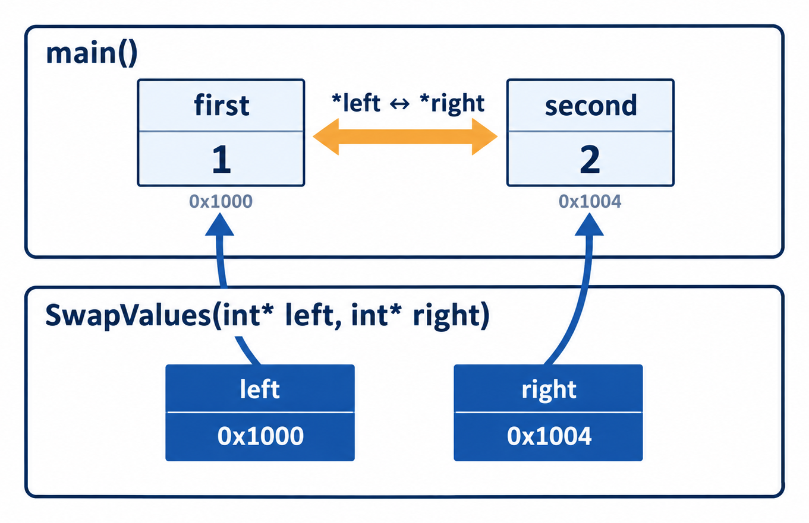{height=370 style="max-height:370px" fig-align="center" fig-alt="В main переменная first хранит 1, а second — 2. Параметры left и right функции swap_values хранят адреса этих переменных; обмен через *left и *right меняет исходные значения. Адреса на схеме условные."}

:::
::::


**NB** для этой же задачи правильно скорее использовать ссылку. Про симантику ссылок и указателй поговорим в следующих лекциях


## 3. Массивы и адресная арифметика

- Массив — последовательность элементов **одного типа**.
- Элементы расположены в памяти **подряд**.
- Размер встроенного массива задаётся при создании и **не меняется**.
- Индексация начинается **с нуля**: для массива из `N` элементов допустимы индексы от `0` до `N - 1`.

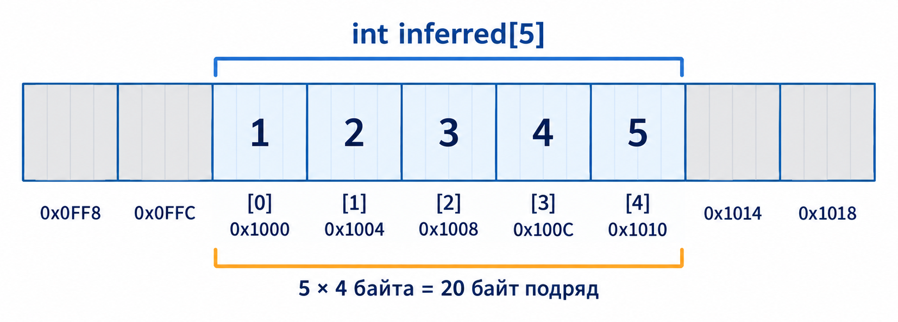{height=340 fig-align="center" fig-alt="Массив inferred из пяти int со значениями от 1 до 5 занимает соседние области памяти. Индексы идут от 0 до 4. При размере int в 4 байта адреса элементов отличаются на 4, а весь массив занимает 20 байт."}

На схеме `sizeof(int) == 4`: пять элементов занимают **20 байт**.

## Объявление массивов

```{.cpp filename="array-declarations.cpp"}

```

[{.godbolt-link-image width="32"}][godbolt-03-array-declarations]{aria-label="Open in Compiler Explorer"}

## Преобразование массива в указатель

Во многих выражениях массив `T[N]` неявно преобразуется в указатель `T*` на свой первый элемент — `&values[0]`. Это часто называют `array-to-pointer decay`

- при инициализации или присваивании указателя;
- при передаче в функцию с параметром-указателем;
- в адресной арифметике, например `values + 1`.

```{.cpp filename="array-to-pointer.cpp" code-line-numbers="9-11"}

```

[{.godbolt-link-image width="32"}][godbolt-03-array-to-pointer]{aria-label="Open in Compiler Explorer"}

Преобразование не копирует элементы и не передаёт размер массива. Для константного массива результат имеет тип `const T*`.

::: {.notes}

Правило преобразования: [стандарт C++, array-to-pointer conversion](https://eel.is/c++draft/conv.array).

:::

## Когда массив остаётся массивом

Преобразования нет в `sizeof(values)`, `&values`, `decltype(values)` и при связывании со ссылкой на массив:

```{.cpp filename="array-without-decay.cpp" code-line-numbers="5-9"}

```

[{.godbolt-link-image width="32"}][godbolt-03-array-without-decay]{aria-label="Open in Compiler Explorer"}

Массив хранит все элементы, указатель — только адрес. `&values` имеет тип указателя на **весь массив**, а не на первый `int`.

::: {.notes}

`sizeof` возвращает размер всего массива: [стандарт C++, sizeof](https://eel.is/c++draft/expr.sizeof). `decltype(values)` сохраняет объявленный тип: [стандарт C++, decltype](https://eel.is/c++draft/dcl.type.decltype).

:::

## `sizeof` массива и параметра функции

:::: {.columns}
::: {.column width="60%"}

```{.cpp filename="array-parameter-size.cpp" code-line-numbers="3-4,8-10"}

```

[{.godbolt-link-image width="32"}][godbolt-03-array-parameter-size]{aria-label="Open in Compiler Explorer"}

:::
::: {.column width="40%"}

- `PrintSize(values)` передаёт адрес первого элемента. Параметр `array` — указатель.
- В параметрах функции `int array[]` означает `int* array`.
- Число элементов из указателя не получить: его передают отдельно.

:::
::::

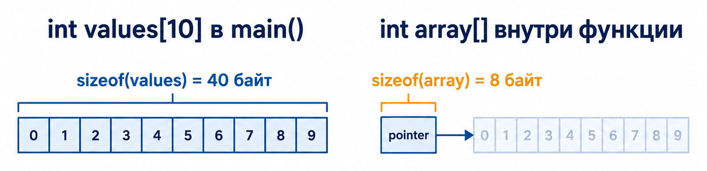{height=220 fig-align="center" fig-alt="Слева массив values из десяти int в main занимает 40 байт. Справа параметр array функции PrintSize — указатель на первый элемент массива и занимает 8 байт. Числа 0–9 обозначают индексы. На схеме предполагается sizeof(int) == 4 и sizeof(int*) == 8."}

На схеме `sizeof(int) == 4`, `sizeof(int*) == 8`; числа 0–9 — **индексы**.

::: {.notes}

Программа сначала выводит размер всего массива `values` в `main`, затем вызывает `PrintSize`, которая выводит размер своего параметра-указателя `array`. При размерах типов, указанных на схеме, вывод — `40` и `8`.

Параметр можно записать и как `int array[]`: его тип всё равно будет `int*`. В примере использована явная запись указателя, чтобы `sizeof(array)` не вызывал предупреждение Clang о размере параметра-массива.

:::

## Арифметика указателей

Для указателя на элемент массива прибавление единицы даёт указатель на следующий элемент этого же массива. Смещение измеряется в элементах типа указателя, а не в байтах:

```{.cpp filename="pointer-arithmetic.cpp"}

```

[{.godbolt-link-image width="32"}][godbolt-03-pointer-arithmetic]{aria-label="Open in Compiler Explorer"}

## Индексы и смещения

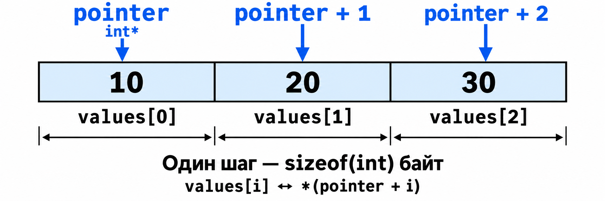{height=310 fig-align="center" fig-alt="pointer, pointer + 1 и pointer + 2 указывают на элементы values[0], values[1] и values[2]; шаг равен sizeof(int) байт."}

Для допустимого индекса `i` выражения `values[i]`, `*(values + i)`, `pointer[i]` и `*(pointer + i)` эквивалентны.

## Границы арифметики указателей

```{.cpp filename="pointer-bounds.cpp" code-line-numbers="5-9"}

```

[{.godbolt-link-image width="32"}][godbolt-03-pointer-bounds]{aria-label="Open in Compiler Explorer"}

- Элементы образуют диапазон **`[begin, end)`**: позиция `end` в него не входит.
- `end` можно получить и сравнивать с указателем при обходе массива.
- `*end` и `end + 1` в этом примере — **неопределённое поведение**.

::: {.notes}

Арифметика определена внутри одного массива и для позиции сразу после его последнего элемента. Переход дальше этой позиции недопустим даже без разыменования: [стандарт C++, additive operators](https://eel.is/c++draft/expr.add).

:::

## 4. C-строки

- C-строка — нуль-терминированная последовательность символов char.
- Завершается нулевым символом **`'\0'`**.
- `'\0'` обозначает конец строки и занимает отдельный элемент массива.
- В длину строки завершающий символ **не входит**.

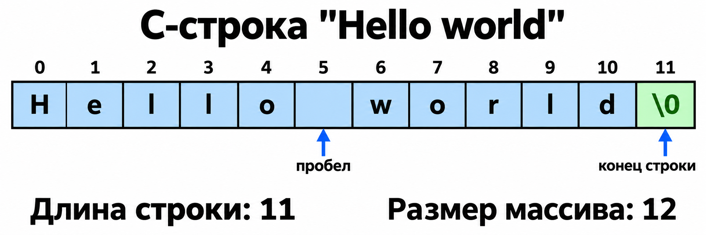{height=300 fig-align="center" fig-alt="Hello world занимает 11 символов, включая пробел. Завершающий нулевой символ находится в двенадцатой ячейке, с индексом 11."}

## Строковый литерал и изменяемый массив

Строковый литерал в C++ — массив константных символов. Указатель на него должен быть `const char*`:

```{.cpp filename="c-string-storage.cpp"}

```

[{.godbolt-link-image width="32"}][godbolt-03-c-string-storage]{aria-label="Open in Compiler Explorer"}

`first` указывает на неизменяемый литерал. `second` — отдельный изменяемый массив. `third` позволяет читать этот массив через указатель.

## Длина строки

Перемещаем указатель до нулевого символа:

```{.cpp filename="string-length.cpp"}

```

[{.godbolt-link-image width="32"}][godbolt-03-string-length]{aria-label="Open in Compiler Explorer"}

Предусловие: передан ненулевой указатель на корректную строку с завершающим `'\0'`.

## Сравнение строк

Строки сравниваются **посимвольно**. Оператор `==` для двух указателей сравнивает адреса. Вариант с индексами:

```{.cpp filename="string-compare-indices.cpp"}

```

[{.godbolt-link-image width="32"}][godbolt-03-string-compare-indices]{aria-label="Open in Compiler Explorer"}

## Сравнение строк через указатели

Ту же операцию можно выразить через арифметику указателей:

```{.cpp filename="string-compare-pointers.cpp"}

```

[{.godbolt-link-image width="32"}][godbolt-03-string-compare-pointers]{aria-label="Open in Compiler Explorer"}

Результат: **0** — строки равны; **< 0** — первая идёт раньше; **> 0** — позже. Символы сравниваем как `unsigned char`.

## Почему C-строки опасны

```{.cpp filename="c-string-boundaries.cpp" code-line-numbers="5-6,8-11"}

```

[{.godbolt-link-image width="32"}][godbolt-03-c-string-boundaries]{aria-label="Open in Compiler Explorer"}

- Без `'\0'` массив `raw` **не является C-строкой**.
- `strlen` ищет терминатор; чтение за границей массива — **неопределённое поведение**.
- При записи нужно учитывать вместимость буфера: для `C++` нужны **4 ячейки `char`**, включая `'\0'`.

::: {.notes}

Опасный вызов для `raw` закомментирован. Рабочий пример печатает размеры двух массивов и длину корректной строки. Функция `strlen` не получает вместимость буфера и не может проверить её сама.

:::
## Аргументы командной строки

В традиционной форме `main` получает количество аргументов и массив указателей на строки:

```{.cpp filename="command-line-arguments.cpp"}

```

[{.godbolt-link-image width="32"}][godbolt-03-command-line]{aria-label="Open in Compiler Explorer"}

`argc` содержит количество аргументов, а `argv[index]` указывает на C-строку с соответствующим аргументом.

## 5. Универсальный указатель `void*`

`void*` может хранить адрес объекта любого типа. Чтобы обратиться к объекту, нужно восстановить тип указателя:

```{.cpp filename="void-pointer.cpp"}

```

[{.godbolt-link-image width="32"}][godbolt-03-void-pointer]{aria-label="Open in Compiler Explorer"}

Разыменовать `void*` напрямую нельзя. Чтение объекта через указатель несовместимого типа может привести к неопределённому поведению.

## `void*`: адрес без типа

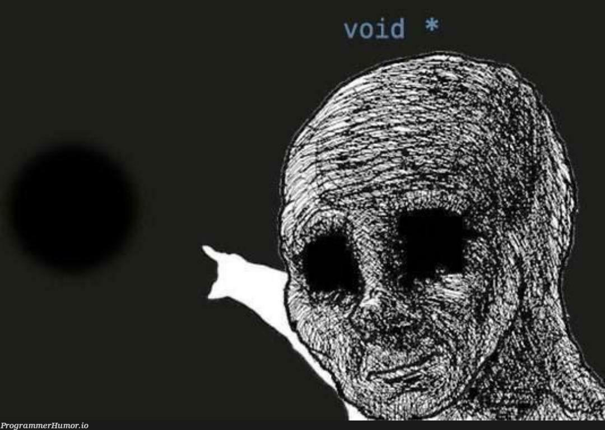{height=500 fig-align="center" fig-alt="void* указывает на неизвестный объект"}

## Просмотр объекта как последовательности байтов

```{.cpp filename="print-bytes.cpp" code-line-numbers="6"}

```

[{.godbolt-link-image width="32"}][godbolt-03-print-bytes]{aria-label="Open in Compiler Explorer"}

::: {.notes}

`std::format` появилась в C++20. Увеличение индекса перемещает чтение на один байт. Квалификатор `const` сохраняется: функция только читает данные.

Доступ к представлению объекта через `unsigned char` разрешён правилами доступа по типу: [стандарт C++, basic.lval](https://eel.is/c++draft/basic.lval).

:::

## Порядок байтов

Порядок байтов многобайтового числа зависит от платформы. На little-endian системах младший байт хранится по младшему адресу, а на big-endian — наоборот.

{height=300}

## 6. Указатели на функции

Адрес можно получить не только у объекта, но и у функции. Тип указателя содержит тип возвращаемого значения и типы параметров:

```{.cpp filename="function-pointers.cpp"}

```

[{.godbolt-link-image width="32"}][godbolt-03-function-pointers]{aria-label="Open in Compiler Explorer"}

Оператор взятия адреса необязателен: `same` и `&same` дают подходящий указатель.

## Функция как параметр алгоритма

Функция сравнения задаёт, каким элементом заменить текущий результат:

```{.cpp filename="find-by-order.cpp" code-line-numbers="4-13"}

```

[{.godbolt-link-image width="32"}][godbolt-03-find-by-order]{aria-label="Open in Compiler Explorer"}

## Выбор порядка сравнения

Две функции с подходящей сигнатурой задают разные варианты сравнения:

```{.cpp filename="comparison-functions.cpp"}

```

[{.godbolt-link-image width="32"}][godbolt-03-comparison-functions]{aria-label="Open in Compiler Explorer"}

`Less` заменяет результат бо́льшим элементом, `Greater` — меньшим.

## Поиск максимума и минимума

```{.cpp filename="find-extremes.cpp" code-line-numbers="25-26"}

```

[{.godbolt-link-image width="32"}][godbolt-03-find-extremes]{aria-label="Open in Compiler Explorer"}

::: {.notes}

В современном C++ вместо обычного указателя на функцию также применяют функциональные объекты, лямбда-выражения и `std::function`.

:::

## Как прочитать объявление `signal`

Функция может принимать указатель на функцию и возвращать указатель на функцию. Две эквивалентные записи:

```{.cpp filename="signal-declaration.cpp" code-line-numbers="2,4-5"}

```

[{.godbolt-link-image width="32"}][godbolt-03-signal-declaration]{aria-label="Open in Compiler Explorer"}

- `number` — параметр типа `int`, номер сигнала.
- `handler` — указатель на функцию, принимающую `int` и возвращающую `void`.
- Результат имеет тот же тип `Handler`: это **указатель на функцию**.
- `using` даёт имя типу и упрощает чтение объявления.

::: {.notes}

Учебный пример показывает две записи одного объявления в `namespace example`, без вызова функции и регистрации обработчиков. Служебные детали языкового связывания стандартной функции здесь опущены. Настоящая `std::signal` объявлена в заголовке `<csignal>`; использовать её нужно через этот заголовок, а не через собственное объявление: [стандарт C++, csignal synopsis](https://eel.is/c++draft/csignal.syn).

:::

[godbolt-03-dangling-pointer]: <https://godbolt.org/#g:!((g:!((h:codeEditor,i:(j:1,lang:c%2B%2B,options:(compileOnChange:'0'),source:'%23include+%3Ciostream%3E%0A%0Aint*+Make()+%7B%0A++++int+local+%3D+42%3B%0A++++return+%26local%3B++//+%D0%9E%D1%88%D0%B8%D0%B1%D0%BA%D0%B0:+%D0%B2%D0%BE%D0%B7%D0%B2%D1%80%D0%B0%D1%89%D0%B0%D0%B5%D0%BC+%D0%B0%D0%B4%D1%80%D0%B5%D1%81+%D0%BB%D0%BE%D0%BA%D0%B0%D0%BB%D1%8C%D0%BD%D0%BE%D0%B9+%D0%BF%D0%B5%D1%80%D0%B5%D0%BC%D0%B5%D0%BD%D0%BD%D0%BE%D0%B9.%0A%7D%0A%0Aint+main()+%7B%0A++++int*+pointer+%3D+Make()%3B%0A++++std::cout+%3C%3C+*pointer+%3C%3C+!'%5Cn!'%3B++//+%D0%9D%D0%B5%D0%BE%D0%BF%D1%80%D0%B5%D0%B4%D0%B5%D0%BB%D1%91%D0%BD%D0%BD%D0%BE%D0%B5+%D0%BF%D0%BE%D0%B2%D0%B5%D0%B4%D0%B5%D0%BD%D0%B8%D0%B5.+%D0%9D%D0%B5+%D0%B7%D0%B0%D0%BF%D1%83%D1%81%D0%BA%D0%B0%D1%82%D1%8C.%0A%7D%0A'),l:'5'),(h:executor,i:(compilationPanelShown:'0',compiler:clang2310,compilerOutShown:'0',lang:c%2B%2B,libs:!(),options:'-std%3Dc%2B%2B20+-O0+-Werror%3Dreturn-stack-address',source:1,tree:0),l:'5')),l:'2')),version:4>
<!-- godbolt source="../examples/03-pointers-arrays/dangling-pointer.cpp" compiler="clang2310" options="-std=c++20 -O0 -Werror=return-stack-address" -->

[godbolt-03-pointer-bounds]: <https://godbolt.org/#g:!((g:!((h:codeEditor,i:(j:1,lang:c%2B%2B,options:(compileOnChange:'0'),source:'%23include+%3Ciostream%3E%0A%0Aint+main()+%7B%0A++++int+values%5B%5D+%3D+%7B10,+20,+30%7D%3B%0A++++int*+begin+%3D+values%3B%0A++++int*+end+%3D+values+%2B+3%3B++//+%D0%9F%D0%BE%D0%B7%D0%B8%D1%86%D0%B8%D1%8F+%D0%BF%D0%BE%D1%81%D0%BB%D0%B5+%D0%BF%D0%BE%D1%81%D0%BB%D0%B5%D0%B4%D0%BD%D0%B5%D0%B3%D0%BE+%D1%8D%D0%BB%D0%B5%D0%BC%D0%B5%D0%BD%D1%82%D0%B0.%0A%0A++++for+(int*+current+%3D+begin%3B+current+!!%3D+end%3B+%2B%2Bcurrent)+%7B%0A++++++++std::cout+%3C%3C+*current+%3C%3C+!'%5Cn!'%3B%0A++++%7D%0A%7D%0A'),l:'5'),(h:executor,i:(compilationPanelShown:'0',compiler:clang2310,compilerOutShown:'0',lang:c%2B%2B,libs:!(),options:'-std%3Dc%2B%2B20+-O0',source:1,tree:0),l:'5')),l:'2')),version:4>
<!-- godbolt source="../examples/03-pointers-arrays/pointer-bounds.cpp" compiler="clang2310" options="-std=c++20 -O0" -->

[godbolt-03-c-string-boundaries]: <https://godbolt.org/#g:!((g:!((h:codeEditor,i:(j:1,lang:c%2B%2B,options:(compileOnChange:'0'),source:'%23include+%3Ccstring%3E%0A%23include+%3Ciostream%3E%0A%0Aint+main()+%7B%0A++++const+char+raw%5B3%5D+%3D+%7B!'C!',+!'%2B!',+!'%2B!'%7D%3B++//+%D0%9D%D0%B5%D1%82+%D0%B7%D0%B0%D0%B2%D0%B5%D1%80%D1%88%D0%B0%D1%8E%D1%89%D0%B5%D0%B3%D0%BE+!'%5C0!'.%0A++++const+char+text%5B4%5D+%3D+%22C%2B%2B%22%3B++++++++++//+%D0%95%D1%81%D1%82%D1%8C+%D0%BC%D0%B5%D1%81%D1%82%D0%BE+%D0%B4%D0%BB%D1%8F+!'%5C0!'.%0A%0A++++std::cout+%3C%3C+sizeof(raw)+%3C%3C+!'%5Cn!'%3B++++++++//+3%0A++++std::cout+%3C%3C+sizeof(text)+%3C%3C+!'%5Cn!'%3B+++++++//+4%0A++++std::cout+%3C%3C+std::strlen(text)+%3C%3C+!'%5Cn!'%3B++//+3%0A++++//+std::cout+%3C%3C+std::strlen(raw)%3B++//+%D0%9D%D0%B5%D0%BE%D0%BF%D1%80%D0%B5%D0%B4%D0%B5%D0%BB%D1%91%D0%BD%D0%BD%D0%BE%D0%B5+%D0%BF%D0%BE%D0%B2%D0%B5%D0%B4%D0%B5%D0%BD%D0%B8%D0%B5.%0A%7D%0A'),l:'5'),(h:executor,i:(compilationPanelShown:'0',compiler:clang2310,compilerOutShown:'0',lang:c%2B%2B,libs:!(),options:'-std%3Dc%2B%2B20+-O0',source:1,tree:0),l:'5')),l:'2')),version:4>
<!-- godbolt source="../examples/03-pointers-arrays/c-string-boundaries.cpp" compiler="clang2310" options="-std=c++20 -O0" -->

[godbolt-03-signal-declaration]: <https://godbolt.org/#g:!((g:!((h:codeEditor,i:(j:1,lang:c%2B%2B,options:(compileOnChange:'0'),source:'namespace+example+%7B%0A++++void+(*signal(int+number,+void+(*handler)(int)))(int)%3B%0A%0A++++using+Handler+%3D+void+(*)(int)%3B%0A++++Handler+signal(int+number,+Handler+handler)%3B++//+%D0%A2%D0%BE+%D0%B6%D0%B5+%D0%BE%D0%B1%D1%8A%D1%8F%D0%B2%D0%BB%D0%B5%D0%BD%D0%B8%D0%B5.%0A%7D%0A%0Aint+main()+%7B%7D%0A'),l:'5'),(h:executor,i:(compilationPanelShown:'0',compiler:clang2310,compilerOutShown:'0',lang:c%2B%2B,libs:!(),options:'-std%3Dc%2B%2B20+-O0',source:1,tree:0),l:'5')),l:'2')),version:4>
<!-- godbolt source="../examples/03-pointers-arrays/signal-declaration.cpp" compiler="clang2310" options="-std=c++20 -O0" -->

[godbolt-03-pointer-operators]: <https://godbolt.org/#g:!((g:!((h:codeEditor,i:(j:1,lang:c%2B%2B,options:(compileOnChange:'0'),source:'%23include+%3Ciostream%3E%0A%0Aint+main()+%7B%0A++++int+x+%3D+1%3B%0A++++int+y+%3D+2%3B%0A++++int*+pointer+%3D+%26x%3B++//+%D0%91%D0%B5%D1%80%D1%91%D0%BC+%D0%B0%D0%B4%D1%80%D0%B5%D1%81+x.%0A++++y+%3D+*pointer%3B++++++//+%D0%A7%D0%B8%D1%82%D0%B0%D0%B5%D0%BC+x:+%D1%82%D0%B5%D0%BF%D0%B5%D1%80%D1%8C+y+%3D%3D+1.%0A++++*pointer+%3D+0%3B++++++//+%D0%98%D0%B7%D0%BC%D0%B5%D0%BD%D1%8F%D0%B5%D0%BC+x:+%D1%82%D0%B5%D0%BF%D0%B5%D1%80%D1%8C+x+%3D%3D+0.%0A%0A++++std::cout+%3C%3C+x+%3C%3C+!'+!'+%3C%3C+y+%3C%3C+!'%5Cn!'%3B++//+0+1%0A%7D%0A'),l:'5'),(h:executor,i:(compilationPanelShown:'0',compiler:clang2310,compilerOutShown:'0',lang:c%2B%2B,libs:!(),options:'-std%3Dc%2B%2B20+-O0',source:1,tree:0),l:'5')),l:'2')),version:4>
<!-- godbolt source="../examples/03-pointers-arrays/pointer-operators.cpp" compiler="clang2310" options="-std=c++20 -O0" -->

[godbolt-03-pointer-sizes]: <https://godbolt.org/#g:!((g:!((h:codeEditor,i:(j:1,lang:c%2B%2B,options:(compileOnChange:'0'),source:'%23include+%3Ciostream%3E%0A%0Aint+main()+%7B%0A++++bool+flag+%3D+true%3B%0A++++long+number+%3D+128L%3B%0A%0A++++bool*+flag_pointer+%3D+%26flag%3B%0A++++long*+number_pointer+%3D+%26number%3B%0A%0A++++std::cout+%3C%3C+sizeof(flag)+%3C%3C+!'+!'+%3C%3C+sizeof(number)+%3C%3C+!'%5Cn!'%3B%0A++++std::cout+%3C%3C+sizeof(flag_pointer)+%3C%3C+!'+!'+%3C%3C+sizeof(number_pointer)+%3C%3C+!'%5Cn!'%3B%0A%0A++++return+0%3B%0A%7D%0A'),l:'5'),(h:executor,i:(compilationPanelShown:'0',compiler:clang2310,compilerOutShown:'0',lang:c%2B%2B,libs:!(),options:'-std%3Dc%2B%2B20+-O0',source:1,tree:0),l:'5')),l:'2')),version:4>
<!-- godbolt source="../examples/03-pointers-arrays/pointer-sizes.cpp" compiler="clang2310" options="-std=c++20 -O0" -->

[godbolt-03-pointer-addresses]: <https://godbolt.org/#g:!((g:!((h:codeEditor,i:(j:1,lang:c%2B%2B,options:(compileOnChange:'0'),source:'%23include+%3Ciostream%3E%0A%0Aint+main()+%7B%0A++++int+value+%3D+10%3B%0A++++int*+pointer+%3D+%26value%3B%0A%0A++++std::cout+%3C%3C+%22%D0%90%D0%B4%D1%80%D0%B5%D1%81+value:+%22+%3C%3C+%26value+%3C%3C+!'%5Cn!'%3B%0A++++std::cout+%3C%3C+%22%D0%97%D0%BD%D0%B0%D1%87%D0%B5%D0%BD%D0%B8%D0%B5+pointer:+%22+%3C%3C+pointer+%3C%3C+!'%5Cn!'%3B%0A++++std::cout+%3C%3C+%22%D0%90%D0%B4%D1%80%D0%B5%D1%81+pointer:+%22+%3C%3C+%26pointer+%3C%3C+!'%5Cn!'%3B%0A%0A++++return+0%3B%0A%7D%0A'),l:'5'),(h:executor,i:(compilationPanelShown:'0',compiler:clang2310,compilerOutShown:'0',lang:c%2B%2B,libs:!(),options:'-std%3Dc%2B%2B20+-O0',source:1,tree:0),l:'5')),l:'2')),version:4>
<!-- godbolt source="../examples/03-pointers-arrays/pointer-addresses.cpp" compiler="clang2310" options="-std=c++20 -O0" -->

[godbolt-03-multi-level-pointers]: <https://godbolt.org/#g:!((g:!((h:codeEditor,i:(j:1,lang:c%2B%2B,options:(compileOnChange:'0'),source:'%23include+%3Ciostream%3E%0A%0Aint+main()+%7B%0A++++int+value+%3D+0%3B%0A++++int*+pointer+%3D+%26value%3B%0A++++int**+pointer_to_pointer+%3D+%26pointer%3B%0A++++int***+third_level+%3D+%26pointer_to_pointer%3B%0A%0A++++std::cout+%3C%3C+value+%3C%3C+!'%5Cn!'%3B%0A++++std::cout+%3C%3C+*pointer+%3C%3C+!'%5Cn!'%3B%0A++++std::cout+%3C%3C+**pointer_to_pointer+%3C%3C+!'%5Cn!'%3B%0A++++std::cout+%3C%3C+***third_level+%3C%3C+!'%5Cn!'%3B%0A%0A++++return+0%3B%0A%7D%0A'),l:'5'),(h:executor,i:(compilationPanelShown:'0',compiler:clang2310,compilerOutShown:'0',lang:c%2B%2B,libs:!(),options:'-std%3Dc%2B%2B20+-O0',source:1,tree:0),l:'5')),l:'2')),version:4>
<!-- godbolt source="../examples/03-pointers-arrays/multi-level-pointers.cpp" compiler="clang2310" options="-std=c++20 -O0" -->

[godbolt-03-nullptr-overload]: <https://godbolt.org/#g:!((g:!((h:codeEditor,i:(j:1,lang:c%2B%2B,options:(compileOnChange:'0'),source:'%23include+%3Ccstddef%3E%0A%23include+%3Ciostream%3E%0A%0Avoid+func(int*)+%7B%0A++++std::cout+%3C%3C+%22func(int*)%5Cn%22%3B%0A%7D%0A%0Avoid+func(int)+%7B%0A++++std::cout+%3C%3C+%22func(int)%5Cn%22%3B%0A%7D%0A%0Aint+main()+%7B%0A++++func(nullptr)%3B++//+%D0%92%D1%8B%D0%B1%D0%B8%D1%80%D0%B0%D0%B5%D1%82+func(int*).%0A++++func(0)%3B++++++++//+%D0%92%D1%8B%D0%B1%D0%B8%D1%80%D0%B0%D0%B5%D1%82+func(int).%0A++++func(NULL)%3B+++++//+%D0%9D%D0%B0%D0%BC%D0%B5%D1%80%D0%B5%D0%BD%D0%BD%D0%B0%D1%8F+%D0%BE%D1%88%D0%B8%D0%B1%D0%BA%D0%B0+%D0%B2+Clang:+%D0%BD%D0%B5%D0%BE%D0%B4%D0%BD%D0%BE%D0%B7%D0%BD%D0%B0%D1%87%D0%BD%D1%8B%D0%B9+%D0%B2%D1%8B%D0%B7%D0%BE%D0%B2.%0A%7D%0A'),l:'5'),(h:executor,i:(compilationPanelShown:'0',compiler:clang2310,compilerOutShown:'0',lang:c%2B%2B,libs:!(),options:'-std%3Dc%2B%2B20+-O0',source:1,tree:0),l:'5')),l:'2')),version:4>
<!-- godbolt source="../examples/03-pointers-arrays/nullptr-overload.cpp" compiler="clang2310" options="-std=c++20 -O0" -->

[godbolt-03-swap-by-value]: <https://godbolt.org/#g:!((g:!((h:codeEditor,i:(j:1,lang:c%2B%2B,options:(compileOnChange:'0'),source:'%23include+%3Ciostream%3E%0A%0Avoid+SwapValues(int+left,+int+right)+%7B%0A++++int+temporary+%3D+left%3B%0A++++left+%3D+right%3B%0A++++right+%3D+temporary%3B%0A++++std::cout+%3C%3C+left+%3C%3C+!'+!'+%3C%3C+right+%3C%3C+!'%5Cn!'%3B++//+2+1%0A%7D%0A%0Aint+main()+%7B%0A++++int+first+%3D+1%3B%0A++++int+second+%3D+2%3B%0A++++SwapValues(first,+second)%3B%0A++++std::cout+%3C%3C+first+%3C%3C+!'+!'+%3C%3C+second+%3C%3C+!'%5Cn!'%3B++//+1+2%0A%7D%0A'),l:'5'),(h:executor,i:(compilationPanelShown:'0',compiler:clang2310,compilerOutShown:'0',lang:c%2B%2B,libs:!(),options:'-std%3Dc%2B%2B20+-O0',source:1,tree:0),l:'5')),l:'2')),version:4>
<!-- godbolt source="../examples/03-pointers-arrays/swap-by-value.cpp" compiler="clang2310" options="-std=c++20 -O0" -->

[godbolt-03-swap-pointers]: <https://godbolt.org/#g:!((g:!((h:codeEditor,i:(j:1,lang:c%2B%2B,options:(compileOnChange:'0'),source:'%23include+%3Ciostream%3E%0A%0Avoid+swap_values(int*+left,+int*+right)+%7B%0A++++int+temporary+%3D+*left%3B%0A++++*left+%3D+*right%3B%0A++++*right+%3D+temporary%3B%0A%7D%0A%0Aint+main()+%7B%0A++++int+first+%3D+1%3B%0A++++int+second+%3D+2%3B%0A%0A++++swap_values(%26first,+%26second)%3B%0A++++std::cout+%3C%3C+first+%3C%3C+!'+!'+%3C%3C+second+%3C%3C+!'%5Cn!'%3B%0A%0A++++return+0%3B%0A%7D%0A'),l:'5'),(h:executor,i:(compilationPanelShown:'0',compiler:clang2310,compilerOutShown:'0',lang:c%2B%2B,libs:!(),options:'-std%3Dc%2B%2B20+-O0',source:1,tree:0),l:'5')),l:'2')),version:4>
<!-- godbolt source="../examples/03-pointers-arrays/swap-through-pointers.cpp" compiler="clang2310" options="-std=c++20 -O0" -->

[godbolt-03-array-declarations]: <https://godbolt.org/#g:!((g:!((h:codeEditor,i:(j:1,lang:c%2B%2B,options:(compileOnChange:'0'),source:'%23include+%3Ciostream%3E%0A%0Aint+main()+%7B%0A++++int+uninitialized%5B10%5D%3B++//+%D0%97%D0%BD%D0%B0%D1%87%D0%B5%D0%BD%D0%B8%D1%8F+%D1%8D%D0%BB%D0%B5%D0%BC%D0%B5%D0%BD%D1%82%D0%BE%D0%B2+%D0%BD%D0%B5+%D0%BE%D0%BF%D1%80%D0%B5%D0%B4%D0%B5%D0%BB%D0%B5%D0%BD%D1%8B.%0A++++int+inferred%5B%5D+%3D+%7B1,+2,+3,+4,+5%7D%3B%0A++++int+fixed%5B3%5D+%3D+%7B1,+2,+3%7D%3B%0A++++int+matrix%5B2%5D%5B3%5D+%3D+%7B%0A++++++++%7B1,+2,+3%7D,%0A++++++++%7B4,+5,+6%7D,%0A++++%7D%3B%0A%0A++++std::cout+%3C%3C+sizeof(uninitialized)+%3C%3C+!'%5Cn!'%3B++//+%D0%9D%D0%B5+%D1%87%D0%B8%D1%82%D0%B0%D0%B5%D0%BC+%D1%8D%D0%BB%D0%B5%D0%BC%D0%B5%D0%BD%D1%82%D1%8B.%0A++++std::cout+%3C%3C+inferred%5B0%5D+%3C%3C+!'+!'+%3C%3C+fixed%5B2%5D+%3C%3C+!'%5Cn!'%3B%0A++++std::cout+%3C%3C+matrix%5B1%5D%5B2%5D+%3C%3C+!'%5Cn!'%3B%0A%7D%0A'),l:'5'),(h:executor,i:(compilationPanelShown:'0',compiler:clang2310,compilerOutShown:'0',lang:c%2B%2B,libs:!(),options:'-std%3Dc%2B%2B20+-O0',source:1,tree:0),l:'5')),l:'2')),version:4>
<!-- godbolt source="../examples/03-pointers-arrays/array-declarations.cpp" compiler="clang2310" options="-std=c++20 -O0" -->

[godbolt-03-array-to-pointer]: <https://godbolt.org/#g:!((g:!((h:codeEditor,i:(j:1,lang:c%2B%2B,options:(compileOnChange:'0'),source:'%23include+%3Ciostream%3E%0A%0Avoid+PrintFirst(const+int*+pointer)+%7B%0A++++std::cout+%3C%3C+*pointer+%3C%3C+!'%5Cn!'%3B%0A%7D%0A%0Aint+main()+%7B%0A++++int+values%5B%5D+%3D+%7B10,+20,+30%7D%3B%0A++++int*+first+%3D+values%3B++//+%D0%98%D0%BD%D0%B8%D1%86%D0%B8%D0%B0%D0%BB%D0%B8%D0%B7%D0%B0%D1%86%D0%B8%D1%8F+%D1%83%D0%BA%D0%B0%D0%B7%D0%B0%D1%82%D0%B5%D0%BB%D1%8F:+values+-%3E+%26values%5B0%5D.%0A++++PrintFirst(values)%3B++//+%D0%90%D1%80%D0%B3%D1%83%D0%BC%D0%B5%D0%BD%D1%82+%D1%84%D1%83%D0%BD%D0%BA%D1%86%D0%B8%D0%B8:+values+-%3E+%26values%5B0%5D.%0A++++std::cout+%3C%3C+*(values+%2B+1)+%3C%3C+!'%5Cn!'%3B++//+%D0%92+%D0%B0%D1%80%D0%B8%D1%84%D0%BC%D0%B5%D1%82%D0%B8%D0%BA%D0%B5+%D1%82%D0%BE%D0%B6%D0%B5+%D0%BD%D1%83%D0%B6%D0%B5%D0%BD+%D1%83%D0%BA%D0%B0%D0%B7%D0%B0%D1%82%D0%B5%D0%BB%D1%8C.%0A++++std::cout+%3C%3C+values%5B0%5D+%3C%3C+!'+!'+%3C%3C+*values+%3C%3C+!'+!'+%3C%3C+*first+%3C%3C+!'%5Cn!'%3B%0A%7D%0A'),l:'5'),(h:executor,i:(compilationPanelShown:'0',compiler:clang2310,compilerOutShown:'0',lang:c%2B%2B,libs:!(),options:'-std%3Dc%2B%2B20+-O0',source:1,tree:0),l:'5')),l:'2')),version:4>
<!-- godbolt source="../examples/03-pointers-arrays/array-to-pointer.cpp" compiler="clang2310" options="-std=c++20 -O0" -->

[godbolt-03-array-without-decay]: <https://godbolt.org/#g:!((g:!((h:codeEditor,i:(j:1,lang:c%2B%2B,options:(compileOnChange:'0'),source:'%23include+%3Ciostream%3E%0A%0Aint+main()+%7B%0A++++int+values%5B%5D+%3D+%7B10,+20,+30%7D%3B%0A++++int+(%26reference)%5B3%5D+%3D+values%3B++//+%D0%A1%D1%81%D1%8B%D0%BB%D0%BA%D0%B0+%D0%BD%D0%B0+%D0%B2%D0%B5%D1%81%D1%8C+%D0%BC%D0%B0%D1%81%D1%81%D0%B8%D0%B2.%0A++++int+(*whole)%5B3%5D+%3D+%26values%3B++++//+%D0%A3%D0%BA%D0%B0%D0%B7%D0%B0%D1%82%D0%B5%D0%BB%D1%8C+%D0%BD%D0%B0+%D0%B2%D0%B5%D1%81%D1%8C+%D0%BC%D0%B0%D1%81%D1%81%D0%B8%D0%B2.%0A++++decltype(values)+copy+%3D+%7B40,+50,+60%7D%3B++//+%D0%A2%D0%B8%D0%BF+copy+%E2%80%94+int%5B3%5D.%0A%0A++++std::cout+%3C%3C+sizeof(values)+/+sizeof(values%5B0%5D)+%3C%3C+!'%5Cn!'%3B++//+3%0A++++std::cout+%3C%3C+reference%5B1%5D+%3C%3C+!'+!'+%3C%3C+(*whole)%5B1%5D+%3C%3C+!'%5Cn!'%3B++//+20+20%0A++++std::cout+%3C%3C+copy%5B0%5D+%3C%3C+!'%5Cn!'%3B++//+40%0A%7D%0A'),l:'5'),(h:executor,i:(compilationPanelShown:'0',compiler:clang2310,compilerOutShown:'0',lang:c%2B%2B,libs:!(),options:'-std%3Dc%2B%2B20+-O0',source:1,tree:0),l:'5')),l:'2')),version:4>
<!-- godbolt source="../examples/03-pointers-arrays/array-without-decay.cpp" compiler="clang2310" options="-std=c++20 -O0" -->

[godbolt-03-array-parameter-size]: <https://godbolt.org/#g:!((g:!((h:codeEditor,i:(j:1,lang:c%2B%2B,options:(compileOnChange:'0'),source:'%23include+%3Ciostream%3E%0A%0Avoid+PrintSize(int*+array)+%7B%0A++++std::cout+%3C%3C+sizeof(array)+%3C%3C+!'%5Cn!'%3B%0A%7D%0A%0Aint+main()+%7B%0A++++int+values%5B10%5D%7B%7D%3B%0A++++std::cout+%3C%3C+sizeof(values)+%3C%3C+!'%5Cn!'%3B%0A++++PrintSize(values)%3B%0A%7D%0A'),l:'5'),(h:executor,i:(compilationPanelShown:'0',compiler:clang2310,compilerOutShown:'0',lang:c%2B%2B,libs:!(),options:'-std%3Dc%2B%2B20+-O0',source:1,tree:0),l:'5')),l:'2')),version:4>
<!-- godbolt source="../examples/03-pointers-arrays/array-parameter-size.cpp" compiler="clang2310" options="-std=c++20 -O0" -->

[godbolt-03-pointer-arithmetic]: <https://godbolt.org/#g:!((g:!((h:codeEditor,i:(j:1,lang:c%2B%2B,options:(compileOnChange:'0'),source:'%23include+%3Ciostream%3E%0A%0Aint+main()+%7B%0A++++int+values%5B%5D+%3D+%7B10,+20,+30%7D%3B%0A++++int*+pointer+%3D+values%3B%0A%0A++++int+first+%3D+*pointer%3B+++++++++//+10%0A++++int+second+%3D+*(pointer+%2B+1)%3B++//+20%0A++++int+third+%3D+pointer%5B2%5D%3B+++++++//+30%0A++++std::cout+%3C%3C+first+%3C%3C+!'+!'+%3C%3C+second+%3C%3C+!'+!'+%3C%3C+third+%3C%3C+!'%5Cn!'%3B%0A%7D%0A'),l:'5'),(h:executor,i:(compilationPanelShown:'0',compiler:clang2310,compilerOutShown:'0',lang:c%2B%2B,libs:!(),options:'-std%3Dc%2B%2B20+-O0',source:1,tree:0),l:'5')),l:'2')),version:4>
<!-- godbolt source="../examples/03-pointers-arrays/pointer-arithmetic.cpp" compiler="clang2310" options="-std=c++20 -O0" -->

[godbolt-03-c-string-storage]: <https://godbolt.org/#g:!((g:!((h:codeEditor,i:(j:1,lang:c%2B%2B,options:(compileOnChange:'0'),source:'%23include+%3Ciostream%3E%0A%0Aint+main()+%7B%0A++++const+char*+first+%3D+%22Hello+world%22%3B%0A++++char+second%5B%5D+%3D+%22Hello+world%22%3B%0A++++const+char*+third+%3D+second%3B%0A%0A++++second%5B0%5D+%3D+!'h!'%3B++//+%D0%9C%D0%B5%D0%BD%D1%8F%D0%B5%D0%BC+%D0%BE%D1%82%D0%B4%D0%B5%D0%BB%D1%8C%D0%BD%D1%8B%D0%B9+%D0%BC%D0%B0%D1%81%D1%81%D0%B8%D0%B2,+%D0%B0+%D0%BD%D0%B5+%D0%BB%D0%B8%D1%82%D0%B5%D1%80%D0%B0%D0%BB.%0A++++std::cout+%3C%3C+first+%3C%3C+!'%5Cn!'%3B++//+Hello+world%0A++++std::cout+%3C%3C+third+%3C%3C+!'%5Cn!'%3B++//+hello+world%0A%7D%0A'),l:'5'),(h:executor,i:(compilationPanelShown:'0',compiler:clang2310,compilerOutShown:'0',lang:c%2B%2B,libs:!(),options:'-std%3Dc%2B%2B20+-O0',source:1,tree:0),l:'5')),l:'2')),version:4>
<!-- godbolt source="../examples/03-pointers-arrays/c-string-storage.cpp" compiler="clang2310" options="-std=c++20 -O0" -->

[godbolt-03-string-length]: <https://godbolt.org/#g:!((g:!((h:codeEditor,i:(j:1,lang:c%2B%2B,options:(compileOnChange:'0'),source:'%23include+%3Ccstddef%3E%0A%23include+%3Ciostream%3E%0A%0Astd::size_t+StringLength(const+char*+string)+%7B%0A++++std::size_t+length+%3D+0%3B%0A++++while+(*string+!!%3D+!'%5C0!')+%7B%0A++++++++%2B%2Bstring%3B%0A++++++++%2B%2Blength%3B%0A++++%7D%0A++++return+length%3B%0A%7D%0A%0Aint+main()+%7B%0A++++std::cout+%3C%3C+StringLength(%22Hello%22)+%3C%3C+!'%5Cn!'%3B++//+5%0A++++std::cout+%3C%3C+StringLength(%22%22)+%3C%3C+!'%5Cn!'%3B+++++++//+0%0A%7D%0A'),l:'5'),(h:executor,i:(compilationPanelShown:'0',compiler:clang2310,compilerOutShown:'0',lang:c%2B%2B,libs:!(),options:'-std%3Dc%2B%2B20+-O0',source:1,tree:0),l:'5')),l:'2')),version:4>
<!-- godbolt source="../examples/03-pointers-arrays/string-length.cpp" compiler="clang2310" options="-std=c++20 -O0" -->

[godbolt-03-string-compare-indices]: <https://godbolt.org/#g:!((g:!((h:codeEditor,i:(j:1,lang:c%2B%2B,options:(compileOnChange:'0'),source:'%23include+%3Ccstddef%3E%0A%23include+%3Ciostream%3E%0A%0Aint+StringCompare(const+char*+first,+const+char*+second)+%7B%0A++++std::size_t+index+%3D+0%3B%0A++++while+(first%5Bindex%5D+!!%3D+!'%5C0!'+%26%26+first%5Bindex%5D+%3D%3D+second%5Bindex%5D)+%7B%0A++++++++%2B%2Bindex%3B%0A++++%7D%0A++++return+static_cast%3Cunsigned+char%3E(first%5Bindex%5D)%0A+++++++++-+static_cast%3Cunsigned+char%3E(second%5Bindex%5D)%3B%0A%7D%0A%0Aint+main()+%7B%0A++++std::cout+%3C%3C+StringCompare(%22cat%22,+%22cat%22)+%3C%3C+!'%5Cn!'%3B++//+0%0A++++std::cout+%3C%3C+StringCompare(%22cat%22,+%22car%22)+%3C%3C+!'%5Cn!'%3B++//+%3E+0%0A++++std::cout+%3C%3C+StringCompare(%22cat%22,+%22cats%22)+%3C%3C+!'%5Cn!'%3B+//+%3C+0%0A%7D%0A'),l:'5'),(h:executor,i:(compilationPanelShown:'0',compiler:clang2310,compilerOutShown:'0',lang:c%2B%2B,libs:!(),options:'-std%3Dc%2B%2B20+-O0',source:1,tree:0),l:'5')),l:'2')),version:4>
<!-- godbolt source="../examples/03-pointers-arrays/string-compare-indices.cpp" compiler="clang2310" options="-std=c++20 -O0" -->

[godbolt-03-string-compare-pointers]: <https://godbolt.org/#g:!((g:!((h:codeEditor,i:(j:1,lang:c%2B%2B,options:(compileOnChange:'0'),source:'%23include+%3Ciostream%3E%0A%0Aint+StringCompare(const+char*+first,+const+char*+second)+%7B%0A++++while+(*first+!!%3D+!'%5C0!'+%26%26+*first+%3D%3D+*second)+%7B%0A++++++++%2B%2Bfirst%3B%0A++++++++%2B%2Bsecond%3B%0A++++%7D%0A++++return+static_cast%3Cunsigned+char%3E(*first)%0A+++++++++-+static_cast%3Cunsigned+char%3E(*second)%3B%0A%7D%0A%0Aint+main()+%7B%0A++++std::cout+%3C%3C+StringCompare(%22cat%22,+%22cat%22)+%3C%3C+!'%5Cn!'%3B++//+0%0A++++std::cout+%3C%3C+StringCompare(%22cat%22,+%22car%22)+%3C%3C+!'%5Cn!'%3B++//+%3E+0%0A++++std::cout+%3C%3C+StringCompare(%22cat%22,+%22cats%22)+%3C%3C+!'%5Cn!'%3B+//+%3C+0%0A%7D%0A'),l:'5'),(h:executor,i:(compilationPanelShown:'0',compiler:clang2310,compilerOutShown:'0',lang:c%2B%2B,libs:!(),options:'-std%3Dc%2B%2B20+-O0',source:1,tree:0),l:'5')),l:'2')),version:4>
<!-- godbolt source="../examples/03-pointers-arrays/string-compare-pointers.cpp" compiler="clang2310" options="-std=c++20 -O0" -->

[godbolt-03-command-line]: <https://godbolt.org/#g:!((g:!((h:codeEditor,i:(j:1,lang:c%2B%2B,options:(compileOnChange:'0'),source:'%23include+%3Ciostream%3E%0A%0Aint+main(int+argc,+char*+argv%5B%5D)+%7B%0A++++for+(int+index+%3D+0%3B+index+%3C+argc%3B+%2B%2Bindex)+%7B%0A++++++++std::cout+%3C%3C+argv%5Bindex%5D+%3C%3C+!'%5Cn!'%3B%0A++++%7D%0A%0A++++return+0%3B%0A%7D%0A'),l:'5'),(h:executor,i:(compilationPanelShown:'0',compiler:clang2310,compilerOutShown:'0',lang:c%2B%2B,libs:!(),options:'-std%3Dc%2B%2B20+-O0',source:1,tree:0),l:'5')),l:'2')),version:4>
<!-- godbolt source="../examples/03-pointers-arrays/command-line-arguments.cpp" compiler="clang2310" options="-std=c++20 -O0" -->

[godbolt-03-void-pointer]: <https://godbolt.org/#g:!((g:!((h:codeEditor,i:(j:1,lang:c%2B%2B,options:(compileOnChange:'0'),source:'%23include+%3Ciostream%3E%0A%0Aint+main()+%7B%0A++++int+value+%3D+239%3B%0A++++int*+typed_pointer+%3D+%26value%3B%0A++++void*+untyped_pointer+%3D+typed_pointer%3B%0A++++int*+restored_pointer+%3D+static_cast%3Cint*%3E(untyped_pointer)%3B%0A%0A++++std::cout+%3C%3C+*restored_pointer+%3C%3C+!'%5Cn!'%3B++//+239%0A%7D%0A'),l:'5'),(h:executor,i:(compilationPanelShown:'0',compiler:clang2310,compilerOutShown:'0',lang:c%2B%2B,libs:!(),options:'-std%3Dc%2B%2B20+-O0',source:1,tree:0),l:'5')),l:'2')),version:4>
<!-- godbolt source="../examples/03-pointers-arrays/void-pointer.cpp" compiler="clang2310" options="-std=c++20 -O0" -->

[godbolt-03-print-bytes]: <https://godbolt.org/#g:!((g:!((h:codeEditor,i:(j:1,lang:c%2B%2B,options:(compileOnChange:'0'),source:'%23include+%3Ccstddef%3E%0A%23include+%3Cformat%3E%0A%23include+%3Ciostream%3E%0A%0Avoid+PrintBytes(const+void*+object,+std::size_t+size)+%7B%0A++++const+auto*+bytes+%3D+(const+unsigned+char*)object%3B%0A++++for+(std::size_t+index+%3D+0%3B+index+%3C+size%3B+%2B%2Bindex)+%7B%0A++++++++std::cout+%3C%3C+std::format(%22%7B:08b%7D+%22,+bytes%5Bindex%5D)%3B%0A++++%7D%0A++++std::cout+%3C%3C+!'%5Cn!'%3B%0A%7D%0A%0Aint+main()+%7B%0A++++int+value+%3D+2+%3C%3C+10%3B%0A++++PrintBytes(%26value,+sizeof(value))%3B%0A++++value+%3D+239%3B%0A++++PrintBytes(%26value,+sizeof(value))%3B%0A%7D%0A'),l:'5'),(h:executor,i:(compilationPanelShown:'0',compiler:clang2310,compilerOutShown:'0',lang:c%2B%2B,libs:!(),options:'-std%3Dc%2B%2B20+-O0',source:1,tree:0),l:'5')),l:'2')),version:4>
<!-- godbolt source="../examples/03-pointers-arrays/print-bytes.cpp" compiler="clang2310" options="-std=c++20 -O0" -->

[godbolt-03-function-pointers]: <https://godbolt.org/#g:!((g:!((h:codeEditor,i:(j:1,lang:c%2B%2B,options:(compileOnChange:'0'),source:'int+same(int+value)+%7B%0A++++return+value%3B%0A%7D%0A%0Aint+main()+%7B%0A++++int+(*function)(int)+%3D+same%3B%0A++++int+(*same_function)(int)+%3D+%26same%3B%0A%0A++++return+function(2)+%2B+same_function(2)+%3D%3D+4+%3F+0+:+1%3B%0A%7D%0A'),l:'5'),(h:executor,i:(compilationPanelShown:'0',compiler:clang2310,compilerOutShown:'0',lang:c%2B%2B,libs:!(),options:'-std%3Dc%2B%2B20+-O0',source:1,tree:0),l:'5')),l:'2')),version:4>
<!-- godbolt source="../examples/03-pointers-arrays/function-pointers.cpp" compiler="clang2310" options="-std=c++20 -O0" -->

[godbolt-03-find-by-order]: <https://godbolt.org/#g:!((g:!((h:codeEditor,i:(j:1,lang:c%2B%2B,options:(compileOnChange:'0'),source:'%23include+%3Ccstddef%3E%0A%23include+%3Ciostream%3E%0A%0Aint*+FindByOrder(int*+array,+std::size_t+size,+bool+(*comes_before)(int,+int))+%7B%0A++++if+(size+%3D%3D+0)+return+nullptr%3B%0A++++int*+result+%3D+array%3B%0A++++for+(std::size_t+index+%3D+1%3B+index+%3C+size%3B+%2B%2Bindex)+%7B%0A++++++++if+(comes_before(*result,+array%5Bindex%5D))+%7B%0A++++++++++++result+%3D+%26array%5Bindex%5D%3B%0A++++++++%7D%0A++++%7D%0A++++return+result%3B%0A%7D%0A%0Abool+Less(int+left,+int+right)+%7B%0A++++return+left+%3C+right%3B%0A%7D%0A%0Aint+main()+%7B%0A++++int+values%5B%5D+%3D+%7B3,+1,+4%7D%3B%0A++++std::cout+%3C%3C+*FindByOrder(values,+3,+Less)+%3C%3C+!'%5Cn!'%3B++//+4%0A++++std::cout+%3C%3C+(FindByOrder(values,+0,+Less)+%3D%3D+nullptr)+%3C%3C+!'%5Cn!'%3B++//+1%0A%7D%0A'),l:'5'),(h:executor,i:(compilationPanelShown:'0',compiler:clang2310,compilerOutShown:'0',lang:c%2B%2B,libs:!(),options:'-std%3Dc%2B%2B20+-O0',source:1,tree:0),l:'5')),l:'2')),version:4>
<!-- godbolt source="../examples/03-pointers-arrays/find-by-order.cpp" compiler="clang2310" options="-std=c++20 -O0" -->

[godbolt-03-comparison-functions]: <https://godbolt.org/#g:!((g:!((h:codeEditor,i:(j:1,lang:c%2B%2B,options:(compileOnChange:'0'),source:'%23include+%3Ciostream%3E%0A%0Abool+Less(int+left,+int+right)+%7B%0A++++return+left+%3C+right%3B%0A%7D%0A%0Abool+Greater(int+left,+int+right)+%7B%0A++++return+left+%3E+right%3B%0A%7D%0A%0Aint+main()+%7B%0A++++bool+(*comes_before)(int,+int)+%3D+Less%3B%0A++++std::cout+%3C%3C+comes_before(1,+2)+%3C%3C+!'%5Cn!'%3B++//+1%0A++++comes_before+%3D+Greater%3B%0A++++std::cout+%3C%3C+comes_before(1,+2)+%3C%3C+!'%5Cn!'%3B++//+0%0A%7D%0A'),l:'5'),(h:executor,i:(compilationPanelShown:'0',compiler:clang2310,compilerOutShown:'0',lang:c%2B%2B,libs:!(),options:'-std%3Dc%2B%2B20+-O0',source:1,tree:0),l:'5')),l:'2')),version:4>
<!-- godbolt source="../examples/03-pointers-arrays/comparison-functions.cpp" compiler="clang2310" options="-std=c++20 -O0" -->

[godbolt-03-find-extremes]: <https://godbolt.org/#g:!((g:!((h:codeEditor,i:(j:1,lang:c%2B%2B,options:(compileOnChange:'0'),source:'%23include+%3Ccstddef%3E%0A%23include+%3Ciostream%3E%0A%0Aint*+FindByOrder(int*+array,+std::size_t+size,+bool+(*comes_before)(int,+int))+%7B%0A++++if+(size+%3D%3D+0)+return+nullptr%3B%0A++++int*+result+%3D+array%3B%0A++++for+(std::size_t+index+%3D+1%3B+index+%3C+size%3B+%2B%2Bindex)+%7B%0A++++++++if+(comes_before(*result,+array%5Bindex%5D))+%7B%0A++++++++++++result+%3D+%26array%5Bindex%5D%3B%0A++++++++%7D%0A++++%7D%0A++++return+result%3B%0A%7D%0A%0Abool+Less(int+left,+int+right)+%7B%0A++++return+left+%3C+right%3B%0A%7D%0A%0Abool+Greater(int+left,+int+right)+%7B%0A++++return+left+%3E+right%3B%0A%7D%0A%0Aint+main()+%7B%0A++++int+values%5B%5D+%3D+%7B1,+2,+3,+4,+5,+6,+7,+8%7D%3B%0A++++std::cout+%3C%3C+*FindByOrder(values,+8,+Less)+%3C%3C+!'%5Cn!'%3B+++++//+8%0A++++std::cout+%3C%3C+*FindByOrder(values,+8,+Greater)+%3C%3C+!'%5Cn!'%3B++//+1%0A%7D%0A'),l:'5'),(h:executor,i:(compilationPanelShown:'0',compiler:clang2310,compilerOutShown:'0',lang:c%2B%2B,libs:!(),options:'-std%3Dc%2B%2B20+-O0',source:1,tree:0),l:'5')),l:'2')),version:4>
<!-- godbolt source="../examples/03-pointers-arrays/find-extremes.cpp" compiler="clang2310" options="-std=c++20 -O0" -->

[godbolt-03-object-addresses]: <https://godbolt.org/#g:!((g:!((h:codeEditor,i:(j:1,lang:c%2B%2B,options:(compileOnChange:'0'),source:'%23include+%3Ciostream%3E%0A%0Aint+main()+%7B%0A++++int+i+%3D+10%3B%0A++++int+j+%3D+12%3B%0A++++long+l+%3D+128L%3B%0A++++float+f+%3D+129.1f%3B%0A%0A++++std::cout+%3C%3C+%26i+%3C%3C+std::endl%3B%0A++++std::cout+%3C%3C+%26j+%3C%3C+std::endl%3B%0A++++std::cout+%3C%3C+%26l+%3C%3C+std::endl%3B%0A++++std::cout+%3C%3C+%26f+%3C%3C+std::endl%3B%0A%0A++++return+0%3B%0A%7D%0A'),l:'5'),(h:executor,i:(compilationPanelShown:'0',compiler:clang2310,compilerOutShown:'0',lang:c%2B%2B,libs:!(),options:'-std%3Dc%2B%2B20+-O0',source:1,tree:0),l:'5')),l:'2')),version:4>
<!-- godbolt source="../examples/03-pointers-arrays/object-addresses.cpp" compiler="clang2310" options="-std=c++20 -O0" -->
