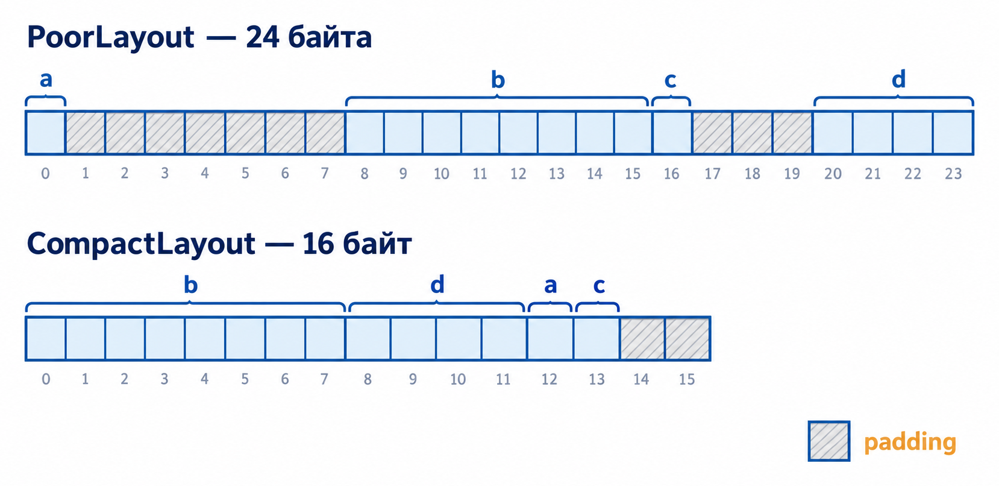

::: {.content-visible unless-format="revealjs"}

[Открыть слайды](../slides/lectures/04-struct-union.html){.btn .btn-outline-primary target="_blank"}

:::

## План лекции

- Структуры: объявление, инициализация, вложенность
- Операции со структурами и передача в функции
- Размещение в памяти: padding, выравнивание, упаковка
- Объединения, tagged union и `std::variant`
- Измерение производительности

## Зачем нужны структуры {.compact-code}

::: {.added}

```cpp
std::string first_name = "Ivan";
std::string first_surname = "Ivanov";
int first_age = 19;
std::string first_phone = "+79001234567";

std::string second_name = "Petr";
std::string second_surname = "Petrov";
int second_age = 20;
std::string second_phone = "+79007654321";

void Print(std::string name, std::string surname, int age, std::string phone);

Print(first_name, second_surname, first_age, first_phone);  // ошибка незаметна
```

Эти четыре переменные описывают одного человека, но знает об этом только программист — по префиксу в имени. Компилятор не мешает перепутать поля разных людей.

:::

## Одна сущность — один тип

::: {.added}

```cpp
struct Person {
    std::string name;
    std::string surname;
    int age;
    std::string phone;
};

Person first{"Ivan", "Ivanov", 19, "+79001234567"};
Person second{"Petr", "Petrov", 20, "+79007654321"};

void Print(Person person);

Print(first);
```

Данные человека теперь путешествуют вместе: один объект, одна переменная, один параметр.

:::

## 1. Структуры

Структура — это пользовательский тип, объединяющий несколько связанных полей. Поля могут иметь разные типы и вместе описывать один объект предметной области.

```cpp
struct Point {
    int x;
    int y;
};
```

Объявление `struct Point` создаёт новый тип. Его объекты лежат в памяти так же, как всё остальное — поля подряд, начиная с адреса объекта:

::: {.added}


:::

## Создание объектов

```cpp
Point first;                    // поля не инициализированы
Point second{200, 300};
Point third{.x = 10, .y = 20};
```

Инициализация с именами полей (designated initializers) пришла в C++20 из C99 — но в урезанном виде:

::: {.added .fragment}

- **Строгий порядок.** `Point p{.y = 20, .x = 10};` — в C можно, в C++ нельзя
- **Никаких массивов.** `int arr[5] = {[2] = 10, [4] = 20};` — только в C
- **Никакого смешивания.** `Point p{10, .y = 20};` — только в C

:::

## Доступ к полям

Для обращения к полю обычного объекта используется оператор `.`:

```{.cpp filename="point-structure.cpp"}

```

[{.godbolt-link-image width="32"}][godbolt-04-point-structure]{aria-label="Open in Compiler Explorer"}

Инициализация `Point point{};` обнуляет оба поля. Если написать только `Point point;`, значения полей фундаментальных типов останутся неопределёнными.

## Вложенные структуры {.compact-code}

Полем структуры может быть объект другого типа:

```{.cpp filename="nested-structures.cpp"}

```

[{.godbolt-link-image width="32"}][godbolt-04-nested-structures]{aria-label="Open in Compiler Explorer"}

`rectangle.left_top.x` — сначала поле `left_top`, затем его `x`.

## Группировка полей {.compact-code}

Безымянные вложенные структуры — нестандартное расширение. Вместо них объявляйте отдельные типы:

```cpp
struct Position {
    int x;
    int y;
};

struct Size {
    std::size_t width;
    std::size_t height;
};

struct Button {
    Position position;
    Size size;
};

Button button{
    .position = {0, 100},
    .size = {400, 80},
};
```

Каждая группа получает имя и смысл: `button.position.x`, `button.size.width`.

## 2. Операции со структурами

Для структуры компилятор генерирует копирование и присваивание, которые обрабатывают каждое поле:

```cpp
Point first{1, 2};
Point second = first;

second.x = 10;
first = second;
```

Если все поля можно копировать, структура целиком также копируема. Можно брать её адрес, передавать в функцию и возвращать из функции. Небольшую структуру удобно передать по значению и вернуть как результат:

## Структуры в функциях {.compact-code .tall-code}

```{.cpp filename="point-functions.cpp"}

```

[{.godbolt-link-image width="32"}][godbolt-04-point-functions]{aria-label="Open in Compiler Explorer"}

## Массивы структур

Структуры можно хранить в массивах так же, как встроенные типы:

```cpp
#include <string>

struct Record {
    std::string name;
    std::string surname;
    long phone;
};

Record phonebook[200]{};
```

Каждый элемент массива — самостоятельный объект `Record` со своими полями.

## Указатели на структуры

Если переменная хранит указатель на структуру, для доступа к полю используется оператор `->`. Выражения `pointer->field` и `(*pointer).field` эквивалентны.

```cpp
#include <cstddef>

Record* FindRecord(long phone, Record* records, std::size_t count) {
    for (std::size_t index = 0; index < count; ++index) {
        if (records[index].phone == phone) {
            return &records[index];
        }
    }

    return nullptr;
}
```

## Использование результата

```cpp
#include <iostream>

Record* record = FindRecord(22345, phonebook, 200);

if (record != nullptr) {
    std::cout << record->name << ' ' << record->surname << '\n';
}
```

`nullptr` здесь — честный ответ «не нашли», и вызывающий код обязан его проверить.

> **Важно:** указатель на элемент массива остаётся действительным только пока существует сам массив и элемент не был перемещён или удалён.

## 3. Размещение структуры в памяти

Поля структуры располагаются в памяти в порядке объявления, но между ними могут находиться неиспользуемые байты — **padding**. Компилятор добавляет их, чтобы каждое поле начиналось с адреса, подходящего для его типа.

::: {.added}



:::

## Два порядка полей {.compact-code}

```{.cpp filename="layout-padding.cpp"}

```

[{.godbolt-link-image width="32"}][godbolt-04-layout-padding]{aria-label="Open in Compiler Explorer"}

::: {.notes}
Живой код: перед запуском попросить зал предсказать оба размера и смещения. На x86-64 и arm64 — `24/8 16/8` и `0 8 16 20`.
:::

## Правила выравнивания

1. Адрес каждого поля должен быть кратен выравниванию его типа.
2. Общий размер структуры округляется до значения, кратного выравниванию структуры.
3. Благодаря этому объекты структуры можно располагать подряд в массиве.

На x86-64 и arm64 `PoorLayout` занимает 24 байта, а `CompactLayout` — 16. Точные значения зависят от ABI, компилятора и целевой платформы.

## Порядок полей

Группировка полей от большего выравнивания к меньшему часто сокращает padding. Однако менять порядок только ради размера стоит после измерений: логическая структура типа и совместимость формата данных могут быть важнее нескольких байтов.

::: {.added .fragment}

В ядре Linux для поиска таких дыр есть инструмент с говорящим названием **`pahole`** — *poke-a-hole*. Патчи вида «переставили два поля — минус 8 байт на объект» там обычное дело: на миллионе объектов это мегабайты, а на горячем пути — лишние кеш-линии.

:::

## Пустая структура

::: {.added}

```{.cpp filename="empty-struct.cpp"}

```

[{.godbolt-link-image width="32"}][godbolt-04-empty-struct]{aria-label="Open in Compiler Explorer"}

`sizeof(Empty)` равен 1, а не 0: у каждого объекта должен быть собственный адрес, иначе два `Empty` подряд в массиве были бы неразличимы. Поэтому `WithEmpty` — 8 байт: один байт пустого поля, три байта padding и `int`.

:::

## Битовые поля

::: {.added}

```{.cpp filename="bit-fields.cpp"}

```

[{.godbolt-link-image width="32"}][godbolt-04-bit-fields]{aria-label="Open in Compiler Explorer"}

Три поля делят один `unsigned`: 4 байта вместо 12. Цена — переполнение обрезается молча, а взять адрес битового поля нельзя.

:::

## Уплотнение {.compact-code}

Некоторые компиляторы позволяют отключить обычное выравнивание:

```{.cpp filename="packed-layout.cpp"}

```

[{.godbolt-link-image width="32"}][godbolt-04-packed-layout]{aria-label="Open in Compiler Explorer"}

Объект занимает 14 байт — сумму размеров полей. Но `#pragma pack` не является частью стандарта C++ и оправдан лишь для внешних бинарных форматов и сетевых протоколов — с учётом порядка байтов.

::: {.added .fragment}

На x86 невыровненное чтение просто медленнее. На части ARM-процессоров оно завершается `SIGBUS` — «у меня на ноутбуке работало» здесь буквально.

:::

## Увеличенное выравнивание

Ключевое слово `alignas` задаёт более строгое требование к выравниванию:

```cpp
struct alignas(64) CacheAlignedData {
    char a;
    std::int64_t b;
    std::uint8_t c;
    std::uint32_t d;
};
```

Такой объект будет начинаться с адреса, кратного 64. Это применяется в низкоуровневых оптимизациях, например для размещения данных по границе кеш-линии. Использовать подобное выравнивание без измерений не следует.

## 4. Объединения

Объединение `union` похоже на структуру, но все его поля используют **одну** область памяти. Размер объединения — размер самого крупного поля с учётом выравнивания.

::: {.added}


:::

## Активный член

В каждый момент времени активным считается только одно поле. Запись в поле делает его активным:

```{.cpp filename="union-value.cpp"}

```

[{.godbolt-link-image width="32"}][godbolt-04-union-value]{aria-label="Open in Compiler Explorer"}

## Чтение неактивного члена

> **Важно:** чтение неактивного поля `union` в общем случае — неопределённое поведение в C++. `union` нельзя использовать как переносимый способ переосмыслить биты одного типа как другой.

Для безопасного копирования битового представления применяют `std::memcpy`, а для типов одинакового размера в C++20 — `std::bit_cast`:

```cpp
#include <bit>
#include <cstdint>

float real = 3.14F;
std::uint32_t bits = std::bit_cast<std::uint32_t>(real);
```

## Tagged union: данные {.compact-code}

Само объединение не хранит информацию о том, какое поле активно. Опишем фигуры, между которыми будем выбирать:

```cpp
struct Point {
    float x;
    float y;
};

struct Triangle {
    Point a;
    Point b;
    Point c;
};

struct Rectangle {
    Point left_top;
    Point right_bottom;
};

struct Circle {
    Point center;
    float radius;
};
```

## Tagged union: тег

Информацию об активном поле добавляем отдельно — в виде тега:

```cpp
enum class FigureType {
    Triangle,
    Rectangle,
    Circle,
};

union FigureData {
    Triangle triangle;
    Rectangle rectangle;
    Circle circle;
};

struct Figure {
    FigureType type;
    FigureData data;
};
```

## Как работать с tagged union

::: {.added}


:::

Код, работающий с `Figure`, обязан проверять `type` и обращаться только к соответствующему полю `data`. Ошибка в теге — чтение неактивного члена.

Преимущество — память выделяется под самый большой вариант, а не под все фигуры сразу. Цена — ручное управление активным полем и временем жизни сложных объектов.

## `std::variant`

В современном C++ безопасная альтернатива tagged union — `std::variant`:

```cpp
#include <variant>

using Figure = std::variant<Triangle, Rectangle, Circle>;

Figure figure = Circle{
    .center = {0.0F, 0.0F},
    .radius = 10.0F,
};
```

`std::variant` сам хранит тег и контролирует время жизни активного объекта. Для обработки вариантов используются `std::get`, `std::get_if` и `std::visit`.

## 5. Измерение производительности {.compact-code}

Предположение об оптимизации нужно подтверждать измерением. Для небольших фрагментов удобны Google Benchmark и онлайн-сервис [Quick Bench](https://quick-bench.com/). Сравним поиск в `phonebook` по фамилии и по номеру:

```cpp
#include <benchmark/benchmark.h>

static void NameComparison(benchmark::State& state) {
    for (auto _ : state) {
        benchmark::DoNotOptimize(FindByName("Ivanov", phonebook, 200));
    }
}

static void IntComparison(benchmark::State& state) {
    for (auto _ : state) {
        benchmark::DoNotOptimize(FindRecord(22345, phonebook, 200));
    }
}

BENCHMARK(NameComparison);
BENCHMARK(IntComparison);
BENCHMARK_MAIN();
```

::: {.notes}
`FindByName` — та же `FindRecord`, но сравнивает `records[index].surname`. Код рассчитан на Quick Bench: локально без библиотеки benchmark он не собирается.
:::

## Читаем график

{width="62%"}

Сравнение `std::string` примерно в девять раз дороже сравнения `long`. `benchmark::DoNotOptimize` не даёт компилятору выбросить результат как неиспользуемый; библиотека сама делает прогрев, повторы и статистику.

Чтобы сравнение было честным: одинаковые входные данные, оптимизированная сборка, проверка корректности обоих вариантов, повтор на целевой платформе.

## Легенда: `0x5f3759df`

::: {.added}

```cpp
float Q_rsqrt(float number) {
    long i;
    float x2, y;
    const float threehalfs = 1.5F;

    x2 = number * 0.5F;
    y = number;
    i = *(long*)&y;                        // evil floating point bit level hacking
    i = 0x5f3759df - (i >> 1);             // what the ...?
    y = *(float*)&i;
    y = y * (threehalfs - (x2 * y * y));   // 1st iteration
    return y;
}
```

Quake III Arena, 1999: обратный квадратный корень через чтение битов `float` как целого — ровно то, что стандарт называет неопределённым поведением. Бенчмарк был на его стороне: в четыре раза быстрее `1 / sqrt(x)`. Сегодня те же биты получают через `std::bit_cast` — без UB. А корректность, как мы помним, скоростью не покупается.

:::

::: {.notes}
Исторический код, не запускаем: `long` здесь 32-битный, на современных платформах это не соберётся как задумано.

Вопросы залу: чем поле структуры отличается от локальной переменной? В чём разница между `.` и `->`? Почему две структуры с одинаковыми полями занимают разный объём? Зачем padding в конце структуры? Когда нужен `#pragma pack`? Почему чтение неактивного поля `union` небезопасно? Как `std::variant` упрощает работу с альтернативами? Зачем в бенчмарке `DoNotOptimize`?
:::


[godbolt-04-point-structure]: <https://godbolt.org/#g:!((g:!((h:codeEditor,i:(j:1,lang:c%2B%2B,options:(compileOnChange:'0'),source:'%23include+%3Ciostream%3E%0A%0Astruct+Point+%7B%0A++++int+x%3B%0A++++int+y%3B%0A%7D%3B%0A%0Aint+main()+%7B%0A++++Point+point%7B%7D%3B%0A++++point.x+%3D+200%3B%0A++++point.y+%3D+250%3B%0A%0A++++std::cout+%3C%3C+point.x+%3C%3C+!'+!'+%3C%3C+point.y+%3C%3C+!'%5Cn!'%3B%0A%0A++++return+0%3B%0A%7D%0A'),l:'5'),(h:executor,i:(compilationPanelShown:'0',compiler:clang2310,compilerOutShown:'0',lang:c%2B%2B,libs:!(),options:'-std%3Dc%2B%2B20+-O0',source:1,tree:0),l:'5')),l:'2')),version:4>
<!-- godbolt source="../examples/04-struct-union/point-structure.cpp" compiler="clang2310" options="-std=c++20 -O0" -->

[godbolt-04-nested-structures]: <https://godbolt.org/#g:!((g:!((h:codeEditor,i:(j:1,lang:c%2B%2B,options:(compileOnChange:'0'),source:'%23include+%3Ciostream%3E%0A%0Astruct+Point+%7B%0A++++int+x%3B%0A++++int+y%3B%0A%7D%3B%0A%0Astruct+Rectangle+%7B%0A++++Point+left_top%3B%0A++++Point+right_bottom%3B%0A%7D%3B%0A%0Aint+main()+%7B%0A++++Rectangle+rectangle%7B.left_top+%3D+%7B0,+100%7D,+.right_bottom+%3D+%7B200,+0%7D%7D%3B%0A%0A++++rectangle.left_top.x+%3D+10%3B%0A++++std::cout+%3C%3C+rectangle.left_top.x+%3C%3C+!'%5Cn!'%3B%0A%0A++++return+0%3B%0A%7D%0A'),l:'5'),(h:executor,i:(compilationPanelShown:'0',compiler:clang2310,compilerOutShown:'0',lang:c%2B%2B,libs:!(),options:'-std%3Dc%2B%2B20+-O0',source:1,tree:0),l:'5')),l:'2')),version:4>
<!-- godbolt source="../examples/04-struct-union/nested-structures.cpp" compiler="clang2310" options="-std=c++20 -O0" -->

[godbolt-04-point-functions]: <https://godbolt.org/#g:!((g:!((h:codeEditor,i:(j:1,lang:c%2B%2B,options:(compileOnChange:'0'),source:'%23include+%3Ciostream%3E%0A%0Astruct+Point+%7B%0A++++int+x%3B%0A++++int+y%3B%0A%7D%3B%0A%0APoint+MakePoint(int+x,+int+y)+%7B%0A++++return+Point%7B.x+%3D+x,+.y+%3D+y%7D%3B%0A%7D%0A%0APoint+Add(Point+left,+Point+right)+%7B%0A++++return+Point%7B%0A++++++++.x+%3D+left.x+%2B+right.x,%0A++++++++.y+%3D+left.y+%2B+right.y,%0A++++%7D%3B%0A%7D%0A%0Aint+main()+%7B%0A++++Point+first+%3D+MakePoint(239,+1)%3B%0A++++Point+second%7B1,+2%7D%3B%0A++++Point+sum+%3D+Add(first,+second)%3B%0A%0A++++std::cout+%3C%3C+sum.x+%3C%3C+!'+!'+%3C%3C+sum.y+%3C%3C+!'%5Cn!'%3B%0A%0A++++return+0%3B%0A%7D%0A'),l:'5'),(h:executor,i:(compilationPanelShown:'0',compiler:clang2310,compilerOutShown:'0',lang:c%2B%2B,libs:!(),options:'-std%3Dc%2B%2B20+-O0',source:1,tree:0),l:'5')),l:'2')),version:4>
<!-- godbolt source="../examples/04-struct-union/point-functions.cpp" compiler="clang2310" options="-std=c++20 -O0" -->

[godbolt-04-layout-padding]: <https://godbolt.org/#g:!((g:!((h:codeEditor,i:(j:1,lang:c%2B%2B,options:(compileOnChange:'0'),source:'%23include+%3Ccstddef%3E%0A%23include+%3Ccstdint%3E%0A%23include+%3Ciostream%3E%0A%0Astruct+PoorLayout+%7B%0A++++char+a%3B+++++++++++//+1+%D0%B1%D0%B0%D0%B9%D1%82%0A++++std::int64_t+b%3B+++//+8+%D0%B1%D0%B0%D0%B9%D1%82%0A++++std::uint8_t+c%3B+++//+1+%D0%B1%D0%B0%D0%B9%D1%82%0A++++std::uint32_t+d%3B++//+4+%D0%B1%D0%B0%D0%B9%D1%82%D0%B0%0A%7D%3B%0A%0Astruct+CompactLayout+%7B%0A++++std::int64_t+b%3B+++//+8+%D0%B1%D0%B0%D0%B9%D1%82%0A++++std::uint32_t+d%3B++//+4+%D0%B1%D0%B0%D0%B9%D1%82%D0%B0%0A++++char+a%3B+++++++++++//+1+%D0%B1%D0%B0%D0%B9%D1%82%0A++++std::uint8_t+c%3B+++//+1+%D0%B1%D0%B0%D0%B9%D1%82%0A%7D%3B%0A%0Aint+main()+%7B%0A++++std::cout+%3C%3C+sizeof(PoorLayout)+%3C%3C+!'/!'+%3C%3C+alignof(PoorLayout)+%3C%3C+!'+!'%0A++++++++++++++%3C%3C+sizeof(CompactLayout)+%3C%3C+!'/!'+%3C%3C+alignof(CompactLayout)+%3C%3C+!'%5Cn!'%3B%0A++++std::cout+%3C%3C+offsetof(PoorLayout,+a)+%3C%3C+!'+!'+%3C%3C+offsetof(PoorLayout,+b)+%3C%3C+!'+!'%0A++++++++++++++%3C%3C+offsetof(PoorLayout,+c)+%3C%3C+!'+!'+%3C%3C+offsetof(PoorLayout,+d)+%3C%3C+!'%5Cn!'%3B%0A%0A++++return+0%3B%0A%7D%0A'),l:'5'),(h:executor,i:(compilationPanelShown:'0',compiler:clang2310,compilerOutShown:'0',lang:c%2B%2B,libs:!(),options:'-std%3Dc%2B%2B20+-O0',source:1,tree:0),l:'5')),l:'2')),version:4>
<!-- godbolt source="../examples/04-struct-union/layout-padding.cpp" compiler="clang2310" options="-std=c++20 -O0" -->

[godbolt-04-empty-struct]: <https://godbolt.org/#g:!((g:!((h:codeEditor,i:(j:1,lang:c%2B%2B,options:(compileOnChange:'0'),source:'%23include+%3Ciostream%3E%0A%0Astruct+Empty+%7B%7D%3B%0A%0Astruct+WithEmpty+%7B%0A++++Empty+tag%3B%0A++++int+value%3B%0A%7D%3B%0A%0Aint+main()+%7B%0A++++std::cout+%3C%3C+sizeof(Empty)+%3C%3C+!'%5Cn!'%3B%0A++++std::cout+%3C%3C+sizeof(WithEmpty)+%3C%3C+!'%5Cn!'%3B%0A%0A++++return+0%3B%0A%7D%0A'),l:'5'),(h:executor,i:(compilationPanelShown:'0',compiler:clang2310,compilerOutShown:'0',lang:c%2B%2B,libs:!(),options:'-std%3Dc%2B%2B20+-O0',source:1,tree:0),l:'5')),l:'2')),version:4>
<!-- godbolt source="../examples/04-struct-union/empty-struct.cpp" compiler="clang2310" options="-std=c++20 -O0" -->

[godbolt-04-bit-fields]: <https://godbolt.org/#g:!((g:!((h:codeEditor,i:(j:1,lang:c%2B%2B,options:(compileOnChange:'0'),source:'%23include+%3Ciostream%3E%0A%0Astruct+Flags+%7B%0A++++unsigned+visible+:+1%3B%0A++++unsigned+enabled+:+1%3B%0A++++unsigned+level+:+4%3B++//+%D0%B7%D0%BD%D0%B0%D1%87%D0%B5%D0%BD%D0%B8%D1%8F+0..15%0A%7D%3B%0A%0Aint+main()+%7B%0A++++Flags+flags%7B.visible+%3D+1,+.enabled+%3D+0,+.level+%3D+9%7D%3B%0A%0A++++std::cout+%3C%3C+sizeof(Flags)+%3C%3C+!'%5Cn!'%3B%0A++++std::cout+%3C%3C+flags.level+%3C%3C+!'%5Cn!'%3B%0A%0A++++flags.level+%2B%3D+7%3B++//+16+%D0%BD%D0%B5+%D0%BF%D0%BE%D0%BC%D0%B5%D1%89%D0%B0%D0%B5%D1%82%D1%81%D1%8F+%D0%B2+4+%D0%B1%D0%B8%D1%82%D0%B0:+%D0%BE%D1%81%D1%82%D0%B0%D1%91%D1%82%D1%81%D1%8F+0%0A++++std::cout+%3C%3C+flags.level+%3C%3C+!'%5Cn!'%3B%0A%0A++++return+0%3B%0A%7D%0A'),l:'5'),(h:executor,i:(compilationPanelShown:'0',compiler:clang2310,compilerOutShown:'0',lang:c%2B%2B,libs:!(),options:'-std%3Dc%2B%2B20+-O0',source:1,tree:0),l:'5')),l:'2')),version:4>
<!-- godbolt source="../examples/04-struct-union/bit-fields.cpp" compiler="clang2310" options="-std=c++20 -O0" -->

[godbolt-04-packed-layout]: <https://godbolt.org/#g:!((g:!((h:codeEditor,i:(j:1,lang:c%2B%2B,options:(compileOnChange:'0'),source:'%23include+%3Ccstdint%3E%0A%23include+%3Ciostream%3E%0A%0A%23pragma+pack(push,+1)%0A%0Astruct+PackedData+%7B%0A++++char+a%3B%0A++++std::int64_t+b%3B%0A++++std::uint8_t+c%3B%0A++++std::uint32_t+d%3B%0A%7D%3B%0A%0A%23pragma+pack(pop)%0A%0Aint+main()+%7B%0A++++std::cout+%3C%3C+sizeof(PackedData)+%3C%3C+!'+!'+%3C%3C+alignof(PackedData)+%3C%3C+!'%5Cn!'%3B%0A%0A++++return+0%3B%0A%7D%0A'),l:'5'),(h:executor,i:(compilationPanelShown:'0',compiler:clang2310,compilerOutShown:'0',lang:c%2B%2B,libs:!(),options:'-std%3Dc%2B%2B20+-O0',source:1,tree:0),l:'5')),l:'2')),version:4>
<!-- godbolt source="../examples/04-struct-union/packed-layout.cpp" compiler="clang2310" options="-std=c++20 -O0" -->

[godbolt-04-union-value]: <https://godbolt.org/#g:!((g:!((h:codeEditor,i:(j:1,lang:c%2B%2B,options:(compileOnChange:'0'),source:'%23include+%3Ccstdint%3E%0A%23include+%3Ciostream%3E%0A%0Aunion+Value+%7B%0A++++std::int64_t+integer%3B%0A++++double+real%3B%0A++++char+text%5B16%5D%3B%0A%7D%3B%0A%0Aint+main()+%7B%0A++++Value+value%7B%7D%3B%0A++++std::cout+%3C%3C+sizeof(value)+%3C%3C+!'%5Cn!'%3B%0A%0A++++value.integer+%3D+239%3B%0A++++std::cout+%3C%3C+value.integer+%3C%3C+!'%5Cn!'%3B++//+%D0%B0%D0%BA%D1%82%D0%B8%D0%B2%D0%B5%D0%BD+integer%0A%0A++++value.real+%3D+3.14%3B%0A++++std::cout+%3C%3C+value.real+%3C%3C+!'%5Cn!'%3B++//+%D1%82%D0%B5%D0%BF%D0%B5%D1%80%D1%8C+%D0%B0%D0%BA%D1%82%D0%B8%D0%B2%D0%B5%D0%BD+real%0A%0A++++return+0%3B%0A%7D%0A'),l:'5'),(h:executor,i:(compilationPanelShown:'0',compiler:clang2310,compilerOutShown:'0',lang:c%2B%2B,libs:!(),options:'-std%3Dc%2B%2B20+-O0',source:1,tree:0),l:'5')),l:'2')),version:4>
<!-- godbolt source="../examples/04-struct-union/union-value.cpp" compiler="clang2310" options="-std=c++20 -O0" -->
