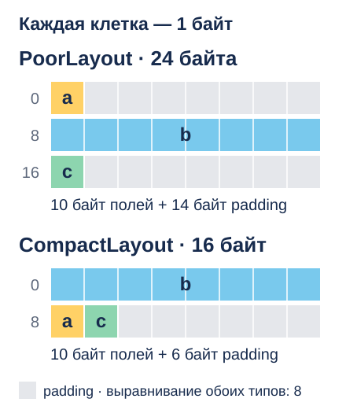
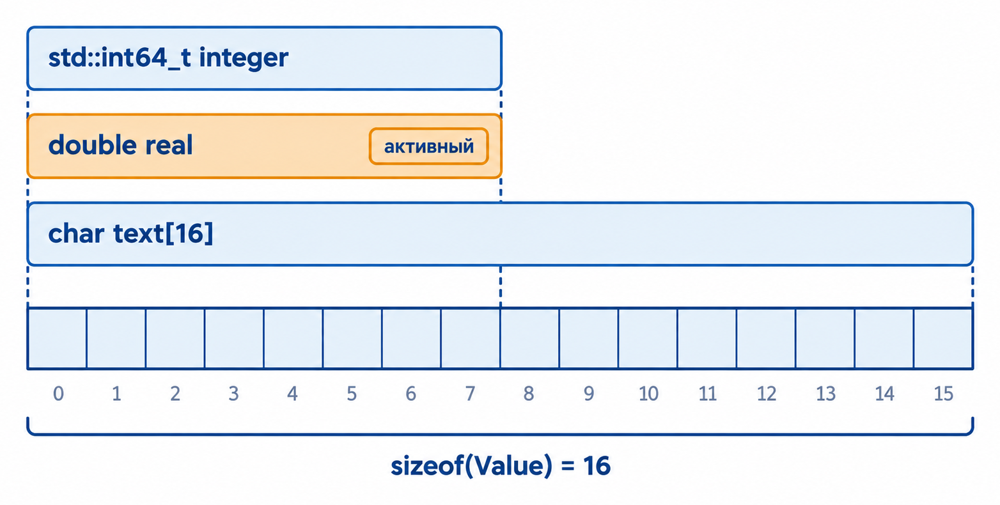
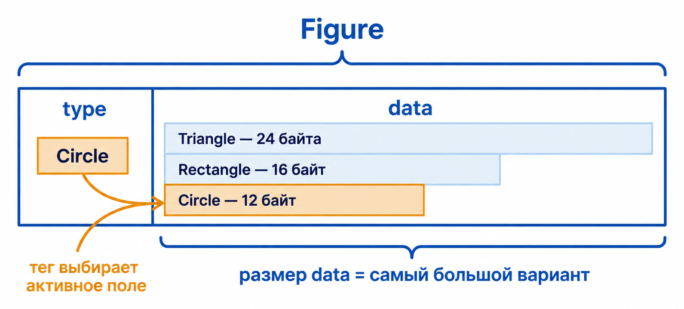
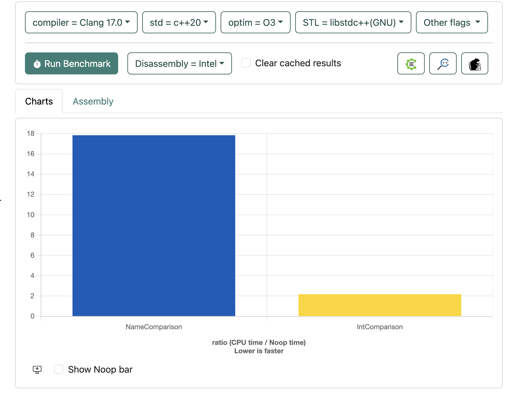

::: {.content-visible unless-format="revealjs"}

[Открыть слайды](../slides/lectures/04-struct-union.html){.btn .btn-outline-primary target="_blank"}

:::

## План лекции

- Объявление, инициализация и вложенность структур
- Операции со структурами и передача в функции
- Размещение в памяти, выравнивание и padding
- Объединения, tagged union и `std::variant`
- Базовые измерения производительности


## Точки

```{.cpp filename="points-without-structure.cpp"}

```

Какие `x` и `y` образуют одну точку, знаем только мы.

## 1. Структуры

Структура объединяет связанные поля в один пользовательский тип. Координаты точки теперь передаются вместе:

```{.cpp filename="points-with-structure.cpp"}

```

[{.godbolt-link-image width="32"}][godbolt-04-points-with-structure]{aria-label="Open in Compiler Explorer"}

## Инициализация структур

```{.cpp filename="designated-initializers.cpp"}

```

[{.godbolt-link-image width="32"}][godbolt-04-designated-initializers]{aria-label="Open in Compiler Explorer"}

В C++20 именованные поля перечисляются **в порядке объявления**. Можно пропускать поля, но нельзя смешивать именованные и позиционные инициализаторы.

## Доступ к полям

Для обращения к полю обычного объекта используется оператор `.`:

```{.cpp filename="point-structure.cpp"}

```

[{.godbolt-link-image width="32"}][godbolt-04-point-structure]{aria-label="Open in Compiler Explorer"}

## Вложенные структуры

Полем структуры может быть объект другого пользовательского типа. Так можно собирать более сложные модели из простых компонентов:

```{.cpp filename="nested-structures.cpp"}

```

[{.godbolt-link-image width="32"}][godbolt-04-nested-structures]{aria-label="Open in Compiler Explorer"}

Выражение `rectangle.left_top.x` последовательно выбирает поле `left_top`, а затем его координату `x`.

## Группировка полей

```cpp
struct Position {
    int x;
    int y;
};

struct Size {
    std::size_t width;
    std::size_t height;
};

struct Button {
    Position position;
    Size size;
};

Button button{
    .position = {0, 100},
    .size = {400, 80},
};
```

## 2. Операции со структурами

Для структуры компилятор  генерирует операции копирования и присваивания по умолчанию, которые обрабатывают каждое поле:

```cpp
Point first{1, 2};
Point second = first;

second.x = 10;
first = second;
```

Если все поля можно копировать, структура целиком также копируема. Можно брать её адрес, передавать в функцию и возвращать из функции.

## Структуры в функциях

```{.cpp filename="point-functions.cpp"}

```

[{.godbolt-link-image width="32"}][godbolt-04-point-functions]{aria-label="Open in Compiler Explorer"}

> Крупные объекты можно передавать без копирования — по константной ссылке. Этот способ разберём, когда изучим ссылки.

## Массивы структур

Структуры можно хранить в массивах так же, как встроенные типы:

```cpp
#include <string>

struct Record {
    std::string name;
    std::string surname;
    long phone;
};

Record phonebook[200]{};
```

Каждый элемент массива — самостоятельный объект `Record` со своими полями.

## Указатели на структуры

Если переменная хранит указатель на структуру, для доступа к полю используется оператор `->`. Выражения `pointer->field` и `(*pointer).field` эквивалентны.

```cpp
#include <cstddef>

Record* FindRecord(long phone, Record* records, std::size_t count) {
    for (std::size_t index = 0; index < count; ++index) {
        if (records[index].phone == phone) {
            return &records[index];
        }
    }

    return nullptr;
}
```

Использование результата:

```cpp
#include <iostream>

Record* record = FindRecord(22345, phonebook, 200);

if (record != nullptr) {
    std::cout << record->name << ' ' << record->surname << '\n';
}
```

> **Важно:** указатель на элемент массива остаётся действительным только пока существует сам массив и элемент не был перемещён или удалён.

## Размещение структуры в памяти

:::: {.columns}
::: {.column width="72%"}

```{.cpp filename="structure-layout.cpp"}

```

[{.godbolt-link-image width="32"}][godbolt-04-structure-layout]{aria-label="Open in Compiler Explorer"}

:::
::: {.column width="28%"}

{fig-alt="Схема размещения байтов для PoorLayout и CompactLayout при выравнивании int64_t по 8 байтам." fig-cap=""}

:::
::::

**Выравнивание** задаёт допустимые адреса для корректного и эффективного доступа: при `alignof(T) == 8` адрес кратен 8.

**Padding** — промежутки для выравнивания полей. Размер `PoorLayout` округляется с 17 до 24 байт, чтобы выравнивание сохранялось и в массиве.

::: {.notes}

Здесь предполагается платформа с sizeof(int64_t) == 8 и alignof(int64_t) == 8; начало структуры тоже выровнено по 8. Требования определяются реализацией и ABI. Выравнивание не следует путать с размером типа: они не обязаны совпадать.

Это правило размещения объектов, а не обещание, что любой невыровненный доступ на любом процессоре обязательно будет медленнее.

Источник: [C++ — требования выравнивания](https://eel.is/c++draft/basic.align).

Между a и b компилятор оставляет 7 байт padding, чтобы b начиналось с подходящего адреса. Эти байты не принадлежат ни одному полю.

Без завершающего padding второй элемент начинался бы со смещения 17, а его поле b — со смещения 25, не кратного 8. С padding это смещения 24 и 32. Начало массива предполагается выровненным по 8.

Перестановка полей сокращает промежутки: CompactLayout занимает 16 байт вместо 24.

:::

## Уплотнение

:::: {.columns}
::: {.column width="72%"}

```{.cpp filename="packed-layout.cpp"}

```

[{.godbolt-link-image width="32"}][godbolt-04-packed-layout]{aria-label="Open in Compiler Explorer"}

:::
::: {.column width="28%"}

Типичный вывод:

```text
type: size alignment value-offset
Data: 8 4 4
PackedData: 5 1 1
```

`#pragma pack(1)` убирает padding: поле `value` начинается сразу после `tag`.

**Меньше памяти, но доступ к полям может стать медленнее.** Проверим это бенчмарком.

::: {.notes}

#pragma pack — расширение компилятора. При работе с бинарными форматами также необходимо учитывать порядок байтов.

:::

:::
::::

## Меньше памяти — медленнее обработка?

`#pragma pack(1)` уменьшает структуру с **8 до 5 байт**, но поле `value` теперь может быть невыровненным. Сравним скорость суммирования этих полей.

```{.cpp filename="packing-benchmark-types.h"}

```

**Пример:** 4096 элементов занимают 32 КиБ или 20 КиБ. Значения одинаковые — измеряем время вычисления одной и той же суммы.

## Выравнивание: сравниваем скорость

:::: {.columns}
::: {.column width="50%"}

**Обычная структура · 32 КиБ**

```{.cpp filename="packing-benchmark.cpp" code-line-numbers="5-6"}

```

:::
::: {.column width="50%"}

**Уплотнённая структура · 20 КиБ**

```{.cpp filename="packed-sum-benchmark.cpp" code-line-numbers="5-6"}

```

:::
::::

[ Запустить · Quick Bench][quick-bench-packing]{.quick-bench-button target="_blank" rel="noopener" aria-label="Открыть оба теста выравнивания в Quick Bench"}

**Кеш-линия** — блок данных в кеше процессора.

**Почему может быть медленнее:** невыровненное поле может пересечь границу кеш-линии — процессору придётся читать части значения из двух линий. Но уплотнение экономит кеш, поэтому замедление не гарантировано.

::: {.notes}

Сборка: C++23, -O3, Google Benchmark. Заголовок packing-benchmark-types.h лежит рядом с исходниками. Ссылка Quick Bench содержит оба теста и определение типов в одном файле, выбирает GCC 13.2, C++23 и -O3.

Суммируем одинаковые 4096 значений. Отличается только размещение данных. Создание и заполнение массива находятся вне измеряемого цикла.

Источник: [Intel VTune: split loads](https://www.intel.com/content/www/us/en/docs/vtune-profiler/user-guide/2024-2/cpu-metrics-reference.html).

DoNotOptimize передаёт адрес массива оптимизатору как используемый; ClobberMemory не позволяет считать его содержимое неизменным между итерациями. Итоговая сумма тоже используется через DoNotOptimize.

Эксперимент измеряет общий эффект уплотнения: выравнивание, плотность данных и возможные различия в векторизации. Невыровненное поле может пересечь границу кеш-линии. Однако меньший массив лучше помещается в кеш, поэтому результат зависит от процессора и параметров сборки.

:::

## `alignas`: зачем увеличивать выравнивание

:::: {.columns}
::: {.column width="72%"}

```{.cpp filename="increased-alignment.cpp"}

```

[{.godbolt-link-image width="32"}][godbolt-04-increased-alignment]{aria-label="Open in Compiler Explorer"}

:::
::: {.column width="28%"}

Типичный вывод (размер и выравнивание):

```text
Data: 4 4
AlignedData: 64 64
array size: 128
address % 64: 0
address % 64: 0
```

`alignas(64)` размещает каждый элемент на границе 64 байт. Цена: 64 байта вместо 4.

**Зачем:** разнести данные, которые разные потоки часто изменяют, по разным кеш-линиям.

:::
::::

При размере кеш-линии **64 байта** элементы `items` занимают разные линии и избегают *false sharing*.

**Как выбрать:** `alignas(std::hardware_destructive_interference_size)` — константа из `<new>` (C++17), рекомендуемое расстояние между независимо изменяемыми объектами. `64` в примере — выбор для конкретной платформы.

::: {.notes}

Без увеличенного выравнивания соседние четырёхбайтовые объекты могут попасть в одну кеш-линию. Когда разные ядра меняют каждый свой объект, протокол согласования кешей всё равно работает с целой линией. Разделение объектов по линиям помогает избежать этих лишних взаимодействий.

В этом примере показано размещение, а не многопоточный бенчмарк. Размер кеш-линии зависит от платформы; 64 байта здесь — условие примера, а не гарантия языка. Увеличение выравнивания само по себе не гарантирует ускорения и повышает расход памяти.

Значение std::hardware_destructive_interference_size определяется реализацией при компиляции, а не измеряется при запуске. Если библиотека не предоставляет константу (проверка __cpp_lib_hardware_interference_size), выравнивание выбирают по целевой платформе.

Источник: [стандарт C++, hardware interference size](https://www.open-std.org/jtc1/sc22/wg21/docs/papers/2023/n4950.pdf).

Ещё одна причина — требования отдельных SIMD-инструкций к выравниванию данных: они обрабатывают несколько чисел за одну инструкцию. Требуемая граница зависит от инструкции.

Источники: [Arm: false sharing и выравнивание](https://learn.arm.com/learning-paths/servers-and-cloud-computing/false-sharing-arm-spe/how-to-1/), [Microsoft: выравнивание данных](https://learn.microsoft.com/en-us/cpp/cpp/align-cpp?view=msvc-170).

:::

## 4. Объединения

Поля `union` используют одну область памяти. В каждый момент активно только одно поле.

:::: {.columns}
::: {.column width="36%"}

```{.cpp filename="union-definition.h"}

```

:::
::: {.column width="64%"}

{fig-cap=""}

:::
::::

Размер достаточен для самого крупного поля с учётом выравнивания. На схеме — типичная раскладка `Value` размером 16 байт.

## Активное поле объединения

```{.cpp filename="union-value.cpp"}

```

[{.godbolt-link-image width="32"}][godbolt-04-union-value]{aria-label="Open in Compiler Explorer"}

> **Важно:** чтение неактивного поля обычного `union` в общем случае приводит к неопределённому поведению в C++. union — инструмент совместного хранения альтернативных объектов, а не переносимый инструмент для преобразования битов между несвязанными типами.

Для безопасного копирования битового представления применяют `std::memcpy`, а для типов одинакового размера в C++20 доступен `std::bit_cast`.

## Tagged union: данные

```{.cpp filename="figure-shapes.h"}

```

## Tagged union: тег

```{.cpp filename="tagged-figure.h"}

```

## Массив разных фигур

:::: {.columns}
::: {.column width="50%"}

```{.cpp filename="tagged-union-use.cpp"}

```

[{.godbolt-link-image width="32"}][godbolt-04-tagged-union-use]{aria-label="Open in Compiler Explorer"}

:::
::: {.column width="50%"}

{fig-cap=""}

:::
::::

::: {.notes}

Тег сообщает, какое поле нужно читать. Изменение одного тега не переключает активное поле: программа поддерживает их согласованность. Массив figures хранит круг, прямоугольник и треугольник как элементы одного типа Figure. Каждый элемент содержит собственный тег и одну фигуру. В цикле switch выбирает соответствующее поле data; геометрические данные остальных вариантов не читаются. Элементы передаются в переменную цикла по значению: ссылки ещё не изучались.

Размеры на схеме приведены для платформы с четырёхбайтовым float.

:::

## `std::variant`

В современном C++ безопасной альтернативой tagged union является `std::variant`:

```cpp
#include <variant>

using Figure = std::variant<Triangle, Rectangle, Circle>;

Figure figure = Circle{
    .center = {0.0F, 0.0F},
    .radius = 10.0F,
};
```

`std::variant` самостоятельно хранит тег и контролирует время жизни активного объекта. Для обработки вариантов используются `std::get`, `std::get_if` и `std::visit`.

## Код из 2005 года

```{.cpp filename="name-comparison.h" code-line-numbers="6-9,17-20|10-12,23-28"}

```

Чтение неактивного поля `union` — UB в ISO C++; здесь используется расширение GCC.

::: {.notes}

Сравним два способа проверки равенства `Name`, как в [исходной презентации](https://docs.google.com/presentation/d/1T35d8A7BWSHqhICtrK9d_z1-EnlnLThijbci3W6qvro/edit#slide=id.g13934380987_0_70): через строки и через четыре целых числа.

Сначала подсвечены поля text и NameCompare, затем поля words и IntCompare.

[GCC поддерживает чтение неактивного члена union как расширение](https://gcc.gnu.org/onlinedocs/gcc/Optimize-Options.html#index-fstrict-aliasing). Эксперимент требует компилятора с поддержкой этого приёма.

Сравнение всех байтов эквивалентно сравнению строк только при одинаковом заполнении байтов после `\0`. В нашем примере строки заполняют массивы целиком, включая терминатор.

:::

## Google Benchmark: строки и целые числа

:::: {.columns}
::: {.column width="50%"}

**Строки**

```{.cpp filename="name-comparison-benchmark.cpp"}

```

:::
::: {.column width="50%"}

**Целые числа**

```{.cpp filename="integer-comparison-benchmark.cpp"}

```

:::
::::

[ Запустить · Quick Bench][quick-bench-name-comparison]{.quick-bench-button target="_blank" rel="noopener" aria-label="Открыть код обоих бенчмарков в Quick Bench"} · [Код обоих тестов](../examples/04-struct-union/name-comparison-quick-bench.cpp)

Одинаковые данные, разные функции сравнения. Выберите GCC: чтение через `union` использует его расширение.

::: {.notes}

`DoNotOptimize` препятствует удалению результата как неиспользуемого. Для сборки нужна библиотека Google Benchmark; заголовки примера лежат рядом с `.cpp`.

Код обоих тестов, C++20 и `-O2` передаются в ссылке. В правом тесте читается неактивный член union: в ISO C++ это UB, эксперимент использует расширение компилятора.

:::

## Результаты в Quick Bench

[Quick Bench](https://quick-bench.com/) позволяет запускать Google Benchmark в браузере.

{height=360}

В исходном эксперименте сравнение четырёх целых чисел существенно быстрее двух вызовов `strcmp`. Величина выигрыша зависит от данных, компилятора и платформы; пример использует расширение для `union`.

[godbolt-04-point-structure]: <https://godbolt.org/#g:!((g:!((h:codeEditor,i:(j:1,lang:c%2B%2B,options:(compileOnChange:'0'),source:'%23include+%3Ciostream%3E%0A%0Astruct+Point+%7B%0A++++int+x%3B%0A++++int+y%3B%0A%7D%3B%0A%0Aint+main()+%7B%0A++++Point+point%3B+//+%D0%9F%D0%BE%D0%BB%D1%8F+%D0%BD%D0%B5+%D0%B8%D0%BD%D0%B8%D1%86%D0%B8%D0%B0%D0%BB%D0%B8%D0%B7%D0%B8%D1%80%D0%BE%D0%B2%D0%B0%D0%BD%D1%8B+%E2%80%94+%D0%B7%D0%B0%D0%B4%D0%B0%D1%91%D0%BC+%D0%B7%D0%BD%D0%B0%D1%87%D0%B5%D0%BD%D0%B8%D1%8F+%D0%BF%D0%B5%D1%80%D0%B5%D0%B4+%D1%87%D1%82%D0%B5%D0%BD%D0%B8%D0%B5%D0%BC.%0A++++point.x+%3D+200%3B%0A++++point.y+%3D+250%3B%0A%0A++++std::cout+%3C%3C+point.x+%3C%3C+!'+!'+%3C%3C+point.y+%3C%3C+!'%5Cn!'%3B%0A%0A++++return+0%3B%0A%7D%0A'),l:'5'),(h:executor,i:(compilationPanelShown:'0',compiler:clang2310,compilerOutShown:'0',lang:c%2B%2B,libs:!(),options:'-std%3Dc%2B%2B20+-O0',source:1,tree:0),l:'5')),l:'2')),version:4>
<!-- godbolt source="../examples/04-struct-union/point-structure.cpp" compiler="clang2310" options="-std=c++20 -O0" -->

[godbolt-04-nested-structures]: <https://godbolt.org/#g:!((g:!((h:codeEditor,i:(j:1,lang:c%2B%2B,options:(compileOnChange:'0'),source:'%23include+%3Ciostream%3E%0A%0Astruct+Point+%7B%0A++++int+x%3B%0A++++int+y%3B%0A%7D%3B%0A%0Astruct+Rectangle+%7B%0A++++Point+left_top%3B%0A++++Point+right_bottom%3B%0A%7D%3B%0A%0Aint+main()+%7B%0A++++Rectangle+rectangle%7B%0A++++++++.left_top+%3D+%7B0,+100%7D,%0A++++++++.right_bottom+%3D+%7B200,+0%7D,%0A++++%7D%3B%0A%0A++++rectangle.left_top.x+%3D+10%3B%0A++++std::cout+%3C%3C+rectangle.left_top.x+%3C%3C+!'%5Cn!'%3B%0A%0A++++return+0%3B%0A%7D%0A'),l:'5'),(h:executor,i:(compilationPanelShown:'0',compiler:clang2310,compilerOutShown:'0',lang:c%2B%2B,libs:!(),options:'-std%3Dc%2B%2B20+-O0',source:1,tree:0),l:'5')),l:'2')),version:4>
<!-- godbolt source="../examples/04-struct-union/nested-structures.cpp" compiler="clang2310" options="-std=c++20 -O0" -->

[godbolt-04-packed-layout]: <https://godbolt.org/#g:!((g:!((h:codeEditor,i:(j:1,lang:c%2B%2B,options:(compileOnChange:'0'),source:'%23include+%3Ccstddef%3E%0A%23include+%3Ccstdint%3E%0A%23include+%3Ciostream%3E%0A%0Astruct+Data+%7B%0A++++char+tag%3B%0A++++std::int32_t+value%3B%0A%7D%3B%0A%0A%23pragma+pack(push,+1)%0Astruct+PackedData+%7B%0A++++char+tag%3B%0A++++std::int32_t+value%3B%0A%7D%3B%0A%23pragma+pack(pop)%0A%0Aint+main()+%7B%0A++++std::cout+%3C%3C+%22type:+size+alignment+value-offset%5Cn%22%3B%0A++++std::cout+%3C%3C+%22Data:+%22+%3C%3C+sizeof(Data)+%3C%3C+!'+!'+%3C%3C+alignof(Data)%0A++++++++++++++%3C%3C+!'+!'+%3C%3C+offsetof(Data,+value)+%3C%3C+!'%5Cn!'%3B%0A++++std::cout+%3C%3C+%22PackedData:+%22+%3C%3C+sizeof(PackedData)%0A++++++++++++++%3C%3C+!'+!'+%3C%3C+alignof(PackedData)%0A++++++++++++++%3C%3C+!'+!'+%3C%3C+offsetof(PackedData,+value)+%3C%3C+!'%5Cn!'%3B%0A%7D%0A'),l:'5'),(h:executor,i:(compilationPanelShown:'0',compiler:clang2310,compilerOutShown:'0',lang:c%2B%2B,libs:!(),options:'-std%3Dc%2B%2B20+-O0',source:1,tree:0),l:'5')),l:'2')),version:4>
<!-- godbolt source="../examples/04-struct-union/packed-layout.cpp" compiler="clang2310" options="-std=c++20 -O0" -->

[godbolt-04-increased-alignment]: <https://godbolt.org/#g:!((g:!((h:codeEditor,i:(j:1,lang:c%2B%2B,options:(compileOnChange:'0'),source:'%23include+%3Ccstdint%3E%0A%23include+%3Ciostream%3E%0A%0Astruct+Data+%7B%0A++++std::int32_t+value%3B%0A%7D%3B%0A%0Astruct+alignas(64)+AlignedData+%7B%0A++++std::int32_t+value%3B%0A%7D%3B%0A%0Aint+main()+%7B%0A++++AlignedData+items%5B2%5D%7B%7D%3B%0A++++std::cout+%3C%3C+%22Data:+%22+%3C%3C+sizeof(Data)+%3C%3C+!'+!'+%3C%3C+alignof(Data)+%3C%3C+!'%5Cn!'%3B%0A++++std::cout+%3C%3C+%22AlignedData:+%22+%3C%3C+sizeof(AlignedData)%0A++++++++++++++%3C%3C+!'+!'+%3C%3C+alignof(AlignedData)+%3C%3C+!'%5Cn!'%3B%0A++++std::cout+%3C%3C+%22array+size:+%22+%3C%3C+sizeof(items)+%3C%3C+!'%5Cn!'%3B%0A++++for+(const+AlignedData%26+item+:+items)+%7B%0A++++++++auto+address+%3D+reinterpret_cast%3Cstd::uintptr_t%3E(%26item)%3B%0A++++++++std::cout+%3C%3C+%22address+%25+64:+%22+%3C%3C+address+%25+64+%3C%3C+!'%5Cn!'%3B%0A++++%7D%0A%7D%0A'),l:'5'),(h:executor,i:(compilationPanelShown:'0',compiler:clang2310,compilerOutShown:'0',lang:c%2B%2B,libs:!(),options:'-std%3Dc%2B%2B20+-O0',source:1,tree:0),l:'5')),l:'2')),version:4>
<!-- godbolt source="../examples/04-struct-union/increased-alignment.cpp" compiler="clang2310" options="-std=c++20 -O0" -->

[godbolt-04-structure-layout]: <https://godbolt.org/#g:!((g:!((h:codeEditor,i:(j:1,lang:c%2B%2B,options:(compileOnChange:'0'),source:'%23include+%3Ccstddef%3E%0A%23include+%3Ccstdint%3E%0A%23include+%3Ccstdio%3E%0A%0Astruct+PoorLayout+%7B%0A++++char+a%3B%0A++++std::int64_t+b%3B%0A++++char+c%3B%0A%7D%3B%0A%0Astruct+CompactLayout+%7B%0A++++std::int64_t+b%3B%0A++++char+a%3B%0A++++char+c%3B%0A%7D%3B%0A%0Aint+main()+%7B%0A++++std::printf(%22+++++++++++size+align+offset(b)%5Cn%22)%3B%0A++++std::printf(%22Poor:++++++%25zu+++%25zu+++++%25zu%5Cn%22,%0A++++++++sizeof(PoorLayout),+alignof(PoorLayout),+offsetof(PoorLayout,+b))%3B%0A++++std::printf(%22Compact:+++%25zu+++%25zu+++++%25zu%5Cn%22,%0A++++++++sizeof(CompactLayout),+alignof(CompactLayout),+offsetof(CompactLayout,+b))%3B%0A%7D%0A'),l:'5'),(h:executor,i:(compilationPanelShown:'0',compiler:clang2310,compilerOutShown:'0',lang:c%2B%2B,libs:!(),options:'-std%3Dc%2B%2B20+-O0',source:1,tree:0),l:'5')),l:'2')),version:4>
<!-- godbolt source="../examples/04-struct-union/structure-layout.cpp" compiler="clang2310" options="-std=c++20 -O0" -->

[quick-bench-name-comparison]: <https://quick-bench.com/#eyJ0ZXh0IjoiLy8gR2VuZXJhdGVkIGJ5OiBub2RlIHNjcmlwdHMvdXBkYXRlLW5hbWUtYmVuY2htYXJrLm1qc1xuLy8gVW5pb24gdHlwZS1wdW5uaW5nIHJlcXVpcmVzIGEgY29tcGlsZXIgZXh0ZW5zaW9uOyB1bmRlZmluZWQgaW4gSVNPIEMrKy5cbiNpbmNsdWRlIDxiZW5jaG1hcmsvYmVuY2htYXJrLmg+XG5cbiNpbmNsdWRlIDxjc3RkaW50PlxuI2luY2x1ZGUgPGNzdHJpbmc+XG5cbnVuaW9uIE5hbWUge1xuICAgIHN0cnVjdCB7XG4gICAgICAgIGNoYXIgbmFtZVsxM107XG4gICAgICAgIGNoYXIgY29kZVszXTtcbiAgICB9IHRleHQ7XG4gICAgc3RydWN0IHtcbiAgICAgICAgc3RkOjppbnQzMl90IGkxLCBpMiwgaTMsIGk0O1xuICAgIH0gd29yZHM7XG59O1xuXG5zdGF0aWNfYXNzZXJ0KHNpemVvZihOYW1lKSA9PSAxNik7XG5cbmlubGluZSBib29sIE5hbWVDb21wYXJlKGNvbnN0IE5hbWUmIGEsIGNvbnN0IE5hbWUmIGIpIHtcbiAgICByZXR1cm4gc3RkOjpzdHJjbXAoYS50ZXh0Lm5hbWUsIGIudGV4dC5uYW1lKSA9PSAwXG4gICAgICAgICYmIHN0ZDo6c3RyY21wKGEudGV4dC5jb2RlLCBiLnRleHQuY29kZSkgPT0gMDtcbn1cblxuLy8gXHUwNDI3XHUwNDQyXHUwNDM1XHUwNDNkXHUwNDM4XHUwNDM1IFx1MDQzZFx1MDQzNVx1MDQzMFx1MDQzYVx1MDQ0Mlx1MDQzOFx1MDQzMlx1MDQzZFx1MDQzZVx1MDQzM1x1MDQzZSBcdTA0NDdcdTA0M2JcdTA0MzVcdTA0M2RcdTA0MzAgdW5pb246IFx1MDQ0MFx1MDQzMFx1MDQ0MVx1MDQ0OFx1MDQzOFx1MDQ0MFx1MDQzNVx1MDQzZFx1MDQzOFx1MDQzNSBcdTA0M2FcdTA0M2VcdTA0M2NcdTA0M2ZcdTA0MzhcdTA0M2JcdTA0NGZcdTA0NDJcdTA0M2VcdTA0NDBcdTA0MzAsIFVCIFx1MDQzMiBJU08gQysrLlxuaW5saW5lIGJvb2wgSW50Q29tcGFyZShjb25zdCBOYW1lJiBhLCBjb25zdCBOYW1lJiBiKSB7XG4gICAgcmV0dXJuIGEud29yZHMuaTEgPT0gYi53b3Jkcy5pMVxuICAgICAgICAmJiBhLndvcmRzLmkyID09IGIud29yZHMuaTJcbiAgICAgICAgJiYgYS53b3Jkcy5pMyA9PSBiLndvcmRzLmkzXG4gICAgICAgICYmIGEud29yZHMuaTQgPT0gYi53b3Jkcy5pNDtcbn1cblxuXG5cbnN0YXRpYyB2b2lkIE5hbWVDb21wYXJpc29uKGJlbmNobWFyazo6U3RhdGUmIHN0YXRlKSB7XG4gICAgTmFtZSBhey50ZXh0ID0ge1wiMDEyMzQ1Njc4OUFCXCIsIFwiMTJcIn19O1xuICAgIE5hbWUgYnsudGV4dCA9IHtcIjAxMjM0NTY3ODlBQlwiLCBcIjEwXCJ9fTtcblxuICAgIGJlbmNobWFyazo6RG9Ob3RPcHRpbWl6ZShhKTtcbiAgICBiZW5jaG1hcms6OkRvTm90T3B0aW1pemUoYik7XG4gICAgZm9yIChhdXRvIF8gOiBzdGF0ZSkge1xuICAgICAgICBib29sIHJlc3VsdCA9IE5hbWVDb21wYXJlKGEsIGIpO1xuICAgICAgICBiZW5jaG1hcms6OkRvTm90T3B0aW1pemUocmVzdWx0KTtcbiAgICB9XG59XG5CRU5DSE1BUksoTmFtZUNvbXBhcmlzb24pO1xuXG5zdGF0aWMgdm9pZCBJbnRDb21wYXJpc29uKGJlbmNobWFyazo6U3RhdGUmIHN0YXRlKSB7XG4gICAgTmFtZSBhey50ZXh0ID0ge1wiMDEyMzQ1Njc4OUFCXCIsIFwiMTJcIn19O1xuICAgIE5hbWUgYnsudGV4dCA9IHtcIjAxMjM0NTY3ODlBQlwiLCBcIjEwXCJ9fTtcblxuICAgIGJlbmNobWFyazo6RG9Ob3RPcHRpbWl6ZShhKTtcbiAgICBiZW5jaG1hcms6OkRvTm90T3B0aW1pemUoYik7XG4gICAgZm9yIChhdXRvIF8gOiBzdGF0ZSkge1xuICAgICAgICBib29sIHJlc3VsdCA9IEludENvbXBhcmUoYSwgYik7XG4gICAgICAgIGJlbmNobWFyazo6RG9Ob3RPcHRpbWl6ZShyZXN1bHQpO1xuICAgIH1cbn1cbkJFTkNITUFSSyhJbnRDb21wYXJpc29uKTtcbiIsImNwcFZlcnNpb24iOiIyMCIsIm9wdGltIjoiMiJ9>

[quick-bench-packing]: <https://quick-bench.com/#eyJ0ZXh0IjoiI2luY2x1ZGUgPGNzdGRpbnQ+XG5cbnN0cnVjdCBEYXRhIHtcbiAgICBjaGFyIHRhZztcbiAgICBzdGQ6OmludDMyX3QgdmFsdWU7XG59O1xuXG4jcHJhZ21hIHBhY2socHVzaCwgMSlcbnN0cnVjdCBQYWNrZWREYXRhIHtcbiAgICBjaGFyIHRhZztcbiAgICBzdGQ6OmludDMyX3QgdmFsdWU7XG59O1xuI3ByYWdtYSBwYWNrKHBvcClcblxuI2luY2x1ZGUgPGJlbmNobWFyay9iZW5jaG1hcmsuaD5cbiNpbmNsdWRlIDx2ZWN0b3I+XG5cbnN0YXRpYyB2b2lkIFN1bVJlZ3VsYXIoYmVuY2htYXJrOjpTdGF0ZSYgc3RhdGUpIHtcbiAgICBzdGQ6OnZlY3RvcjxEYXRhPiBkYXRhKDQwOTYsIHsnQScsIDF9KTtcbiAgICBiZW5jaG1hcms6OkRvTm90T3B0aW1pemUoZGF0YS5kYXRhKCkpO1xuICAgIGZvciAoYXV0byBfIDogc3RhdGUpIHtcbiAgICAgICAgYmVuY2htYXJrOjpDbG9iYmVyTWVtb3J5KCk7XG4gICAgICAgIHN0ZDo6aW50NjRfdCBzdW0gPSAwO1xuICAgICAgICBmb3IgKGNvbnN0IGF1dG8mIGl0ZW0gOiBkYXRhKSB7XG4gICAgICAgICAgICBzdW0gKz0gaXRlbS52YWx1ZTtcbiAgICAgICAgfVxuICAgICAgICBiZW5jaG1hcms6OkRvTm90T3B0aW1pemUoc3VtKTtcbiAgICB9XG59XG5CRU5DSE1BUksoU3VtUmVndWxhcik7XG5cblxuI2luY2x1ZGUgPGJlbmNobWFyay9iZW5jaG1hcmsuaD5cbiNpbmNsdWRlIDx2ZWN0b3I+XG5cbnN0YXRpYyB2b2lkIFN1bVBhY2tlZChiZW5jaG1hcms6OlN0YXRlJiBzdGF0ZSkge1xuICAgIHN0ZDo6dmVjdG9yPFBhY2tlZERhdGE+IGRhdGEoNDA5NiwgeydBJywgMX0pO1xuICAgIGJlbmNobWFyazo6RG9Ob3RPcHRpbWl6ZShkYXRhLmRhdGEoKSk7XG4gICAgZm9yIChhdXRvIF8gOiBzdGF0ZSkge1xuICAgICAgICBiZW5jaG1hcms6OkNsb2JiZXJNZW1vcnkoKTtcbiAgICAgICAgc3RkOjppbnQ2NF90IHN1bSA9IDA7XG4gICAgICAgIGZvciAoY29uc3QgYXV0byYgaXRlbSA6IGRhdGEpIHtcbiAgICAgICAgICAgIHN1bSArPSBpdGVtLnZhbHVlO1xuICAgICAgICB9XG4gICAgICAgIGJlbmNobWFyazo6RG9Ob3RPcHRpbWl6ZShzdW0pO1xuICAgIH1cbn1cbkJFTkNITUFSSyhTdW1QYWNrZWQpO1xuIiwiY3BwVmVyc2lvbiI6IjIzIiwib3B0aW0iOiIzIiwiY29tcGlsZXIiOiJnY2MtMTMuMiJ9>

[godbolt-04-point-functions]: <https://godbolt.org/#g:!((g:!((h:codeEditor,i:(j:1,lang:c%2B%2B,options:(compileOnChange:'0'),source:'%23include+%3Ciostream%3E%0A%0Astruct+Point+%7B%0A++++int+x%3B%0A++++int+y%3B%0A%7D%3B%0A%0APoint+MakePoint(int+x,+int+y)+%7B%0A++++return+Point%7B.x+%3D+x,+.y+%3D+y%7D%3B%0A%7D%0A%0APoint+Add(Point+left,+Point+right)+%7B%0A++++return+Point%7B%0A++++++++.x+%3D+left.x+%2B+right.x,%0A++++++++.y+%3D+left.y+%2B+right.y,%0A++++%7D%3B%0A%7D%0A%0Aint+main()+%7B%0A++++Point+first+%3D+MakePoint(239,+1)%3B%0A++++Point+second%7B1,+2%7D%3B%0A++++Point+sum+%3D+Add(first,+second)%3B%0A%0A++++std::cout+%3C%3C+sum.x+%3C%3C+!'+!'+%3C%3C+sum.y+%3C%3C+!'%5Cn!'%3B%0A%0A++++return+0%3B%0A%7D%0A'),l:'5'),(h:executor,i:(compilationPanelShown:'0',compiler:clang2310,compilerOutShown:'0',lang:c%2B%2B,libs:!(),options:'-std%3Dc%2B%2B20+-O0',source:1,tree:0),l:'5')),l:'2')),version:4>
<!-- godbolt source="../examples/04-struct-union/point-functions.cpp" compiler="clang2310" options="-std=c++20 -O0" -->

[godbolt-04-union-value]: <https://godbolt.org/#g:!((g:!((h:codeEditor,i:(j:1,lang:c%2B%2B,options:(compileOnChange:'0'),source:'%23include+%3Ccstdint%3E%0A%0Aunion+Value+%7B%0A++++std::int64_t+integer%3B%0A++++double+real%3B%0A++++char+text%5B16%5D%3B%0A%7D%3B%0A%23include+%3Ciostream%3E%0A%0Aint+main()+%7B%0A++++Value+value%7B%7D%3B%0A++++std::cout+%3C%3C+sizeof(value)+%3C%3C+!'%5Cn!'%3B%0A%0A++++value.integer+%3D+239%3B%0A++++std::cout+%3C%3C+value.integer+%3C%3C+!'%5Cn!'%3B++//+%D0%B0%D0%BA%D1%82%D0%B8%D0%B2%D0%B5%D0%BD+integer%0A%0A++++value.real+%3D+3.14%3B%0A++++std::cout+%3C%3C+value.real+%3C%3C+!'%5Cn!'%3B++//+%D1%82%D0%B5%D0%BF%D0%B5%D1%80%D1%8C+%D0%B0%D0%BA%D1%82%D0%B8%D0%B2%D0%B5%D0%BD+real%0A%0A++++return+0%3B%0A%7D%0A'),l:'5'),(h:executor,i:(compilationPanelShown:'0',compiler:clang2310,compilerOutShown:'0',lang:c%2B%2B,libs:!(),options:'-std%3Dc%2B%2B20+-O0',source:1,tree:0),l:'5')),l:'2')),version:4>
<!-- godbolt source="../examples/04-struct-union/union-value.cpp" compiler="clang2310" options="-std=c++20 -O0" -->

[godbolt-04-designated-initializers]: <https://godbolt.org/#g:!((g:!((h:codeEditor,i:(j:1,lang:c%2B%2B,options:(compileOnChange:'0'),source:'%23include+%3Ciostream%3E%0A%0Astruct+Point+%7B%0A++++int+x%3B%0A++++int+y%3B%0A%7D%3B%0A%0Aint+main()+%7B%0A++++Point+first%7B%7D%3B+++++++++++++++++//+x+%3D%3D+0,+y+%3D%3D+0.%0A++++Point+second%7B200,+300%7D%3B+++++++++//+%D0%97%D0%BD%D0%B0%D1%87%D0%B5%D0%BD%D0%B8%D1%8F+%D0%BF%D0%BE+%D0%BF%D0%BE%D1%80%D1%8F%D0%B4%D0%BA%D1%83+%D0%BF%D0%BE%D0%BB%D0%B5%D0%B9.%0A++++Point+third%7B.x+%3D+10,+.y+%3D+20%7D%3B+//+%D0%98%D0%BC%D0%B5%D0%BD%D0%B0+%D0%BF%D0%BE%D0%BB%D0%B5%D0%B9,+C%2B%2B20.%0A++++Point+fourth%3B++++++++++++++++++//+%D0%9F%D0%BE%D0%BB%D1%8F+%D0%BD%D0%B5+%D0%B8%D0%BD%D0%B8%D1%86%D0%B8%D0%B0%D0%BB%D0%B8%D0%B7%D0%B8%D1%80%D0%BE%D0%B2%D0%B0%D0%BD%D1%8B.%0A++++fourth+%3D+%7B30,+40%7D%3B+++++++++++++//+%D0%97%D0%B0%D0%B4%D0%B0%D1%91%D0%BC+%D0%B7%D0%BD%D0%B0%D1%87%D0%B5%D0%BD%D0%B8%D1%8F+%D0%BF%D0%B5%D1%80%D0%B5%D0%B4+%D1%87%D1%82%D0%B5%D0%BD%D0%B8%D0%B5%D0%BC.%0A%0A++++//+%D0%9E%D1%88%D0%B8%D0%B1%D0%BA%D0%B8+%D0%B2+%D1%81%D1%82%D0%B0%D0%BD%D0%B4%D0%B0%D1%80%D1%82%D0%BD%D0%BE%D0%BC+C%2B%2B20:%0A++++//+Point+reversed%7B.y+%3D+20,+.x+%3D+10%7D%3B%0A++++//+Point+mixed%7B10,+.y+%3D+20%7D%3B%0A%0A++++std::cout+%3C%3C+first.x+%3C%3C+!'+!'+%3C%3C+first.y+%3C%3C+!'%5Cn!'%3B%0A++++std::cout+%3C%3C+second.x+%3C%3C+!'+!'+%3C%3C+second.y+%3C%3C+!'%5Cn!'%3B%0A++++std::cout+%3C%3C+third.x+%3C%3C+!'+!'+%3C%3C+third.y+%3C%3C+!'%5Cn!'%3B%0A++++std::cout+%3C%3C+fourth.x+%3C%3C+!'+!'+%3C%3C+fourth.y+%3C%3C+!'%5Cn!'%3B%0A%7D%0A'),l:'5'),(h:executor,i:(compilationPanelShown:'0',compiler:clang2310,compilerOutShown:'0',lang:c%2B%2B,libs:!(),options:'-std%3Dc%2B%2B20+-O0',source:1,tree:0),l:'5')),l:'2')),version:4>
<!-- godbolt source="../examples/04-struct-union/designated-initializers.cpp" compiler="clang2310" options="-std=c++20 -O0" -->

[godbolt-04-tagged-union-use]: <https://godbolt.org/#g:!((g:!((h:codeEditor,i:(j:1,lang:c%2B%2B,options:(compileOnChange:'0'),source:'%0Astruct+Point+%7B%0A++++float+x%3B%0A++++float+y%3B%0A%7D%3B%0A%0Astruct+Triangle+%7B%0A++++Point+a%3B%0A++++Point+b%3B%0A++++Point+c%3B%0A%7D%3B%0A%0Astruct+Rectangle+%7B%0A++++Point+left_top%3B%0A++++Point+right_bottom%3B%0A%7D%3B%0A%0Astruct+Circle+%7B%0A++++Point+center%3B%0A++++float+radius%3B%0A%7D%3B%0A%0Aenum+class+FigureType+%7B%0A++++Triangle,%0A++++Rectangle,%0A++++Circle,%0A%7D%3B%0A%0Aunion+FigureData+%7B%0A++++Triangle+triangle%3B%0A++++Rectangle+rectangle%3B%0A++++Circle+circle%3B%0A%7D%3B%0A%0Astruct+Figure+%7B%0A++++FigureType+type%3B%0A++++FigureData+data%3B%0A%7D%3B%0A%23include+%3Ciostream%3E%0A%0Aint+main()+%7B%0A++++Figure+figures%5B%5D%7B%0A++++++++%7BFigureType::Circle,+%7B.circle+%3D+%7B%7B0,+0%7D,+10%7D%7D%7D,%0A++++++++%7BFigureType::Rectangle,+%7B.rectangle+%3D+%7B%7B0,+10%7D,+%7B20,+0%7D%7D%7D%7D,%0A++++++++%7BFigureType::Triangle,+%7B.triangle+%3D+%7B%7B0,+0%7D,+%7B4,+0%7D,+%7B0,+3%7D%7D%7D%7D,%0A++++%7D%3B%0A%0A++++for+(Figure+figure+:+figures)+%7B%0A++++++++switch+(figure.type)+%7B%0A++++++++case+FigureType::Circle:%0A++++++++++++std::cout+%3C%3C+%22Radius:+%22%0A++++++++++++++++++++++%3C%3C+figure.data.circle.radius+%3C%3C+!'%5Cn!'%3B%0A++++++++++++break%3B%0A++++++++case+FigureType::Rectangle:%0A++++++++++++std::cout+%3C%3C+%22Left+x:+%22%0A++++++++++++++++++++++%3C%3C+figure.data.rectangle.left_top.x+%3C%3C+!'%5Cn!'%3B%0A++++++++++++break%3B%0A++++++++case+FigureType::Triangle:%0A++++++++++++std::cout+%3C%3C+%22Vertex+A+x:+%22%0A++++++++++++++++++++++%3C%3C+figure.data.triangle.a.x+%3C%3C+!'%5Cn!'%3B%0A++++++++++++break%3B%0A++++++++%7D%0A++++%7D%0A%7D%0A'),l:'5'),(h:executor,i:(compilationPanelShown:'0',compiler:clang2310,compilerOutShown:'0',lang:c%2B%2B,libs:!(),options:'-std%3Dc%2B%2B20+-O0',source:1,tree:0),l:'5')),l:'2')),version:4>
<!-- godbolt source="../examples/04-struct-union/tagged-union-use.cpp" compiler="clang2310" options="-std=c++20 -O0" -->

[godbolt-04-points-with-structure]: <https://godbolt.org/#g:!((g:!((h:codeEditor,i:(j:1,lang:c%2B%2B,options:(compileOnChange:'0'),source:'%23include+%3Ciostream%3E%0A%0Astruct+Point+%7B%0A++++int+x%3B%0A++++int+y%3B%0A%7D%3B%0A%0Avoid+PrintPoint(Point+point)+%7B%0A++++std::cout+%3C%3C+!'(!'+%3C%3C+point.x+%3C%3C+%22,+%22+%3C%3C+point.y+%3C%3C+%22)%5Cn%22%3B%0A%7D%0A%0Aint+main()+%7B%0A++++Point+first%7B10,+20%7D%3B%0A++++Point+second%7B200,+300%7D%3B%0A%0A++++PrintPoint(first)%3B%0A++++PrintPoint(second)%3B%0A%7D%0A'),l:'5'),(h:executor,i:(compilationPanelShown:'0',compiler:clang2310,compilerOutShown:'0',lang:c%2B%2B,libs:!(),options:'-std%3Dc%2B%2B20+-O0',source:1,tree:0),l:'5')),l:'2')),version:4>
<!-- godbolt source="../examples/04-struct-union/points-with-structure.cpp" compiler="clang2310" options="-std=c++20 -O0" -->
