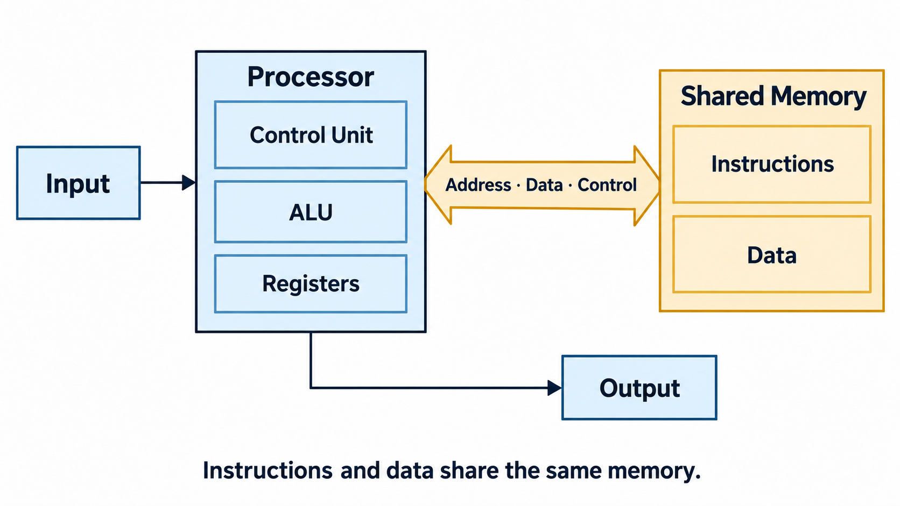
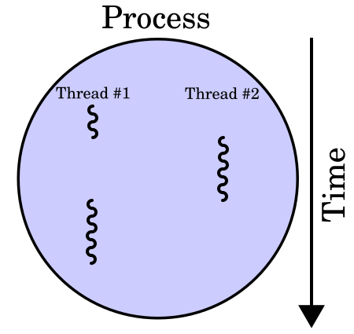
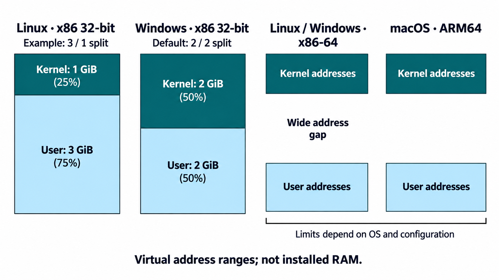
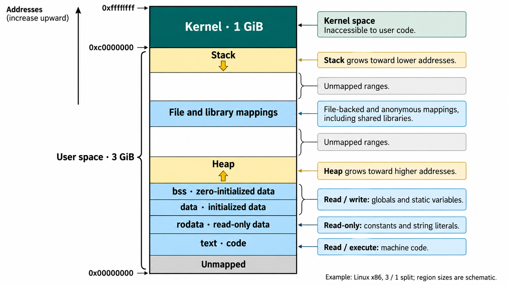

::: {.content-visible unless-format="revealjs"}

[Открыть слайды](../slides/lectures/05-memory.html){.btn .btn-outline-primary target="_blank"}

:::

## План лекции

- Процессы, потоки и виртуальное адресное пространство
- Сегменты программы и представление данных в памяти
- Стек вызовов и время жизни локальных объектов
- Куча, `malloc`/`free` и `new`/`delete`
- Ошибки доступа к памяти и segmentation fault


## Архитектура фон Неймана

{height="600" style="display: block; margin-inline: auto; max-height: 600px;" fig-alt="Von Neumann architecture: processor, shared instruction and data memory, input and output."}

## Иерархия памяти

Чем ближе память к ядру процессора, тем обычно меньше её объём и задержка доступа.

| Уровень | Примерный порядок объёма | Где находится |
| --- | --- | --- |
| Регистры | Сотни B — единицы KiB | Набор регистров одного ядра |
| Кеш L1 | Десятки — сотни KiB | Обычно на ядро; команды и данные отдельно |
| Кеш L2 | Сотни KiB — единицы MiB | На ядро или группу ядер |
| Кеш L3, если есть | Единицы — сотни MiB | Общий для группы ядер или процессора |
| RAM | Единицы — сотни GiB | Оперативная память компьютера |
| SSD | Сотни GiB — единицы TiB | Постоянное хранилище |

## Процессы и потоки

:::: {.columns}
::: {.column width="60%"}

- Процессы
  - Независимое адресное пространство
  - Объекты ядра: файловые дескрипторы, объекты синхронизации и т. д.
- Потоки одного процесса
  - Общее адресное пространство: код, глобальные данные, динамическая память
  - Собственный стек и контекст выполнения: регистры, позиция выполнения
  - При переключении потоков ОС сохраняет и восстанавливает контекст

:::
::: {.column width="40%"}

{height="340" fig-alt="Два потока одного процесса поочерёдно выполняются на одном ядре."}

:::
::::

Собственный стек потока не изолирован от других потоков: при наличии указателя они могут обращаться к этой памяти.

## Виртуальная память и таблицы страниц

:::: {.columns}
::: {.column width="54%"}

- Процесс работает со своими **виртуальными адресами**.
- "Иллюзия" обладанем всей памятью
- ОС задаёт отображения страниц и права доступа в **page tables**; процессор использует их для перевода адресов в физические.
- Один адрес в двух процессах может указывать на разные страницы RAM.
- Общая память и файлы могут отображаться сразу в несколько процессов.

**Размер адресного пространства ≠ объём RAM.** Часть адресов не отображена или защищена; выделение памяти может завершиться неудачей.

:::
::: {.column width="46%"}

{height="450" fig-alt="Virtual pages of a process map to physical memory frames."}

:::
::::

## Если страницы нет в памяти

**Page fault** — исключение при обращении к странице, которая сейчас недоступна или не допускает запрошенную операцию. ОС выясняет причину:

- **Swap:** страницу выгрузили на диск; ОС возвращает её в RAM.
- **Отображение файла:** содержимое ещё не загружено; ОС читает нужную часть файла.
- **Ленивое выделение:** адреса зарезервированы, а физическая память предоставляется при первом обращении.
- **Недопустимый доступ:** нужного отображения или разрешения нет; на Linux процесс обычно получает `SIGSEGV`.

Если ОС смогла обеспечить доступ, выполнение продолжается. Сам по себе page fault не означает ошибку программы.

## Адресное пространство: ОС и платформа

{height="600" style="display: block; margin-inline: auto; max-height: 600px;" fig-alt="Virtual address spaces: Linux x86 3/1 split, Windows x86 2/2 split, x86-64 and macOS ARM64 schematic layouts."}

## Адресное пространство процесса Linux: 32-битная схема

{height="600" style="display: block; margin-inline: auto; max-height: 600px;" fig-alt="Example Linux x86 address space: kernel, stack, mappings, heap, bss, data, rodata and text."}

## Области памяти на схеме

:::: {.columns}
::: {.column width="53%"}

**Сверху вниз, как на предыдущем слайде:**

- **Kernel** — область ядра ОС.
- **Stack** — стек потока.
- **File and library mappings** — отображения файлов, библиотек и анонимные отображения.
- **Heap** — классическая область кучи.
- **bss** — данные с начальным нулевым значением.
- **data** — данные с заданными начальными значениями.
- **rodata** — данные только для чтения, в том числе строковые литералы.
- **text** — машинный код.

**Unmapped** — промежутки без отображения.

:::
::: {.column width="47%"}

**От чего зависит реальная раскладка:**

- **ОС и формат файла:** ELF в Linux, Mach-O в macOS, PE в Windows.
- **Архитектура и ABI:** разрядность адресов, выравнивание и соглашения платформы.
- **Сборка и запуск:** компоновщик, загрузчик, библиотеки, аллокатор и ASLR.

Стеков и областей динамической памяти может быть несколько. Аллокатор может использовать и heap, и отдельные отображения.

:::
::::

Секции файла (`text`, `rodata`, `data`, `bss`) и области адресного пространства — разные уровни описания.


## Что где лежит: типичная схема Linux / ELF

| Объект | Пример | Область | Типичные права |
| --- | --- | --- | --- |
| Машинный код | Тело функции | text | `r-x` |
| Строковые литералы | `"Hello world"` | rodata | `r--` |
| Глобальные данные с ненулевым значением | `int counter = 42;` | data | `rw-` |
| Глобальные данные с начальным нулём | `int total;` | bss | `rw-` |
| Динамический объект | `new int{42}` | heap / анонимное отображение | `rw-` |
| Локальный объект, если он в памяти | `int local;` | stack | `rw-` |
| Библиотеки и отображённые файлы | Результат `mmap` | Отдельные отображения | Зависит от области |

`r` — чтение, `w` — запись, `x` — исполнение. Права задаются страницам; секции файла могут попадать в один сегмент.

## Адреса объектов и функции

```{.cpp filename="memory-addresses.cpp"}

```

[{.godbolt-link-image width="32"}][godbolt-05-memory-addresses]{aria-label="Open in Compiler Explorer"}

## Карта памяти запущенного процесса

Запустите пример с предыдущего слайда. Пока он ждёт Enter, используйте его **PID** в другом терминале.

:::: {.columns}
::: {.column width="49%"}

| ОС | Команда для карты памяти |
| --- | --- |
| Linux | `cat /proc/31707/maps` |
| macOS | `vmmap -interleaved 31707` |
| Windows | `vmmap.exe -p 31707` |

Windows: утилита [Sysinternals VMMap](https://learn.microsoft.com/en-us/sysinternals/downloads/vmmap) открывает карту в окне.

**Фрагмент карты того же запуска на Mac:**

```{.text filename="memory-map-macos.txt"}

```

:::
::: {.column width="51%"}

**Вывод программы на этом Mac (ARM64):**

```{.text filename="memory-addresses-output.txt"}

```

Сопоставьте адреса с диапазонами: функция → `__TEXT`, глобальные → `__DATA`, динамический объект → `MALLOC_TINY`, локальный → `Stack`.

:::
::::

`r` — чтение, `w` — запись, `x` — исполнение. Конец диапазона не включён. При новом запуске PID и адреса изменятся.

## Стек вызовов: передача аргументов и результат

:::: {.columns}
::: {.column width="40%"}

```{.cpp filename="function-call.cpp"}

```

[{.godbolt-link-image width="32"}][godbolt-05-function-call]{aria-label="Open in Compiler Explorer"}

**x86-64, System V ABI.**
Аргументы: `EDI`, `ESI`.<br>Результат: `EAX`.

В этом листинге `add` использует **red zone** — до 128 байт ниже `RSP` — и не выделяет локальную область через `sub rsp`.

:::
::: {.column width="60%"}

```{.asm filename="function-call-godbolt.s" code-line-numbers="|2-3|4-10|11-12|14-23|24-27"}

```

:::
::::

## Регистры x86-64: названия и роли

**Регистр** — небольшое хранилище внутри процессора. `R…` обозначает 64-битный регистр, `E…` — его младшие 32 бита: например, `EAX` — часть `RAX`.

| Регистр | Название | Роль в нашем листинге |
| --- | --- | --- |
| `RDI` / `EDI` | Destination Index | Первый аргумент `a = 40` |
| `RSI` / `ESI` | Source Index | Второй аргумент `b = 2` |
| `RDX` / `EDX` | Data | Временное значение: `b` в main, `a` в add |
| `RAX` / `EAX` | Accumulator | Операнд сложения и результат `42` |
| `RSP` | Stack Pointer | Адрес текущей вершины стека |
| `RBP` | Base Pointer | Опорный адрес кадра функции |
| `RIP` | Instruction Pointer | Адрес следующей исполняемой инструкции |

Названия исторические; назначение зависит от инструкции и **ABI** — соглашений платформы. Здесь используется **System V**: первые два целочисленных аргумента — в `EDI`/`ESI`, результат `int` — в `EAX`.

## Вызов функции по шагам

```{=html}
<iframe src="../assets/05-memory/stack-demo/index.html" title="Пошаговое выполнение add: инструкции, регистры и стек" style="width:100%;height:560px;border:0;border-radius:8px" loading="lazy"></iframe>
```

::: {.content-visible unless-format="revealjs"}
[Открыть схему отдельно](../assets/05-memory/stack-demo/index.html){target="_blank"}
:::

## Длительность хранения — storage duration

Storage duration описывает, как долго существует память для объекта.

| Вид | Пример объявления | Как долго существует память |
| --- | --- | --- |
| Automatic | Обычная локальная переменная | До выхода из её блока |
| Static | Глобальная переменная или локальная `static` | На протяжении работы программы |
| Thread | Переменная `thread_local` | На протяжении работы соответствующего потока |
| Dynamic | Объект, созданный обычным `new` | До освобождения выделенной памяти |

Это категории C++. Стек и куча — типичные способы реализации хранения.

## Область видимости и хранение

`static` у локальной переменной означает, что она инициализируется один раз и сохраняет значение между вызовами функции. Её имя по-прежнему доступно только внутри блока, где она объявлена.

```{.cpp filename="automatic-and-static.cpp"}

```

[{.godbolt-link-image width="32"}][godbolt-05-automatic-and-static]{aria-label="Open in Compiler Explorer"}

## Heap (Куча)

- Динамический объект может пережить выход из функции, которая его создала.
- Его размер можно выбрать во время выполнения.
- Освобождение памяти должно быть предусмотрено программой.
- Позже изучим средства, которые берут освобождение на себя.

Размер объекта — не главное отличие: даже один `int` может требовать динамического времени жизни.

**Не путать:** куча (heap) как область динамической памяти и куча как структура данных, например двоичная куча для очереди с приоритетом, — разные понятия. Совпадение названий не означает, что динамическая память организована в виде такой структуры.

## Объект переживает создавшую его функцию

```{.cpp filename="dynamic-lifetime.cpp"}

```

[{.godbolt-link-image width="32"}][godbolt-05-dynamic-lifetime]{aria-label="Open in Compiler Explorer"}

Локальная переменная-указатель `value` в `make_value` исчезает при возврате. Созданный через `new` объект остаётся; функция возвращает копию его адреса. Освобождение выполняет вызывающий код.

## Функции работы с памятью из `<cstdlib>`

| Функция | Что делает |
| --- | --- |
| `malloc(size)` | Выделяет `size` байт без инициализации содержимого |
| `calloc(count, size)` | Выделяет `count × size` байт и обнуляет их |
| `realloc(pointer, size)` | Меняет размер блока; может переместить его |
| `free(pointer)` | Освобождает блок; `free(nullptr)` ничего не делает |

Для ненулевого запрошенного размера ошибка выделения означает `nullptr`. Если `realloc` завершился неудачей, старый блок остаётся выделенным: его указатель нельзя терять.

## malloc: выделение и освобождение

```{.cpp filename="malloc-array.cpp"}

```

[{.godbolt-link-image width="32"}][godbolt-05-malloc-array]{aria-label="Open in Compiler Explorer"}

В C++ результат `malloc` преобразуем из `void*` в `int*`. Перед чтением элементов записываем в них значения.

## Проверка выделения и освобождение памяти

- Если выделение не удалось, `malloc` возвращает `nullptr`.
- Память освобождаем через `std::free` ровно один раз.
- `std::free(nullptr)` ничего не делает.
- После освобождения указатель нельзя разыменовывать. Присваивание `nullptr` одной переменной не исправляет другие копии указателя.

## free не обнуляет указатель

```{.cpp filename="free-and-nullptr.cpp" code-line-numbers="|12|13|15-16"}

```

[{.godbolt-link-image width="32"}][godbolt-05-free-and-nullptr]{aria-label="Open in Compiler Explorer"}

`free` освобождает выделенный блок, но не присваивает переменной `pointer` значение `nullptr` и не гарантирует обнуления байтов блока. После `free` указатель висячий; следующей строкой мы явно присваиваем ему `nullptr`.

## calloc

```{.cpp filename="calloc-array.cpp"}

```

[{.godbolt-link-image width="32"}][godbolt-05-calloc-array]{aria-label="Open in Compiler Explorer"}

`calloc` получает количество элементов и размер одного элемента, затем обнуляет выделенные байты. Для массива `int` это даёт нулевые значения.

## Указатель и объект: разные адреса и размеры

```{.cpp filename="pointer-and-object.cpp"}

```

[{.godbolt-link-image width="32"}][godbolt-05-pointer-and-object]{aria-label="Open in Compiler Explorer"}

`&pointer` — адрес переменной-указателя; `pointer` — адрес выделенного объекта. `sizeof(pointer)` измеряет указатель, а `sizeof(*pointer)` — объект типа `int`.

## new и delete

:::: {.columns}
::: {.column width="45%"}

```{.cpp filename="new-delete.cpp"}

```

[{.godbolt-link-image width="32"}][godbolt-05-new-delete]{aria-label="Open in Compiler Explorer"}

:::
::: {.column width="55%"}

- `new int` — без начального значения; до чтения нужна запись.
- `new int{}` — значение `0`.
- `new int{42}` — значение `42`.
- `delete` освобождает одиночный объект, `delete[]` — массив.
- При неудаче выделения обычный `new` бросает `std::bad_alloc`; исключения разберём позже.

:::
::::

## new/delete и malloc/free: какой способ выбрать

| Выделение | Освобождение |
| --- | --- |
| `malloc`, `calloc`, `realloc` | `free` |
| `new T` | `delete` |
| `new T[n]` | `delete[]` |

**Способ освобождения определяется способом выделения.** Смешивание пар приводит к неопределённому поведению.

- `malloc` подходит, если нужен **просто блок памяти заданного размера**, без вызова конструкторов.
- `new T` выделяет память и создаёт объект типа `T`.
- При работе с C API способ освобождения задаёт контракт библиотеки.

Для обычных задач C++ позже изучим контейнеры и средства автоматического владения памятью.

## Placement new

Память для точек резервируем заранее. Когда появляется новая точка, создаём её в выбранном слоте без отдельного выделения памяти.

```{.cpp filename="placement-new.cpp" code-line-numbers="|10|11-12|17"}

```

[{.godbolt-link-image width="32"}][godbolt-05-placement-new]{aria-label="Open in Compiler Explorer"}

`new (pool) Point{50, 60}` создаёт новую точку на месте прежней. Память слота используется повторно.

## Placement new: размер, выравнивание и освобождение

- Буфер вмещает две точки; `alignas(Point)` обеспечивает выравнивание.
- Второй слот начинается через `sizeof(Point)` байтов после первого.
- Буфер должен существовать всё время использования точек.
- `delete first` и `delete second` недопустимы: слоты принадлежат буферу.
- У нашей структуры только поля `int`: перед повторным использованием слота отдельный вызов деструктора не требуется.

В полноценном пуле дополнительно учитывают свободные слоты и проверяют, что место есть. Здесь показан только механизм создания объектов в готовой памяти.

## Ошибка памяти не обязана завершать программу

Выход за границы массива, использование уничтоженного объекта и разыменование `nullptr` приводят к **неопределённому поведению**.

- Программа может упасть сразу или позже.
- Она может испортить данные или внешне работать правильно.
- Конкретный результат запуска ничего не гарантирует для следующего запуска.

**Отсутствие падения не доказывает корректность.**

## Segmentation fault

`SIGSEGV` — сигнал ОС при некоторых недопустимых обращениях к памяти, например к неотображённой странице или странице без нужных прав.

ОС проверяет отображения и права страниц, но обычно не знает границы каждого C++-объекта. Выход за границы массива может остаться внутри доступной страницы.

Не всякое неопределённое поведение приводит к `SIGSEGV`, и не всякая ошибка памяти обнаруживается ОС.

## Запись в память только для чтения

**Намеренное UB.** На типичных Linux/macOS строковый литерал размещается в области без права записи; попытка записи обычно приводит к аварийному завершению.

```{.cpp filename="write-read-only.cpp" code-line-numbers="|3|4|5"}

```

[{.godbolt-link-image width="32"}][godbolt-05-write-read-only]{aria-label="Open in Compiler Explorer"}

`const_cast` снимает ограничение типа, но не меняет права страницы и не делает изменение литерала допустимым. `volatile` сохраняет попытку записи в обычной сборке; конкретное проявление UB языком не гарантируется.

Изменяемый `char text[]` из лекции 3 хранит отдельную копию символов; запись в такой массив допустима.

## Выход за границы динамического массива

**Намеренное неопределённое поведение.**

```{.cpp filename="heap-buffer-overflow.cpp"}

```

[{.godbolt-link-image width="32"}][godbolt-05-heap-buffer-overflow]{aria-label="Open in Compiler Explorer"}

Допустимы индексы `0`, `1`, `2`. Указатель за последним элементом можно сформировать, но читать элемент по нему нельзя. AddressSanitizer: `heap-buffer-overflow`.

## Обращение после освобождения

**Намеренное неопределённое поведение.**

```{.cpp filename="use-after-free.cpp"}

```

[{.godbolt-link-image width="32"}][godbolt-05-use-after-free]{aria-label="Open in Compiler Explorer"}

Присваивание `nullptr` переменной `value` не меняет `alias`. AddressSanitizer: `heap-use-after-free`.

## Повторное освобождение

**Намеренное неопределённое поведение.**

```{.cpp filename="double-free.cpp"}

```

[{.godbolt-link-image width="32"}][godbolt-05-double-free]{aria-label="Open in Compiler Explorer"}

Две переменные хранят адрес одного выделенного блока. Освободить его можно только один раз. AddressSanitizer: `double-free`.

## Указатель на объект после выхода из блока

**Намеренное неопределённое поведение.**

```{.cpp filename="use-after-scope.cpp"}

```

[{.godbolt-link-image width="32"}][godbolt-05-use-after-scope]{aria-label="Open in Compiler Explorer"}

Байты могут ещё содержать `42`, но объекта `local` уже нет. AddressSanitizer: `stack-use-after-scope`.

## Разыменование nullptr

**Намеренное неопределённое поведение.**

```{.cpp filename="null-dereference.cpp"}

```

[{.godbolt-link-image width="32"}][godbolt-05-null-dereference]{aria-label="Open in Compiler Explorer"}

`nullptr` не указывает на объект. UndefinedBehaviorSanitizer сообщает о чтении через нулевой указатель; возможное падение — следствие, а не определённый языком результат.

## Санитайзеры: проверки во время выполнения

**Санитайзер** — инструмент, который добавляет проверки в программу при сборке и сообщает об ошибках во время её выполнения.

- **AddressSanitizer (ASan):** выходы за границы, обращение после освобождения, повторное освобождение.
- **UndefinedBehaviorSanitizer (UBSan):** некоторые виды UB, например разыменование `nullptr`.

Из корня репозитория, на примере обращения после освобождения:

```bash
clang++ -std=c++23 -Wall -Wextra -pedantic -O0 -g \
  -fsanitize=address,undefined -fno-sanitize-recover=all \
  -fsanitize-address-use-after-scope -fno-omit-frame-pointer \
  examples/05-memory/use-after-free.cpp -o /tmp/memory-error
/tmp/memory-error
```

**Отчёт:** вид ошибки (`heap-use-after-free`), строка и стек вызовов; для освобождённого блока — места выделения и освобождения.

Проверяется только выполненный путь. Успешный запуск не доказывает отсутствие ошибок.

## Утечка памяти — другая ошибка

Если потерять последний доступный указатель на выделенный блок, освободить его обычным способом уже не получится.

- Сама утечка не обязана приводить к UB или немедленному падению.
- Повторяющиеся утечки увеличивают расход памяти.
- Для поиска утечек есть отдельные проверки; их доступность зависит от платформы.

## Большой локальный массив: риск переполнения стека

**Опасный пример — не запускать как обычный пример.** Ссылка Compiler Explorer открывает только компиляцию, без запуска. Массив занимает 8 МиБ; результат зависит от лимита стека потока. `volatile` сохраняет обращения к массиву при оптимизации, но не гарантирует конкретный размер кадра или падение.

```{.cpp filename="large-stack-array.cpp"}

```

[{.godbolt-link-image width="32"}][godbolt-05-large-stack-array]{aria-label="Open in Compiler Explorer"}

[godbolt-05-new-delete]: <https://godbolt.org/#g:!((g:!((h:codeEditor,i:(j:1,lang:c%2B%2B,options:(compileOnChange:'0'),source:'int+main()+%7B%0A++++int*+value+%3D+new+int%3B%0A++++delete+value%3B%0A%0A++++int*+array+%3D+new+int%5B10%5D%3B%0A++++delete%5B%5D+array%3B%0A%0A++++return+0%3B%0A%7D%0A'),l:'5'),(h:executor,i:(compilationPanelShown:'0',compiler:clang2310,compilerOutShown:'0',lang:c%2B%2B,libs:!(),options:'-std%3Dc%2B%2B23+-O0+-stdlib%3Dlibc%2B%2B',source:1,tree:0),l:'5')),l:'2')),version:4>
<!-- godbolt source="../examples/05-memory/new-delete.cpp" compiler="clang2310" options="-std=c++23 -O0 -stdlib=libc++" -->

[godbolt-05-function-call]: <https://godbolt.org/#g:!((g:!((h:codeEditor,i:(j:1,lang:c%2B%2B,options:(compileOnChange:'0'),source:'int+add(int+a,+int+b)+%7B%0A++++int+result+%3D+a+%2B+b%3B%0A++++return+result%3B%0A%7D%0A%0Aint+main()+%7B%0A++++int+a+%3D+40%3B%0A++++int+b+%3D+2%3B%0A++++int+answer+%3D+add(a,+b)%3B%0A++++return+answer%3B%0A%7D%0A'),l:'5'),(h:executor,i:(compilationPanelShown:'0',compiler:clang2310,compilerOutShown:'0',lang:c%2B%2B,libs:!(),options:'-std%3Dc%2B%2B23+-O0+-m64+-fno-omit-frame-pointer+-fno-stack-protector+-fno-asynchronous-unwind-tables',source:1,tree:0),l:'5')),l:'2')),version:4>
<!-- godbolt source="../examples/05-memory/function-call.cpp" compiler="clang2310" options="-std=c++23 -O0 -m64 -fno-omit-frame-pointer -fno-stack-protector -fno-asynchronous-unwind-tables" -->

[godbolt-05-malloc-array]: <https://godbolt.org/#g:!((g:!((h:codeEditor,i:(j:1,lang:c%2B%2B,options:(compileOnChange:'0'),source:'%23include+%3Cprint%3E%0A%23include+%3Ccstdlib%3E%0A%0Aint+main()+%7B%0A++++int*+values+%3D+static_cast%3Cint*%3E(std::malloc(4+*+sizeof(int)))%3B%0A++++if+(values+%3D%3D+nullptr)+%7B%0A++++++++return+1%3B%0A++++%7D%0A%0A++++for+(int+index+%3D+0%3B+index+%3C+4%3B+%2B%2Bindex)+%7B%0A++++++++values%5Bindex%5D+%3D+index+*+index%3B%0A++++++++std::println(%22values%5B%7B%7D%5D+%3D+%7B%7D%22,+index,+values%5Bindex%5D)%3B%0A++++%7D%0A++++std::free(values)%3B%0A%7D%0A'),l:'5'),(h:executor,i:(compilationPanelShown:'0',compiler:clang2310,compilerOutShown:'0',lang:c%2B%2B,libs:!(),options:'-std%3Dc%2B%2B23+-O0+-stdlib%3Dlibc%2B%2B',source:1,tree:0),l:'5')),l:'2')),version:4>
<!-- godbolt source="../examples/05-memory/malloc-array.cpp" compiler="clang2310" options="-std=c++23 -O0 -stdlib=libc++" -->

[godbolt-05-calloc-array]: <https://godbolt.org/#g:!((g:!((h:codeEditor,i:(j:1,lang:c%2B%2B,options:(compileOnChange:'0'),source:'%23include+%3Cprint%3E%0A%23include+%3Ccstdlib%3E%0A%0Aint+main()+%7B%0A++++int*+values+%3D+static_cast%3Cint*%3E(std::calloc(4,+sizeof(int)))%3B%0A++++if+(values+%3D%3D+nullptr)+%7B%0A++++++++return+1%3B%0A++++%7D%0A%0A++++for+(int+index+%3D+0%3B+index+%3C+4%3B+%2B%2Bindex)+%7B%0A++++++++std::println(%22values%5B%7B%7D%5D+%3D+%7B%7D%22,+index,+values%5Bindex%5D)%3B%0A++++%7D%0A++++std::free(values)%3B%0A%7D%0A'),l:'5'),(h:executor,i:(compilationPanelShown:'0',compiler:clang2310,compilerOutShown:'0',lang:c%2B%2B,libs:!(),options:'-std%3Dc%2B%2B23+-O0+-stdlib%3Dlibc%2B%2B',source:1,tree:0),l:'5')),l:'2')),version:4>
<!-- godbolt source="../examples/05-memory/calloc-array.cpp" compiler="clang2310" options="-std=c++23 -O0 -stdlib=libc++" -->

[godbolt-05-pointer-and-object]: <https://godbolt.org/#g:!((g:!((h:codeEditor,i:(j:1,lang:c%2B%2B,options:(compileOnChange:'0'),source:'%23include+%3Cprint%3E%0A%23include+%3Ccstdlib%3E%0A%0Aint+main()+%7B%0A++++int+local+%3D+0%3B%0A++++int*+pointer+%3D+static_cast%3Cint*%3E(std::malloc(sizeof(int)))%3B%0A++++if+(pointer+%3D%3D+nullptr)+%7B%0A++++++++return+1%3B%0A++++%7D%0A++++*pointer+%3D+42%3B%0A%0A++++std::println(%22local:+size%3D%7B%7D,+address%3D%7B%7D%22,+sizeof(local),+static_cast%3Cvoid*%3E(%26local))%3B%0A++++std::println(%22pointer:+size%3D%7B%7D,+address%3D%7B%7D%22,+sizeof(pointer),+static_cast%3Cvoid*%3E(%26pointer))%3B%0A++++std::println(%22*pointer:+size%3D%7B%7D,+address%3D%7B%7D%22,+sizeof(*pointer),+static_cast%3Cvoid*%3E(pointer))%3B%0A++++std::println(%22value%3D%7B%7D%22,+*pointer)%3B%0A++++std::free(pointer)%3B%0A%7D%0A'),l:'5'),(h:executor,i:(compilationPanelShown:'0',compiler:clang2310,compilerOutShown:'0',lang:c%2B%2B,libs:!(),options:'-std%3Dc%2B%2B23+-O0+-stdlib%3Dlibc%2B%2B',source:1,tree:0),l:'5')),l:'2')),version:4>
<!-- godbolt source="../examples/05-memory/pointer-and-object.cpp" compiler="clang2310" options="-std=c++23 -O0 -stdlib=libc++" -->

[godbolt-05-dynamic-lifetime]: <https://godbolt.org/#g:!((g:!((h:codeEditor,i:(j:1,lang:c%2B%2B,options:(compileOnChange:'0'),source:'%23include+%3Cprint%3E%0A%0Aint*+make_value()+%7B%0A++++int*+value+%3D+new+int%7B42%7D%3B%0A++++return+value%3B%0A%7D%0A%0Aint+main()+%7B%0A++++int*+value+%3D+make_value()%3B%0A++++std::println(%22%7B%7D%22,+*value)%3B%0A++++delete+value%3B%0A%7D%0A'),l:'5'),(h:executor,i:(compilationPanelShown:'0',compiler:clang2310,compilerOutShown:'0',lang:c%2B%2B,libs:!(),options:'-std%3Dc%2B%2B23+-O0+-stdlib%3Dlibc%2B%2B',source:1,tree:0),l:'5')),l:'2')),version:4>
<!-- godbolt source="../examples/05-memory/dynamic-lifetime.cpp" compiler="clang2310" options="-std=c++23 -O0 -stdlib=libc++" -->

[godbolt-05-large-stack-array]: <https://godbolt.org/#g:!((g:!((h:codeEditor,i:(j:1,lang:c%2B%2B,options:(compileOnChange:'0'),source:'%23include+%3Ccstdint%3E%0A%23include+%3Cprint%3E%0A%0A//+Dangerous+example:+this+array+may+exceed+the+thread!'s+stack+limit.%0Aint+main()+%7B%0A++++volatile+std::uint64_t+values%5B1048576%5D%3B%0A++++values%5B10%5D+%3D+1%3B%0A++++std::println(%22%7B%7D%22,+static_cast%3Cunsigned+long+long%3E(values%5B10%5D))%3B%0A%7D%0A'),l:'5'),(h:compiler,i:(compilationPanelShown:'0',compiler:clang2310,compilerOutShown:'0',lang:c%2B%2B,libs:!(),options:'-std%3Dc%2B%2B23+-O0+-stdlib%3Dlibc%2B%2B',source:1,tree:0),l:'5')),l:'2')),version:4>
<!-- godbolt source="../examples/05-memory/large-stack-array.cpp" compiler="clang2310" options="-std=c++23 -O0 -stdlib=libc++" mode="compiler" -->

[godbolt-05-use-after-scope]: <https://godbolt.org/#g:!((g:!((h:codeEditor,i:(j:1,lang:c%2B%2B,options:(compileOnChange:'0'),source:'%23include+%3Cprint%3E%0A%0A//+Intentional+undefined+behavior.%0Aint+main()+%7B%0A++++int*+pointer+%3D+nullptr%3B%0A++++%7B%0A++++++++int+local+%3D+42%3B%0A++++++++pointer+%3D+%26local%3B%0A++++%7D%0A++++std::println(%22%7B%7D%22,+*pointer)%3B+//+local!'s+lifetime+has+ended.%0A%7D%0A'),l:'5'),(h:executor,i:(compilationPanelShown:'0',compiler:clang2310,compilerOutShown:'0',lang:c%2B%2B,libs:!(),options:'-std%3Dc%2B%2B23+-O0+-stdlib%3Dlibc%2B%2B+-g+-fsanitize%3Daddress,undefined+-fno-sanitize-recover%3Dall+-fsanitize-address-use-after-scope+-fno-omit-frame-pointer',source:1,tree:0),l:'5')),l:'2')),version:4>
<!-- godbolt source="../examples/05-memory/use-after-scope.cpp" compiler="clang2310" options="-std=c++23 -O0 -stdlib=libc++ -g -fsanitize=address,undefined -fno-sanitize-recover=all -fsanitize-address-use-after-scope -fno-omit-frame-pointer" -->

[godbolt-05-null-dereference]: <https://godbolt.org/#g:!((g:!((h:codeEditor,i:(j:1,lang:c%2B%2B,options:(compileOnChange:'0'),source:'%23include+%3Cprint%3E%0A%0A//+Intentional+undefined+behavior.%0Aint+main()+%7B%0A++++int*+pointer+%3D+nullptr%3B%0A++++std::println(%22%7B%7D%22,+*pointer)%3B%0A%7D%0A'),l:'5'),(h:executor,i:(compilationPanelShown:'0',compiler:clang2310,compilerOutShown:'0',lang:c%2B%2B,libs:!(),options:'-std%3Dc%2B%2B23+-O0+-stdlib%3Dlibc%2B%2B+-g+-fsanitize%3Daddress,undefined+-fno-sanitize-recover%3Dall+-fsanitize-address-use-after-scope+-fno-omit-frame-pointer',source:1,tree:0),l:'5')),l:'2')),version:4>
<!-- godbolt source="../examples/05-memory/null-dereference.cpp" compiler="clang2310" options="-std=c++23 -O0 -stdlib=libc++ -g -fsanitize=address,undefined -fno-sanitize-recover=all -fsanitize-address-use-after-scope -fno-omit-frame-pointer" -->

[godbolt-05-automatic-and-static]: <https://godbolt.org/#g:!((g:!((h:codeEditor,i:(j:1,lang:c%2B%2B,options:(compileOnChange:'0'),source:'%23include+%3Cprint%3E%0A%0Avoid+visit()+%7B%0A++++int+automatic_count+%3D+0%3B%0A++++static+int+static_count+%3D+0%3B%0A++++%2B%2Bautomatic_count%3B%0A++++%2B%2Bstatic_count%3B%0A++++std::println(%22%7B%7D+%7B%7D%22,+automatic_count,+static_count)%3B%0A%7D%0A%0Aint+main()+%7B%0A++++visit()%3B%0A++++visit()%3B%0A%7D%0A'),l:'5'),(h:executor,i:(compilationPanelShown:'0',compiler:clang2310,compilerOutShown:'0',lang:c%2B%2B,libs:!(),options:'-std%3Dc%2B%2B23+-O0+-stdlib%3Dlibc%2B%2B',source:1,tree:0),l:'5')),l:'2')),version:4>
<!-- godbolt source="../examples/05-memory/automatic-and-static.cpp" compiler="clang2310" options="-std=c++23 -O0 -stdlib=libc++" -->

[godbolt-05-use-after-free]: <https://godbolt.org/#g:!((g:!((h:codeEditor,i:(j:1,lang:c%2B%2B,options:(compileOnChange:'0'),source:'%23include+%3Cprint%3E%0A%0A//+Intentional+undefined+behavior.%0Aint+main()+%7B%0A++++int*+value+%3D+new+int%7B42%7D%3B%0A++++int*+alias+%3D+value%3B%0A++++delete+value%3B%0A++++value+%3D+nullptr%3B%0A++++std::println(%22%7B%7D%22,+*alias)%3B+//+The+object+no+longer+exists.%0A%7D%0A'),l:'5'),(h:executor,i:(compilationPanelShown:'0',compiler:clang2310,compilerOutShown:'0',lang:c%2B%2B,libs:!(),options:'-std%3Dc%2B%2B23+-O0+-stdlib%3Dlibc%2B%2B+-g+-fsanitize%3Daddress,undefined+-fno-sanitize-recover%3Dall+-fsanitize-address-use-after-scope+-fno-omit-frame-pointer',source:1,tree:0),l:'5')),l:'2')),version:4>
<!-- godbolt source="../examples/05-memory/use-after-free.cpp" compiler="clang2310" options="-std=c++23 -O0 -stdlib=libc++ -g -fsanitize=address,undefined -fno-sanitize-recover=all -fsanitize-address-use-after-scope -fno-omit-frame-pointer" -->

[godbolt-05-memory-addresses]: <https://godbolt.org/#g:!((g:!((h:codeEditor,i:(j:1,lang:c%2B%2B,options:(compileOnChange:'0'),source:'%23include+%3Ccstdio%3E%0A%23include+%3Cprint%3E%0A%23include+%3Cunistd.h%3E+//+POSIX+(Linux/macOS):+getpid,+not+standard+C%2B%2B.%0A%0Aconst+double+pi+%3D+3.141592653589793%3B%0Aint+initialized_global+%3D+42%3B%0Aint+zero_initialized_global%3B%0A%0Avoid+some_function()+%7B%7D%0A%0Aint+main()+%7B%0A++++int+local+%3D+0%3B%0A++++const+char*+text+%3D+%22Hello+world%22%3B%0A++++int*+dynamic+%3D+new+int%7B42%7D%3B%0A%0A++++std::println(%22Process+ID:+%7B%7D%22,+static_cast%3Clong%3E(getpid()))%3B%0A++++std::println(%22Constant:+%7B%7D%22,+static_cast%3Cconst+void*%3E(%26pi))%3B%0A++++std::println(%22Initialized+global:+%7B%7D%22,+static_cast%3Cvoid*%3E(%26initialized_global))%3B%0A++++std::println(%22Zero-initialized+global:+%7B%7D%22,+static_cast%3Cvoid*%3E(%26zero_initialized_global))%3B%0A++++std::println(%22String+literal:+%7B%7D%22,+static_cast%3Cconst+void*%3E(text))%3B%0A++++//+POSIX+supports+converting+a+function+pointer+to+void*.%0A++++std::println(%22Function:+%7B%7D%22,+reinterpret_cast%3Cvoid*%3E(%26some_function))%3B%0A++++std::println(%22Local+variable:+%7B%7D%22,+static_cast%3Cvoid*%3E(%26local))%3B%0A++++std::println(%22Dynamic+object:+%7B%7D%22,+static_cast%3Cvoid*%3E(dynamic))%3B%0A++++std::println(%22Press+Enter+to+exit.%22)%3B%0A++++std::getchar()%3B%0A++++delete+dynamic%3B%0A%7D%0A'),l:'5'),(h:executor,i:(compilationPanelShown:'0',compiler:clang2310,compilerOutShown:'0',lang:c%2B%2B,libs:!(),options:'-std%3Dc%2B%2B23+-O0+-stdlib%3Dlibc%2B%2B',source:1,tree:0),l:'5')),l:'2')),version:4>
<!-- godbolt source="../examples/05-memory/memory-addresses.cpp" compiler="clang2310" options="-std=c++23 -O0 -stdlib=libc++" -->

[godbolt-05-double-free]: <https://godbolt.org/#g:!((g:!((h:codeEditor,i:(j:1,lang:c%2B%2B,options:(compileOnChange:'0'),source:'%23include+%3Ccstdlib%3E%0A%0A//+Intentional+undefined+behavior.%0Aint+main()+%7B%0A++++void*+memory+%3D+std::malloc(16)%3B%0A++++if+(memory+%3D%3D+nullptr)+%7B%0A++++++++return+1%3B%0A++++%7D%0A++++void*+alias+%3D+memory%3B%0A++++std::free(memory)%3B%0A++++std::free(alias)%3B+//+The+same+allocation+is+freed+twice.%0A%7D%0A'),l:'5'),(h:executor,i:(compilationPanelShown:'0',compiler:clang2310,compilerOutShown:'0',lang:c%2B%2B,libs:!(),options:'-std%3Dc%2B%2B23+-O0+-stdlib%3Dlibc%2B%2B+-g+-fsanitize%3Daddress,undefined+-fno-sanitize-recover%3Dall+-fsanitize-address-use-after-scope+-fno-omit-frame-pointer',source:1,tree:0),l:'5')),l:'2')),version:4>
<!-- godbolt source="../examples/05-memory/double-free.cpp" compiler="clang2310" options="-std=c++23 -O0 -stdlib=libc++ -g -fsanitize=address,undefined -fno-sanitize-recover=all -fsanitize-address-use-after-scope -fno-omit-frame-pointer" -->

[godbolt-05-placement-new]: <https://godbolt.org/#g:!((g:!((h:codeEditor,i:(j:1,lang:c%2B%2B,options:(compileOnChange:'0'),source:'%23include+%3Cnew%3E%0A%23include+%3Cprint%3E%0A%0Astruct+Point+%7B%0A++++int+x%3B%0A++++int+y%3B%0A%7D%3B%0A%0Aint+main()+%7B%0A++++alignas(Point)+unsigned+char+pool%5B2+*+sizeof(Point)%5D%3B%0A++++Point*+first+%3D+new+(pool)+Point%7B10,+20%7D%3B%0A++++Point*+second+%3D+new+(pool+%2B+sizeof(Point))+Point%7B30,+40%7D%3B%0A++++std::println(%22First:+(%7B%7D,+%7B%7D)%3B+second:+(%7B%7D,+%7B%7D)%22,%0A+++++++++++++++++first-%3Ex,+first-%3Ey,+second-%3Ex,+second-%3Ey)%3B%0A%0A++++//+The+first+point+is+no+longer+needed:+reuse+its+slot.%0A++++first+%3D+new+(pool)+Point%7B50,+60%7D%3B%0A++++std::println(%22New+first:+(%7B%7D,+%7B%7D)%22,+first-%3Ex,+first-%3Ey)%3B%0A++++//+No+delete:+both+objects+occupy+the+automatic+buffer+pool.%0A%7D%0A'),l:'5'),(h:executor,i:(compilationPanelShown:'0',compiler:clang2310,compilerOutShown:'0',lang:c%2B%2B,libs:!(),options:'-std%3Dc%2B%2B23+-O0+-stdlib%3Dlibc%2B%2B',source:1,tree:0),l:'5')),l:'2')),version:4>
<!-- godbolt source="../examples/05-memory/placement-new.cpp" compiler="clang2310" options="-std=c++23 -O0 -stdlib=libc++" -->

[godbolt-05-heap-buffer-overflow]: <https://godbolt.org/#g:!((g:!((h:codeEditor,i:(j:1,lang:c%2B%2B,options:(compileOnChange:'0'),source:'%23include+%3Cprint%3E%0A%0A//+Intentional+undefined+behavior.%0Aint+main()+%7B%0A++++int*+values+%3D+new+int%5B3%5D%7B10,+20,+30%7D%3B%0A++++int+index+%3D+3%3B%0A++++std::println(%22%7B%7D%22,+values%5Bindex%5D)%3B+//+Past+the+array+boundary.%0A++++delete%5B%5D+values%3B%0A%7D%0A'),l:'5'),(h:executor,i:(compilationPanelShown:'0',compiler:clang2310,compilerOutShown:'0',lang:c%2B%2B,libs:!(),options:'-std%3Dc%2B%2B23+-O0+-stdlib%3Dlibc%2B%2B+-g+-fsanitize%3Daddress,undefined+-fno-sanitize-recover%3Dall+-fsanitize-address-use-after-scope+-fno-omit-frame-pointer',source:1,tree:0),l:'5')),l:'2')),version:4>
<!-- godbolt source="../examples/05-memory/heap-buffer-overflow.cpp" compiler="clang2310" options="-std=c++23 -O0 -stdlib=libc++ -g -fsanitize=address,undefined -fno-sanitize-recover=all -fsanitize-address-use-after-scope -fno-omit-frame-pointer" -->

[godbolt-05-free-and-nullptr]: <https://godbolt.org/#g:!((g:!((h:codeEditor,i:(j:1,lang:c%2B%2B,options:(compileOnChange:'0'),source:'%23include+%3Ccstdlib%3E%0A%23include+%3Cprint%3E%0A%0Aint+main()+%7B%0A++++int*+pointer+%3D+static_cast%3Cint*%3E(std::malloc(sizeof(int)))%3B%0A++++if+(pointer+%3D%3D+nullptr)+%7B%0A++++++++return+1%3B%0A++++%7D%0A++++*pointer+%3D+42%3B%0A++++std::println(%22Before+free:+%7B%7D%22,+*pointer)%3B%0A%0A++++std::free(pointer)%3B+//+Releases+the+block%3B+pointer+is+now+dangling.%0A++++pointer+%3D+nullptr%3B++//+Explicit+assignment,+not+an+effect+of+free.%0A%0A++++std::println(%22pointer+%3D%3D+nullptr:+%7B%7D%22,+pointer+%3D%3D+nullptr)%3B%0A++++std::free(pointer)%3B+//+free(nullptr)+does+nothing.%0A%7D%0A'),l:'5'),(h:executor,i:(compilationPanelShown:'0',compiler:clang2310,compilerOutShown:'0',lang:c%2B%2B,libs:!(),options:'-std%3Dc%2B%2B23+-O0+-stdlib%3Dlibc%2B%2B',source:1,tree:0),l:'5')),l:'2')),version:4>
<!-- godbolt source="../examples/05-memory/free-and-nullptr.cpp" compiler="clang2310" options="-std=c++23 -O0 -stdlib=libc++" -->

[godbolt-05-write-read-only]: <https://godbolt.org/#g:!((g:!((h:codeEditor,i:(j:1,lang:c%2B%2B,options:(compileOnChange:'0'),source:'//+Intentional+undefined+behavior:+attempting+to+modify+a+string+literal.%0Aint+main()+%7B%0A++++const+char*+text+%3D+%22Read-only+memory%22%3B%0A++++volatile+char*+writable+%3D+const_cast%3Cchar*%3E(text)%3B%0A++++writable%5B0%5D+%3D+!'r!'%3B+//+Typically+faults+on+Linux/macOS.%0A%7D%0A'),l:'5'),(h:executor,i:(compilationPanelShown:'0',compiler:clang2310,compilerOutShown:'0',lang:c%2B%2B,libs:!(),options:'-std%3Dc%2B%2B23+-O0',source:1,tree:0),l:'5')),l:'2')),version:4>
<!-- godbolt source="../examples/05-memory/write-read-only.cpp" compiler="clang2310" options="-std=c++23 -O0" -->
