::: {.content-visible unless-format="revealjs"}

[Открыть слайды](../slides/lectures/05-memory.html){.btn .btn-outline-primary target="_blank"}

:::

## План лекции

- Работа программ: архитектуры, виды памяти, процессор, прерывания
- Процессы и потоки
- Виртуальная память и сегменты
- Стек вызовов
- Куча: `malloc`/`free` и `new`/`delete`
- Segmentation fault

## 1. Работа программ

- Архитектуры фон Неймана и Гарвардская
- Виды памяти
- Процессор
- Прерывания

## 1. Работа программ {.agenda}

- [Архитектуры фон Неймана и Гарвардская]{.current}
- Виды памяти
- Процессор
- Прерывания

## Архитектура фон Неймана

::: {.added}

Почти все современные компьютеры устроены по схеме, описанной в 1945 году: процессор, память и шина между ними. Команды программы и её данные хранятся в **одной** памяти и адресуются одинаково — поэтому в лекции 3 у функции нашёлся адрес.

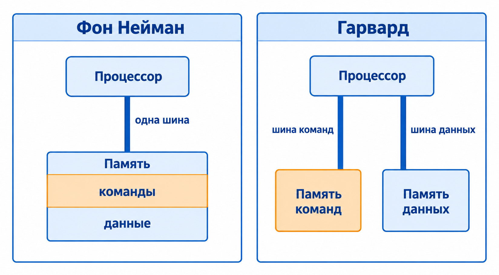{width="72%"}

:::

::: {.added .fragment}

**Гарвардская архитектура** разделяет память команд и память данных и даёт им отдельные шины: процессор читает команду и данные одновременно. Так устроены многие микроконтроллеры, а внутри современных процессоров тот же принцип живёт в виде раздельных кешей команд и данных.

:::

## 1. Работа программ {.agenda}

- Архитектуры фон Неймана и Гарвардская
- [Виды памяти]{.current}
- Процессор
- Прерывания

## Виды памяти

::: {.added}

Память компьютера — это иерархия: чем ближе к процессору, тем она быстрее, меньше и дороже.

| Уровень | Объём | Время доступа |
|---|---|---|
| Регистры процессора | сотни байт | меньше 1 нс |
| Кеш L1 | десятки КБ | ~1 нс |
| Кеш L2 | около 1 МБ | ~4 нс |
| Кеш L3 | десятки МБ | ~10–40 нс |
| Оперативная память | гигабайты | ~100 нс |
| SSD | терабайты | ~100 мкс |

Значения — порядки величин для современного настольного процессора.

:::

::: {.added .fragment}

Если бы один такт процессора длился секунду, чтение из оперативной памяти заняло бы пять минут, а из SSD — три с половиной дня.

:::

## 1. Работа программ {.agenda}

- Архитектуры фон Неймана и Гарвардская
- Виды памяти
- [Процессор]{.current}
- Прерывания

## Процессор

::: {.added}

Процессор бесконечно повторяет один цикл: прочитать команду из памяти по адресу из регистра `rip`, декодировать её, выполнить и перейти к следующей.

**Регистры** — несколько десятков ячеек прямо внутри процессора, с ними он работает быстрее всего. В этой лекции нам понадобятся четыре:

- `rip` (*instruction pointer*) — адрес следующей команды;
- `rsp` (*stack pointer*) — вершина стека;
- `rbp` (*base pointer*) — начало текущего кадра стека;
- `rax` (*accumulator*) — результат функции.

Буква `r` означает 64-битный регистр. На 32-битном x86 те же регистры называются `eip`, `esp`, `ebp` и `eax` — от *extended*.

:::

## 1. Работа программ {.agenda}

- Архитектуры фон Неймана и Гарвардская
- Виды памяти
- Процессор
- [Прерывания]{.current}

## Прерывания

::: {.added}

Процессор можно прервать. **Прерывание** — сигнал, по которому процессор откладывает текущую программу и передаёт управление операционной системе:

- **аппаратные** — от таймера, клавиатуры, сетевой карты;
- **исключения** — деление на ноль, обращение к странице, которой нет в памяти;
- **системные вызовы** — программа сама просит ОС прочитать файл или выделить память.

:::

::: {.added .fragment}

Таймер прерывает процессор сотни раз в секунду. Так ОС переключается между программами — и кажется, что все они работают одновременно.

:::

## 2. Процесс

::: {.added}

**Процесс** — запущенная программа. У каждого процесса есть:

- своё виртуальное адресное пространство — о нём дальше;
- свои объекты ядра: открытые файлы, сетевые соединения, объекты синхронизации;
- хотя бы один поток выполнения.

Процессы изолированы: один не может напрямую прочитать или испортить память другого. Список процессов показывают `ps aux` на Linux и macOS, «Мониторинг системы» и «Диспетчер задач».

:::

## Потоки

::: {.added}

**Поток** — последовательность выполнения команд внутри процесса: со своим `rip`, своими регистрами и своим **стеком**. Код, глобальные переменные и куча у всех потоков процесса общие.

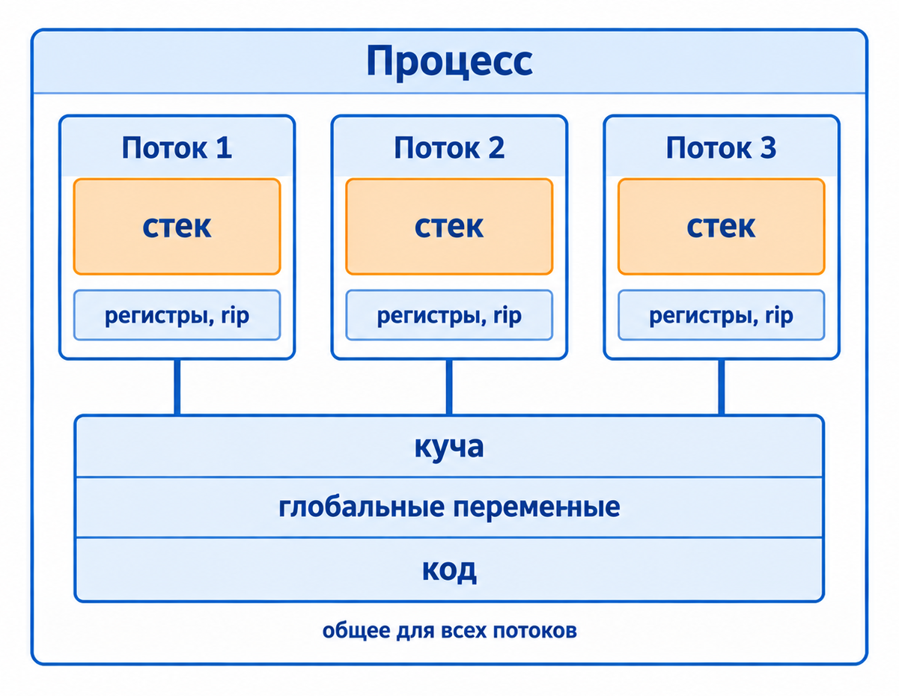{width="62%"}

:::

::: {.added .fragment}

Поэтому локальные переменные у каждого потока свои, а глобальные и данные в куче — общие. О многопоточности будет отдельная лекция.

:::

## 3. Один адрес — две программы

::: {.added}

```{.cpp filename="same-address.cpp"}

```

Запустите две копии одновременно — каждую в своём терминале под отладчиком — и введите разные числа:

```bash
clang++ -std=c++20 -g same-address.cpp -o same-address
lldb ./same-address   # на Linux — gdb ./same-address
(lldb) run            # в первом терминале вводим 42, во втором — 7
```

Каждые 5 секунд обе программы печатают **один и тот же адрес** — и каждая своё значение. Остановить — `Ctrl+C`, затем `quit`.

:::

::: {.notes}
Отладчик нужен из-за ASLR: без него ОС при каждом запуске раскладывает программу по случайным адресам, и адреса в двух копиях разные. `lldb` и `gdb` по умолчанию отключают эту случайность. Можно сначала запустить две копии без отладчика — адреса разные — а потом под `lldb`: адреса совпадут. Проверено на macOS arm64: обе копии печатают `0x100008000`.
:::

## Чья это память?

В лекции 3 память была одной длинной лентой пронумерованных байтов. Но на компьютере одновременно работают сотни программ — и каждая видит адреса начиная с нуля, будто вся лента принадлежит только ей.

Это **виртуальное адресное пространство**. У каждого процесса оно своё, а операционная система вместе с процессором переводит виртуальные адреса в настоящие, физические.

::: {.added .fragment}

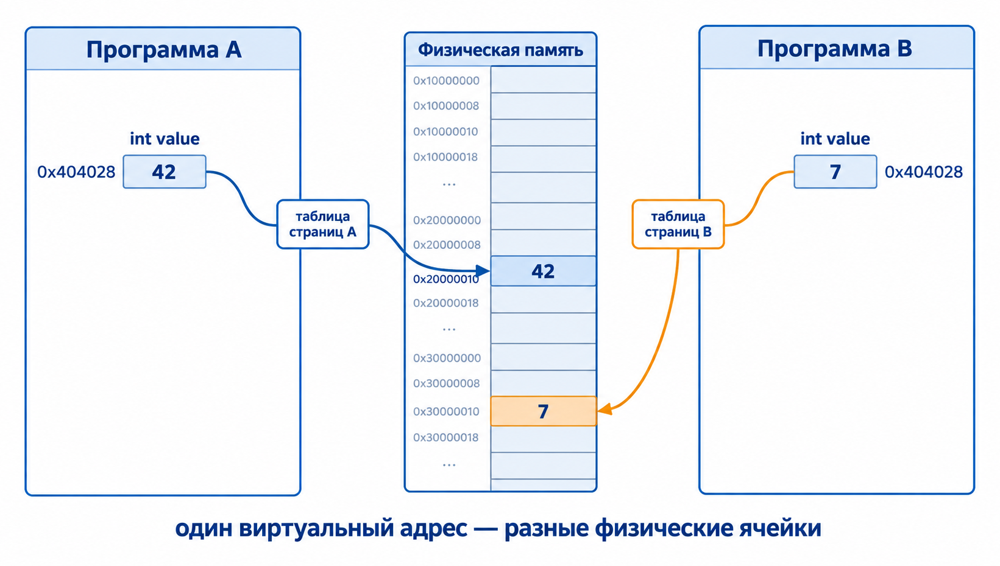{width="70%"}

:::

## Таблица страниц

:::: {.columns}
::: {.column width="45%"}

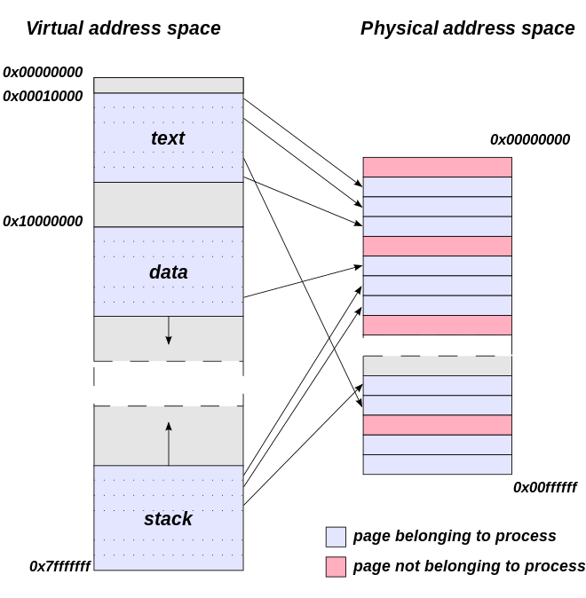

*Изображение: Wikimedia Commons*

:::
::: {.column width="55%"}

Память делится на **страницы** — обычно по 4 КБ, на Apple Silicon по 16 КБ. Таблица страниц:

::: {.added}

- переводит виртуальные адреса в физические;
- изолирует процессы: в таблице процесса есть только его страницы;
- хранит права доступа к каждой странице — чтение, запись, исполнение;
- закрывает от программы память ядра.

:::

:::
::::

## Если страницы нет в памяти

::: {.added}

Обращение к странице, у которой сейчас нет физической памяти, вызывает исключение — **page fault**. Управление получает ОС и решает, что делать:

- **swapping** — страницу вытеснили на диск, когда не хватило памяти, и ОС загружает её обратно;
- **memory-mapped file** — страница отображает кусок файла, и ОС читает его с диска при первом обращении. Так загружаются код программы и библиотеки;
- **ленивое выделение** — память выделили, но ещё не трогали, и физическую страницу ОС даёт только сейчас;
- **ничего из этого** — ошибка: процесс получает `SIGSEGV`. К этому мы вернёмся в конце лекции.

:::

## Memory map

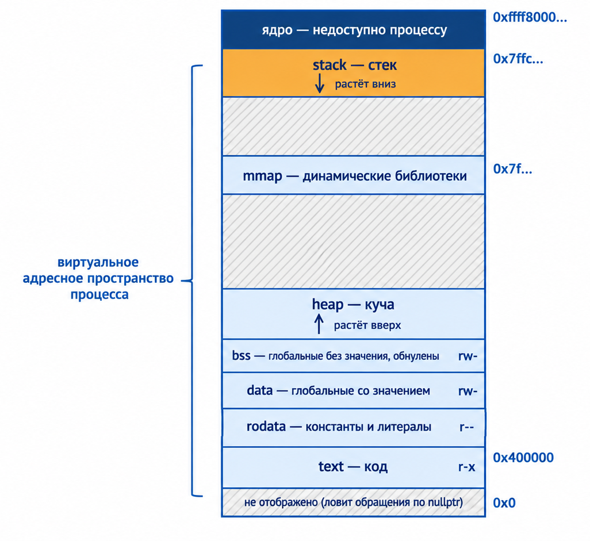

Адресное пространство процесса делится на области — **сегменты**. Их раскладка зависит от ОС и архитектуры: дальше — типичная картина для x86-64 Linux. Стандарт C++ её не фиксирует.

## Где живёт ядро

::: {.added}

Ядро ОС отображено в адресное пространство каждого процесса — в его верхнюю часть, недоступную программе. На 32-битных системах это сильно ограничивало программы: на всё было 4 ГБ, и ядро забирало из них от одного до двух.

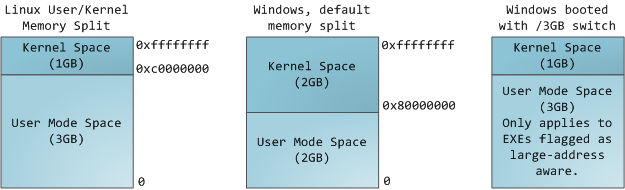{width="80%"}

:::

::: {.added .fragment}

На x86-64 Linux программе отдано 128 ТБ — нижняя половина адресного пространства, а ядро живёт в верхней, начиная с `0xffff800000000000`.

:::

## Что где лежит

:::: {.columns}
::: {.column .small-table width="66%"}

::: {.added}

| Что | Пример | Сегмент | Права |
|---|---|---|---|
| Машинный код | функции | text | чтение, исполнение |
| Константы и строковые литералы | `"Hello world"` | rodata | только чтение |
| Глобальные со значением | `int counter = 239;` | data | чтение и запись |
| Глобальные без значения | `int total;` | bss, обнулён | чтение и запись |
| Динамическая память | `new int` | heap | чтение и запись |
| Библиотеки, большие блоки, стеки потоков | `new char[1'000'000]` | mmap | зависит от области |
| Локальные переменные | `int local;` | stack | чтение и запись |

:::

:::
::: {.column width="34%"}

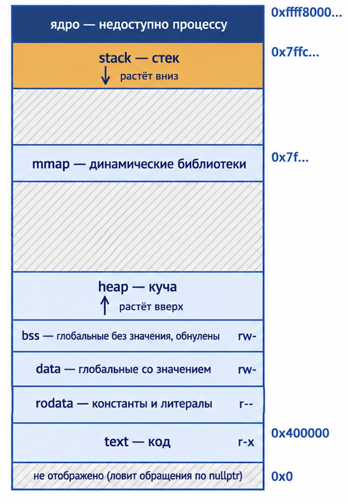{.tall-image}

:::
::::

## Адреса сегментов {.compact-code .tall-code}

```{.cpp filename="segments-addresses.cpp"}

```

[{.godbolt-link-image width="32"}][godbolt-05-segments-addresses]{aria-label="Open in Compiler Explorer"}

::: {.notes}
Живой код: до запуска попросить зал расставить адреса по возрастанию. На Linux порядок совпадёт с memory map: text < rodata < data < bss < heap < stack. На macOS (arm64) куча окажется выше стека — раскладка действительно зависит от ОС.
:::

## Смотрим на memory map

Пока программа ждёт нажатия Enter, её memory map можно посмотреть из соседнего терминала:

```bash
cat /proc/$(pgrep -nf segments-addresses)/maps   # Linux
vmmap $(pgrep -nf segments-addresses)            # macOS
```

Каждая строка — одна область: диапазон адресов, права доступа и что в ней лежит. Найдите в выводе каждый адрес, который напечатала программа.

::: {.notes}
`pgrep` без `-f` ищет по имени процесса, а Linux обрезает его до 15 символов — `segments-addresses` не найдётся. Флаг `-f` ищет по всей командной строке.

Код программы будет не по адресу `0x400000`, как на memory map, а в районе `0x55…`–`0x5f…`: по умолчанию программы собираются как PIE и грузятся по случайному адресу. `0x400000` получится при сборке с `-no-pie`.
:::

## Memory map в `/proc`


У кода права `r-xp`: читать и исполнять можно, писать нельзя. У данных — `rw-p`: писать можно, исполнять нельзя. Это тот самый принцип «записываемое или исполняемое, но не оба сразу» из лекции 3.

## 4. Стек вызовов

Каждый вызов функции получает на стеке собственный участок — **кадр стека**. В нём лежат локальные переменные, сохранённые регистры и адрес, куда вернуться после завершения функции. Стек растёт вниз — в сторону меньших адресов.

```{.cpp filename="stack-add.cpp"}

```

[{.godbolt-link-image width="32"}][godbolt-05-stack-add]{aria-label="Open in Compiler Explorer"}

## Что генерирует компилятор {.compact-code .tall-code}

```{.nasm filename="stack-add-x86-64.asm" code-line-numbers="|15-17|2-3|4-7|8-9|18"}

```

x86-64, clang `-O0`, синтаксис Intel; комментарии добавлены вручную. `rsp` — вершина стека, `rbp` — начало текущего кадра.

::: {.notes}
Если спросят, почему `Add` пишет по `[rbp - 4]`, не сдвигая `rsp`: это red zone. System V разрешает функции, которая никого не вызывает, пользоваться 128 байтами ниже вершины стека без `sub rsp`. `main` вызывает `Add`, поэтому место под локальные ей приходится выделять явно.
:::

## Соглашения о вызовах

::: {.added}

Как передать аргументы и кто уберёт их со стека — договорённость между вызывающей и вызываемой функцией, **соглашение о вызовах**. Оно зависит от архитектуры и ОС:

| Соглашение | Где | Аргументы |
|---|---|---|
| `cdecl` | 32-битный x86 | на стеке, справа налево; стек чистит вызывающий |
| `stdcall` | 32-битный Windows API | на стеке; стек чистит вызываемая функция |
| `fastcall` | 32-битный x86 | первые два — в `ecx` и `edx`, остальные на стеке |
| System V | x86-64 Linux и macOS | первые шесть — в `rdi`, `rsi`, `rdx`, `rcx`, `r8`, `r9` |
| Microsoft x64 | x86-64 Windows | первые четыре — в `rcx`, `rdx`, `r8`, `r9` |

Результат во всех случаях возвращается в `eax` или `rax`.

:::

::: {.added .fragment}

Поэтому в ассемблере выше аргументы пришли в `edi` и `esi`, а на картинках дальше — 32-битный `cdecl` — они лежат на стеке.

:::

## Устройство кадра

{width="62%"}

Картинки дальше — для 32-битного x86: регистры там называются `esp` и `ebp`, а аргументы передаются через стек, а не в регистрах. Устройство кадра от этого не меняется.

*Изображения: Gustavo Duarte, [«Journey to the Stack»](https://manybutfinite.com/post/journey-to-the-stack/)*

## Вызов `add(40, 2)` шаг за шагом

::: {.code-swap}

::: {.fragment .fade-out data-fragment-index="0"}

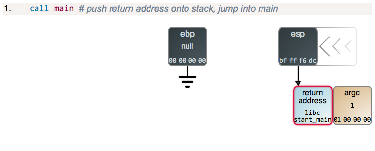

`main` вызвана: на стек лёг адрес возврата в библиотеку C, откуда её позвали.

:::

::: {.fragment .fade-in-then-out data-fragment-index="0"}

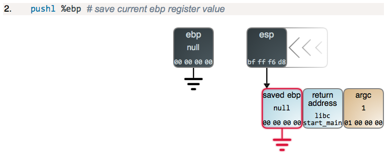

`main` сохраняет на стеке старое значение `ebp`, чтобы потом его восстановить.

:::

::: {.fragment .fade-in-then-out data-fragment-index="1"}

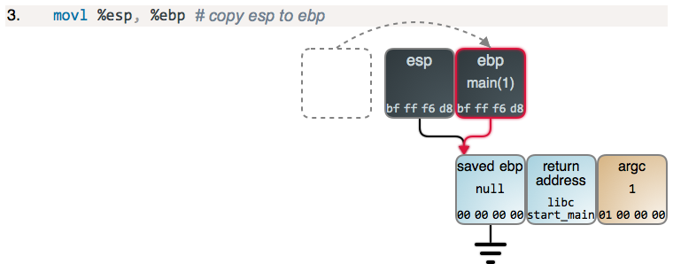

`ebp` получает текущую вершину стека — с этого места начинается кадр `main`.

:::

::: {.fragment .fade-in-then-out data-fragment-index="2"}

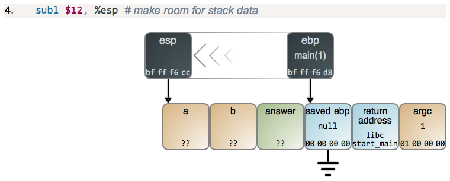

Вершина стека опускается на 12 байт: место под аргументы `a`, `b` и локальную `answer`.

:::

::: {.fragment .fade-in-then-out data-fragment-index="3"}

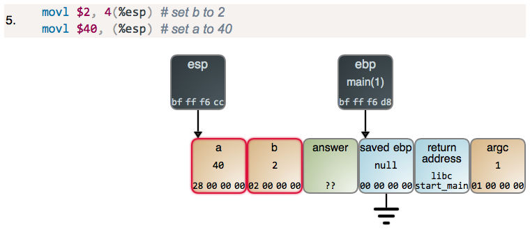

Аргументы для `add` записываются на стек: `a = 40`, `b = 2`.

:::

::: {.fragment .fade-in-then-out data-fragment-index="4"}

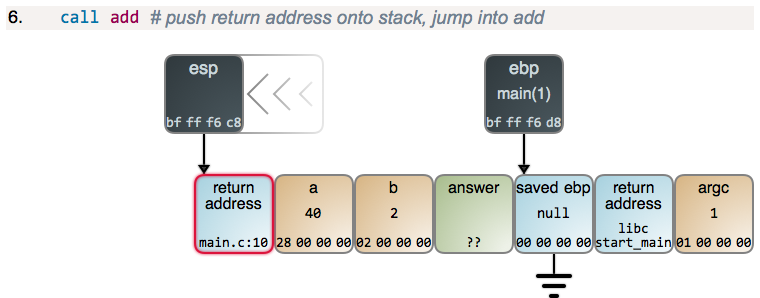

`call add`: на стек кладётся адрес возврата в `main`, управление переходит в `add`.

:::

::: {.fragment .fade-in-then-out data-fragment-index="5"}

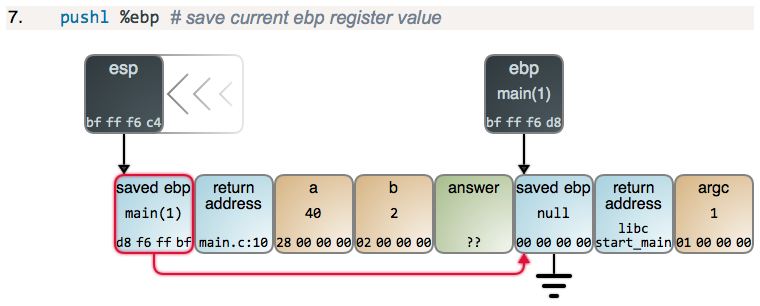

`add` сохраняет `ebp` кадра `main` — цепочка кадров не теряется.

:::

::: {.fragment .fade-in-then-out data-fragment-index="6"}

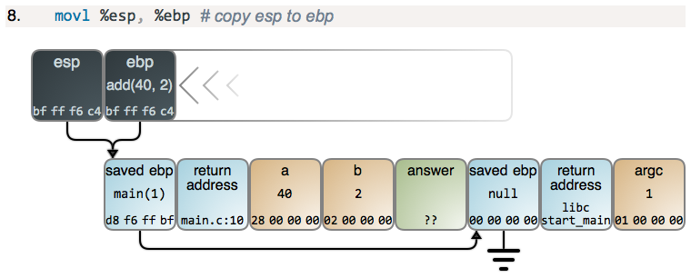

`ebp` указывает на начало нового кадра — теперь это кадр `add`.

:::

::: {.fragment .fade-in-then-out data-fragment-index="7"}

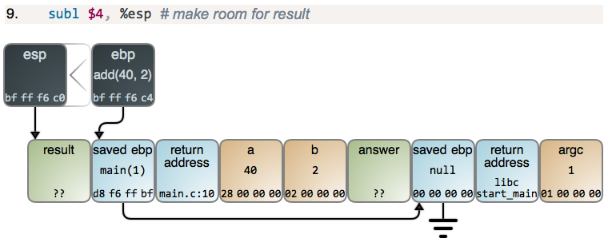

Вершина стека опускается ещё на 4 байта — место под локальную `result`.

:::

::: {.fragment .fade-in-then-out data-fragment-index="8"}

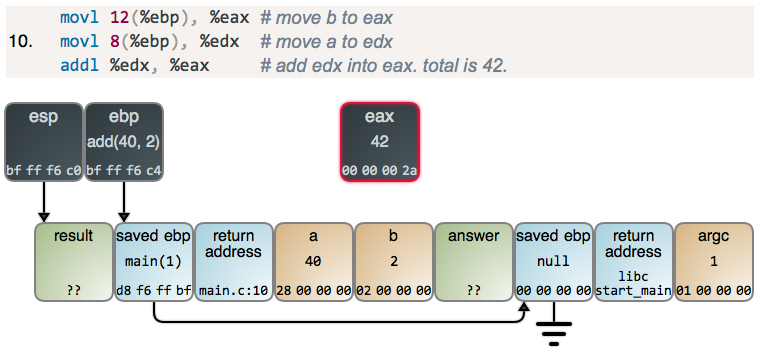

`add` читает `b` и `a` по положительным смещениям от `ebp` и складывает их: в `eax` теперь 42.

:::

::: {.fragment .fade-in data-fragment-index="9"}

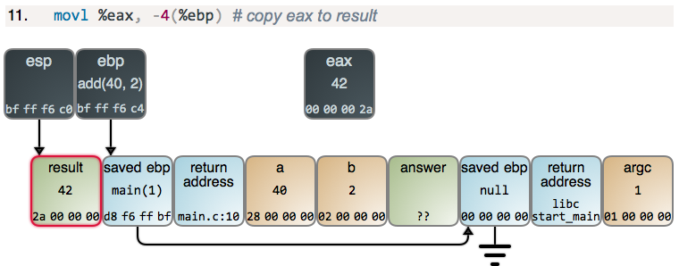

Результат копируется в `result`. Дальше `leave` и `ret` снимут кадр `add` и вернут управление в `main` по адресу возврата.

:::

:::

## Почему висячий указатель висит

::: {.added}

```cpp
int* Make() {
    int local = 42;
    return &local;
}
```

В лекции 3 мы видели, что этот указатель висит. Теперь видно почему: `local` живёт в кадре `Make`. После `ret` вершина стека поднимается обратно, кадр больше никому не принадлежит — и следующий же вызов функции запишет в эти байты свой кадр.

:::

## Стек конечен

На Linux и macOS стек основного потока по умолчанию — 8 МБ, на Windows — 1 МБ. Выход за его границу — **переполнение стека**.

```{.cpp filename="stack-overflow.cpp"}

```

Программа падает намеренно. Собирайте без оптимизаций: с `-O2` компилятор может выбросить массив целиком.

::: {.notes}
Живой код: собрать с `-O0` и запустить — `Segmentation fault`. Размер стека показывает `ulimit -s` (в КБ).
:::

## 5. Куча

Стек хорош, пока размер объекта известен заранее, а сам объект не должен пережить функцию. Когда это не так, память берут в **куче**:

- размер становится известен только во время выполнения;
- объект должен пережить функцию, которая его создала;
- объект слишком велик для стека.

Память в куче выделяют и освобождают вручную: объект живёт, пока его явно не освободят.

## Функции из `<cstdlib>`

| Функция | Что делает |
|---|---|
| `malloc(size)` | выделяет `size` байт, содержимое не инициализировано |
| `calloc(count, size)` | выделяет `count` элементов по `size` байт и обнуляет их |
| `realloc(pointer, size)` | меняет размер выделенного блока |
| `free(pointer)` | возвращает память; `free(nullptr)` ничего не делает |

Если памяти нет, функции выделения возвращают нулевой указатель — это нужно проверять.

## `malloc` и `free` {.compact-code}

```{.cpp filename="malloc-free.cpp"}

```

[{.godbolt-link-image width="32"}][godbolt-05-malloc-free]{aria-label="Open in Compiler Explorer"}

`malloc` возвращает `void*` и ничего не знает о типе: в C++ результат приходится явно приводить к `int*`, а размер считать вручную.

## `new` и `delete`

```{.cpp filename="new-delete.cpp"}

```

[{.godbolt-link-image width="32"}][godbolt-05-new-delete]{aria-label="Open in Compiler Explorer"}

`new` знает тип: сам считает размер, возвращает `int*` и сразу инициализирует объект. При нехватке памяти он не возвращает `nullptr`, а сообщает об ошибке исключением — о них будет отдельная лекция.

## `delete` и `delete[]`

::: {.added}

Каждому способу выделения — свой способ освобождения: `new` ↔ `delete`, `new[]` ↔ `delete[]`, `malloc` ↔ `free`. Смешивать их нельзя:

```cpp
int* numbers = new int[10];
delete numbers;  // неопределённое поведение: нужен delete[]

int* value = static_cast<int*>(std::malloc(sizeof(int)));
delete value;  // неопределённое поведение: нужен free
```

:::

## Типичные ошибки

::: {.added}

- **Утечка памяти** — память выделили, но не освободили. Программа работает, но с каждым часом занимает всё больше.
- **Двойное освобождение** — `delete` для уже освобождённого указателя.
- **Использование после освобождения** — указатель хранит прежний адрес, но память уже не наша. Это тот же висячий указатель, только в куче.

Ни одна из этих ошибок не обязана сразу уронить программу — поэтому их так трудно найти.

:::

## Обнуление не спасает

::: {.added}

```cpp
int* first = new int{42};
int* second = first;

delete first;
first = nullptr;  // first теперь безопасен...
*second = 0;      // ...а second по-прежнему висит
```

Присваивание `nullptr` после `delete` защищает только одну копию указателя.

::: {.fragment}

Поэтому в современном C++ память почти никогда не освобождают вручную: этим занимаются контейнеры и умные указатели — о них в следующих лекциях.

:::

:::

## 6. Segmentation fault

Это тот page fault, который ОС не может обработать: страница не принадлежит процессу или права не разрешают операцию. Тогда программу останавливают сигналом `SIGSEGV`:

- обращение по нулевому указателю — первые страницы адресного пространства намеренно не отображены;
- обращение к памяти, которая не принадлежит процессу;
- запись в сегмент только для чтения — например, в строковый литерал;
- переполнение стека.

::: {.fragment}

Использование освобождённой памяти и выход за границу массива падают не всегда — и это хуже: вспомните Heartbleed из лекции 3.

:::

## Запись в строковый литерал

```cpp
char copy[] = "Hello world";  // копия литерала на стеке
copy[1] = 'E';                // можно
```

```{.cpp filename="string-literal-write.cpp"}

```

Программа падает намеренно. Литерал лежит в rodata, а эти страницы доступны только для чтения. Поэтому в C++ указатель на литерал — `const char*`: без `const_cast` компилятор такую ошибку не пропустит.

::: {.notes}
Живой код: на Linux — `Segmentation fault`, на macOS — `Bus error` (`SIGBUS`). Причина одна и та же.
:::


[godbolt-05-segments-addresses]: <https://godbolt.org/#g:!((g:!((h:codeEditor,i:(j:1,lang:c%2B%2B,options:(compileOnChange:'0'),source:'%23include+%3Ciostream%3E%0A%0Aconst+double+kPi+%3D+3.14159%3B%0Aint+counter+%3D+239%3B%0Aint+total%3B%0A%0Aint+Answer()+%7B%0A++++return+42%3B%0A%7D%0A%0Aint+main()+%7B%0A++++int+local+%3D+0%3B%0A++++const+char*+text+%3D+%22Hello+world%22%3B%0A++++int*+dynamic+%3D+new+int%7BAnswer()%7D%3B%0A%0A++++std::cout+%3C%3C+%22text:+++%22+%3C%3C+reinterpret_cast%3Cvoid*%3E(%26Answer)+%3C%3C+!'%5Cn!'%3B%0A++++std::cout+%3C%3C+%22rodata:+%22+%3C%3C+%26kPi+%3C%3C+!'+!'+%3C%3C+static_cast%3Cconst+void*%3E(text)+%3C%3C+!'%5Cn!'%3B%0A++++std::cout+%3C%3C+%22data:+++%22+%3C%3C+%26counter+%3C%3C+!'%5Cn!'%3B%0A++++std::cout+%3C%3C+%22bss:++++%22+%3C%3C+%26total+%3C%3C+!'%5Cn!'%3B%0A++++std::cout+%3C%3C+%22heap:+++%22+%3C%3C+dynamic+%3C%3C+!'%5Cn!'%3B%0A++++std::cout+%3C%3C+%22stack:++%22+%3C%3C+%26local+%3C%3C+!'%5Cn!'%3B%0A%0A++++std::cin.get()%3B++//+%D0%BF%D0%B0%D1%83%D0%B7%D0%B0,+%D1%87%D1%82%D0%BE%D0%B1%D1%8B+%D0%BF%D0%BE%D1%81%D0%BC%D0%BE%D1%82%D1%80%D0%B5%D1%82%D1%8C+%D0%BA%D0%B0%D1%80%D1%82%D1%83+%D0%BF%D0%B0%D0%BC%D1%8F%D1%82%D0%B8%0A++++delete+dynamic%3B%0A%0A++++return+0%3B%0A%7D%0A'),l:'5'),(h:executor,i:(compilationPanelShown:'0',compiler:clang2310,compilerOutShown:'0',lang:c%2B%2B,libs:!(),options:'-std%3Dc%2B%2B20+-O0',source:1,tree:0),l:'5')),l:'2')),version:4>
<!-- godbolt source="../examples/05-memory/segments-addresses.cpp" compiler="clang2310" options="-std=c++20 -O0" -->

[godbolt-05-stack-add]: <https://godbolt.org/#g:!((g:!((h:codeEditor,i:(j:1,lang:c%2B%2B,options:(compileOnChange:'0'),source:'int+Add(int+a,+int+b)+%7B%0A++++return+a+%2B+b%3B%0A%7D%0A%0Aint+main()+%7B%0A++++int+result+%3D+Add(40,+2)%3B%0A%0A++++return+result%3B%0A%7D%0A'),l:'5'),(h:executor,i:(compilationPanelShown:'0',compiler:clang2310,compilerOutShown:'0',lang:c%2B%2B,libs:!(),options:'-std%3Dc%2B%2B20+-O0',source:1,tree:0),l:'5')),l:'2')),version:4>
<!-- godbolt source="../examples/05-memory/stack-add.cpp" compiler="clang2310" options="-std=c++20 -O0" -->

[godbolt-05-malloc-free]: <https://godbolt.org/#g:!((g:!((h:codeEditor,i:(j:1,lang:c%2B%2B,options:(compileOnChange:'0'),source:'%23include+%3Ccstdlib%3E%0A%23include+%3Ciostream%3E%0A%0Aint+main()+%7B%0A++++int*+numbers+%3D+static_cast%3Cint*%3E(std::malloc(4+*+sizeof(int)))%3B%0A++++if+(numbers+%3D%3D+nullptr)+%7B%0A++++++++return+1%3B%0A++++%7D%0A%0A++++for+(int+index+%3D+0%3B+index+%3C+4%3B+%2B%2Bindex)+%7B%0A++++++++numbers%5Bindex%5D+%3D+index+*+index%3B%0A++++%7D%0A++++std::cout+%3C%3C+numbers%5B3%5D+%3C%3C+!'%5Cn!'%3B%0A%0A++++std::free(numbers)%3B%0A%0A++++return+0%3B%0A%7D%0A'),l:'5'),(h:executor,i:(compilationPanelShown:'0',compiler:clang2310,compilerOutShown:'0',lang:c%2B%2B,libs:!(),options:'-std%3Dc%2B%2B20+-O0',source:1,tree:0),l:'5')),l:'2')),version:4>
<!-- godbolt source="../examples/05-memory/malloc-free.cpp" compiler="clang2310" options="-std=c++20 -O0" -->

[godbolt-05-new-delete]: <https://godbolt.org/#g:!((g:!((h:codeEditor,i:(j:1,lang:c%2B%2B,options:(compileOnChange:'0'),source:'%23include+%3Ciostream%3E%0A%0Aint+main()+%7B%0A++++int*+value+%3D+new+int%7B42%7D%3B%0A++++std::cout+%3C%3C+*value+%3C%3C+!'%5Cn!'%3B%0A++++delete+value%3B%0A%0A++++int*+numbers+%3D+new+int%5B10%5D%7B%7D%3B%0A++++std::cout+%3C%3C+numbers%5B9%5D+%3C%3C+!'%5Cn!'%3B%0A++++delete%5B%5D+numbers%3B%0A%0A++++return+0%3B%0A%7D%0A'),l:'5'),(h:executor,i:(compilationPanelShown:'0',compiler:clang2310,compilerOutShown:'0',lang:c%2B%2B,libs:!(),options:'-std%3Dc%2B%2B20+-O0',source:1,tree:0),l:'5')),l:'2')),version:4>
<!-- godbolt source="../examples/05-memory/new-delete.cpp" compiler="clang2310" options="-std=c++20 -O0" -->
