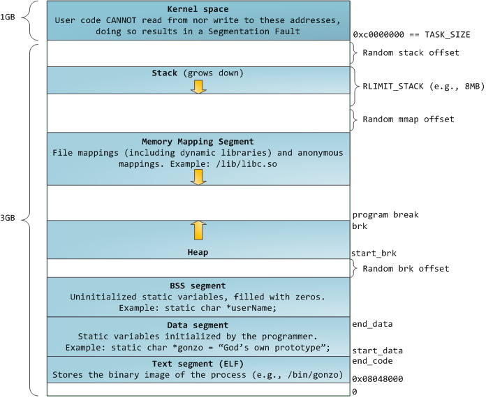
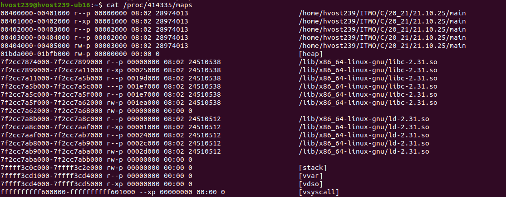
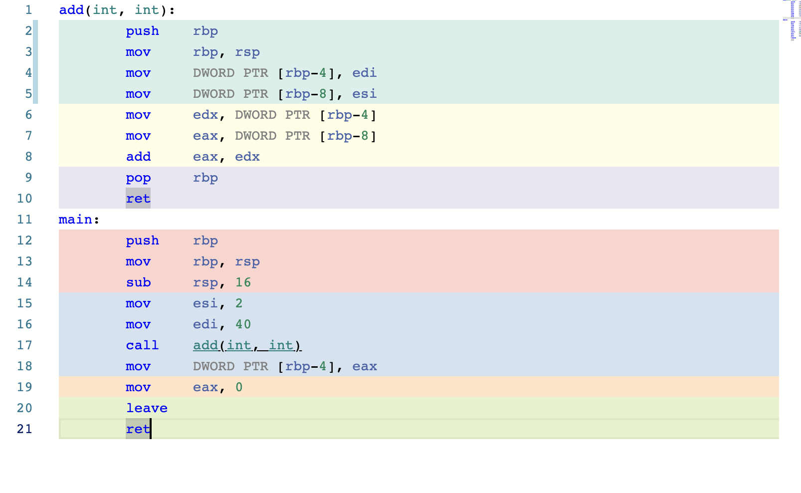
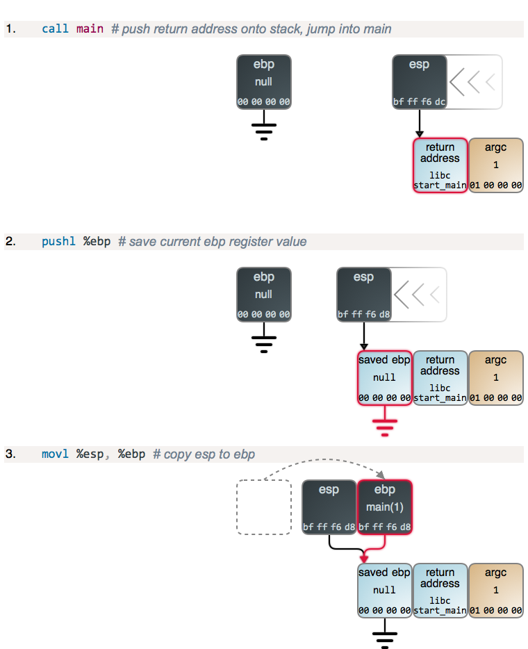
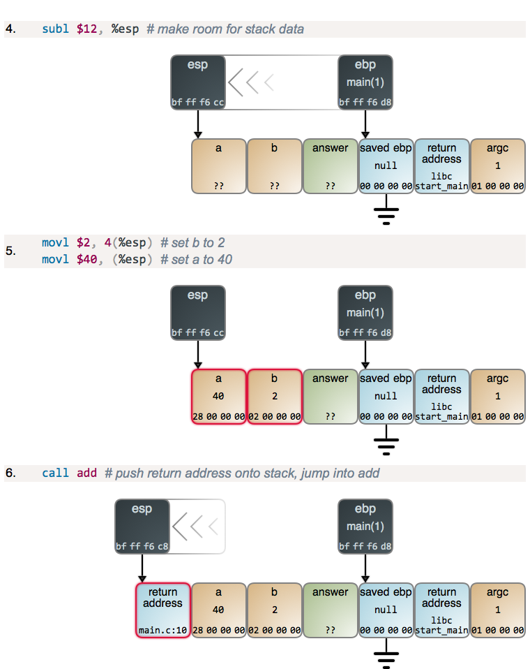
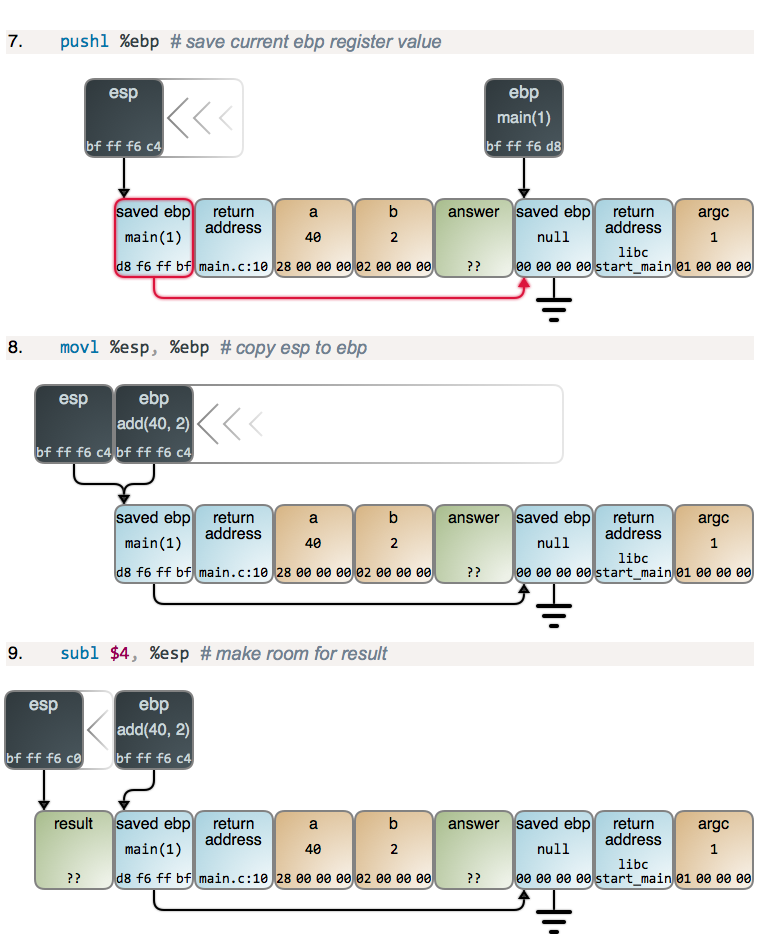
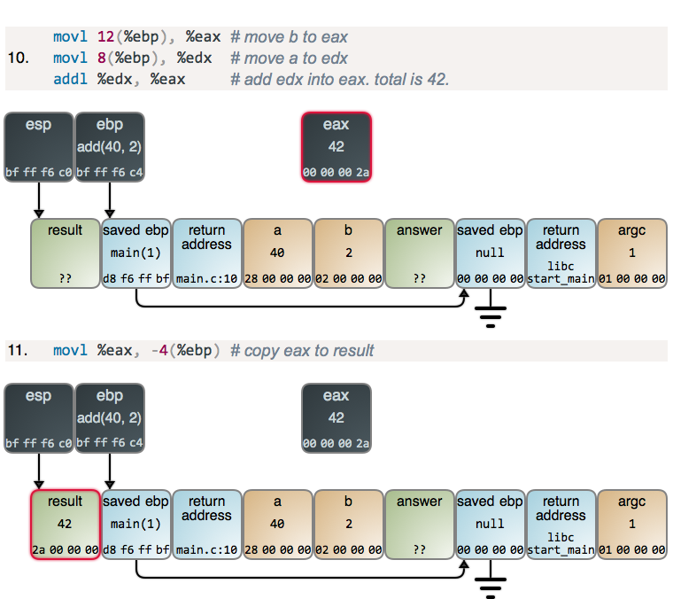

::: {.content-visible unless-format="revealjs"}

[Открыть слайды](../slides/lectures/05-memory.html){.btn .btn-outline-primary target="_blank"}

:::

## План лекции

- Процессы, потоки и виртуальное адресное пространство
- Сегменты программы и представление данных в памяти
- Стек вызовов и время жизни локальных объектов
- Куча, `malloc`/`free` и `new`/`delete`
- Ошибки доступа к памяти и segmentation fault

## Работа программ

- Архитектуры фон Неймана и Гарвардская
- Виды памяти
- Процессор
- Прерывания

## Процессы и потоки

- Процессы
  - Независимое адресное пространство
  - Объекты ядра: файловые дескрипторы, объекты синхронизации и т. д.
- Потоки одного процесса
  - Общее адресное пространство: код, глобальные данные, динамическая память
  - Собственный стек и контекст выполнения: регистры, позиция выполнения
  - При переключении потоков ОС сохраняет и восстанавливает контекст

Собственный стек потока не изолирован от других потоков: при наличии указателя они могут обращаться к этой памяти.

## Виртуальное адресное пространство

- Программа работает со своим пространством виртуальных адресов.
- Ей не нужно выбирать свободные физические адреса или учитывать размещение других процессов в RAM.
- Один виртуальный адрес в разных процессах может соответствовать разной физической памяти.
- ОС управляет отображениями и правами; процессор использует их при обращении к памяти.

## Адресное пространство и доступная память

Программист видит собственное адресное пространство, независимо от текущего размещения данных в физической памяти.

Но это не означает, что любой адрес доступен для чтения и записи:

- часть диапазонов не отображена или защищена;
- выделение памяти может завершиться неудачей;
- загрузка памяти в системе влияет на возможность выделения и скорость работы.

## Page table

<!-- embedded-images:start -->

<!-- embedded-images:end -->

- Маппинг виртуального адреса на физический
- Изоляция процессов
- Memory-mapped file
- Обеспечение безопасного режима работы ОС
- swapping

## Представление программы в памяти

<!-- embedded-images:start -->

<!-- embedded-images:end -->

## Адресное пространство процесса Linux: 32-битная схема

<!-- embedded-images:start -->

<!-- embedded-images:end -->

## Сегменты памяти

- Stack
- Heap
- Memory Mapping
- BSS
- Data
- Text
- etc

## Адреса объектов и функции

Пример для Linux/macOS: `getpid` и преобразование указателя на функцию в `void*` опираются на POSIX. Программа ждёт Enter, чтобы можно было изучить память процесса.

```{.cpp filename="memory-addresses.cpp"}

```

## Карта памяти запущенного процесса

<!-- embedded-images:start -->

<!-- embedded-images:end -->

## Стек вызовов: передача аргументов и результат

```{.cpp filename="function-call.cpp"}

```

[{.godbolt-link-image width="32"}][godbolt-05-function-call]{aria-label="Open in Compiler Explorer"}

## [Compiler Explorer (Godbolt)](https://godbolt.org/)

<!-- embedded-images:start -->

<!-- embedded-images:end -->

## Стек вызова

- Кадр стека (stack frame)
  - Аргументы
  - Локальные переменные
  - Адрес возврата
- Соглашения о вызовах: cdecl, stdcall, fastcall
- Регистры процессора на схемах x86
  - `esp` — вершина стека
  - `ebp` — начало кадра
  - `eax` — возвращаемое целое значение

## Устройство кадра стека

[Источник: Journey to the Stack](https://manybutfinite.com/post/journey-to-the-stack/)

Схемы показывают 32-битный x86 с указателем кадра. На другой архитектуре и при оптимизации размещение аргументов и работа со стеком могут отличаться.

<!-- embedded-images:start -->

<!-- embedded-images:end -->

## Вызов main: адрес возврата

<!-- embedded-images:start -->

<!-- embedded-images:end -->

## Пролог main: сохранение ebp

<!-- embedded-images:start -->

<!-- embedded-images:end -->

## Пролог main: установка указателя кадра

<!-- embedded-images:start -->

<!-- embedded-images:end -->

## Выделение места для локальных данных main

<!-- embedded-images:start -->

<!-- embedded-images:end -->

## Подготовка аргументов: 40 и 2

<!-- embedded-images:start -->

<!-- embedded-images:end -->

## Вызов add: адрес возврата в main

<!-- embedded-images:start -->

<!-- embedded-images:end -->

## Пролог add: сохранение кадра main

<!-- embedded-images:start -->

<!-- embedded-images:end -->

## Пролог add: установка нового кадра

<!-- embedded-images:start -->

<!-- embedded-images:end -->

## Место для локальной переменной result

<!-- embedded-images:start -->

<!-- embedded-images:end -->

## Вычисление суммы в eax

<!-- embedded-images:start -->

<!-- embedded-images:end -->

## Сохранение результата в локальную переменную

<!-- embedded-images:start -->

<!-- embedded-images:end -->

## Длительность хранения — storage duration

Storage duration описывает, как долго существует память для объекта.

| Вид | Пример объявления | Как долго существует память |
| --- | --- | --- |
| Automatic | Обычная локальная переменная | До выхода из её блока |
| Static | Глобальная переменная или локальная `static` | На протяжении работы программы |
| Thread | Переменная `thread_local` | На протяжении работы соответствующего потока |
| Dynamic | Объект, созданный обычным `new` | До освобождения выделенной памяти |

Это категории C++. Стек и куча — типичные способы реализации хранения.

## Область видимости и хранение

```{.cpp filename="automatic-and-static.cpp"}

```

Результат: сначала `1 1`, затем `1 2`. Имя `static_count` видно только внутри функции, но память и значение сохраняются между вызовами.

## Heap (Куча)

- Динамический объект может пережить выход из функции, которая его создала.
- Его размер можно выбрать во время выполнения.
- Освобождение памяти должно быть предусмотрено программой.
- Позже изучим средства, которые берут освобождение на себя.

Размер объекта — не главное отличие: даже один `int` может требовать динамического времени жизни.

## Объект переживает создавшую его функцию

```{.cpp filename="dynamic-lifetime.cpp"}

```

Локальная переменная-указатель `value` в `make_value` исчезает при возврате. Созданный через `new` объект остаётся; функция возвращает копию его адреса. Освобождение выполняет вызывающий код.

## Функции работы с памятью из `<cstdlib>`

- malloc
- free
- calloc
- realloc

## malloc: выделение и освобождение

```{.cpp filename="malloc-array.cpp"}

```

[{.godbolt-link-image width="32"}][godbolt-05-malloc-array]{aria-label="Open in Compiler Explorer"}

В C++ результат `malloc` преобразуем из `void*` в `int*`. Перед чтением элементов записываем в них значения.

## Проверка выделения и освобождение памяти

- Если выделение не удалось, `malloc` возвращает `nullptr`.
- Память освобождаем через `std::free` ровно один раз.
- `std::free(nullptr)` ничего не делает.
- После освобождения указатель нельзя разыменовывать. Присваивание `nullptr` одной переменной не исправляет другие копии указателя.

## calloc: массив с нулевыми значениями

```{.cpp filename="calloc-array.cpp"}

```

[{.godbolt-link-image width="32"}][godbolt-05-calloc-array]{aria-label="Open in Compiler Explorer"}

`calloc` получает количество элементов и размер одного элемента, затем обнуляет выделенные байты. Для массива `int` это даёт нулевые значения.

## Указатель и объект: разные адреса и размеры

```{.cpp filename="pointer-and-object.cpp"}

```

[{.godbolt-link-image width="32"}][godbolt-05-pointer-and-object]{aria-label="Open in Compiler Explorer"}

`&pointer` — адрес переменной-указателя; `pointer` — адрес выделенного объекта. `sizeof(pointer)` измеряет указатель, а `sizeof(*pointer)` — объект типа `int`.

## new и delete

```{.cpp filename="new-delete.cpp"}

```

[{.godbolt-link-image width="32"}][godbolt-05-new-delete]{aria-label="Open in Compiler Explorer"}

## new: выделение и инициализация

- `new int` создаёт `int` без заданного начального значения: читать его до записи нельзя.
- `new int{}` создаёт `int` со значением `0`.
- `new int{42}` создаёт `int` со значением `42`.
- Обычный `new` при неудаче выделения бросает `std::bad_alloc`; исключения разберём позже.

NB: для классов `new` может вызвать конструктор, а `delete` вызывает деструктор. Вернёмся к этому при изучении классов.

## Правильные пары выделения и освобождения

| Выделение | Освобождение |
| --- | --- |
| `malloc`, `calloc`, `realloc` | `free` |
| `new T` | `delete` |
| `new T[n]` | `delete[]` |

Смешивать пары нельзя. Например, `free` для результата `new` и `delete` для результата `new[]` приводят к неопределённому поведению.

## Placement new: объект в готовой памяти

```{.cpp filename="placement-new.cpp"}

```

`new (storage) int{42}` создаёт объект по указанному адресу без выделения нового блока памяти.

## Placement new: размер, выравнивание и освобождение

- `sizeof(int)` резервирует достаточно байтов для `int`.
- `alignas(int)` обеспечивает требуемое выравнивание.
- Буфер должен существовать всё время использования объекта.
- `delete value` здесь недопустим: буфер не выделялся обычным `new`.
- Для `int` отдельный вызов деструктора не нужен; хранение буфера закончится при выходе из блока.

NB: для классов отдельно разберём завершение жизни объекта и освобождение его памяти.

## Ошибка памяти не обязана завершать программу

Выход за границы массива, использование уничтоженного объекта и разыменование `nullptr` приводят к **неопределённому поведению**.

- Программа может упасть сразу или позже.
- Она может испортить данные или внешне работать правильно.
- Конкретный результат запуска ничего не гарантирует для следующего запуска.

**Отсутствие падения не доказывает корректность.**

## Segmentation fault

`SIGSEGV` — сигнал ОС при некоторых недопустимых обращениях к памяти, например к неотображённой странице или странице без нужных прав.

ОС проверяет отображения и права страниц, но обычно не знает границы каждого C++-объекта. Выход за границы массива может остаться внутри доступной страницы.

Не всякое неопределённое поведение приводит к `SIGSEGV`, и не всякая ошибка памяти обнаруживается ОС.

## Выход за границы динамического массива

**Намеренное UB. Запускать только с санитайзером.**

```{.cpp filename="heap-buffer-overflow.cpp"}

```

Допустимы индексы `0`, `1`, `2`. Указатель за последним элементом можно сформировать, но читать элемент по нему нельзя. AddressSanitizer: `heap-buffer-overflow`.

## Обращение после освобождения

**Намеренное UB. Запускать только с санитайзером.**

```{.cpp filename="use-after-free.cpp"}

```

Присваивание `nullptr` переменной `value` не меняет `alias`. AddressSanitizer: `heap-use-after-free`.

## Повторное освобождение

**Намеренное UB. Запускать только с санитайзером.**

```{.cpp filename="double-free.cpp"}

```

Две переменные хранят адрес одного выделенного блока. Освободить его можно только один раз. AddressSanitizer: `double-free`.

## Указатель на объект после выхода из блока

**Намеренное UB. Запускать только с санитайзером.**

```{.cpp filename="use-after-scope.cpp"}

```

Байты могут ещё содержать `42`, но объекта `local` уже нет. AddressSanitizer: `stack-use-after-scope`.

## Разыменование nullptr

**Намеренное UB. Запускать только с санитайзером.**

```{.cpp filename="null-dereference.cpp"}

```

`nullptr` не указывает на объект. UndefinedBehaviorSanitizer сообщает о чтении через нулевой указатель; возможное падение — следствие, а не определённый языком результат.

## Как увидеть ошибку: санитайзеры

Из корня репозитория, на примере обращения после освобождения:

```bash
clang++ -std=c++20 -Wall -Wextra -pedantic -O0 -g \
  -fsanitize=address,undefined -fno-sanitize-recover=all \
  -fsanitize-address-use-after-scope -fno-omit-frame-pointer \
  examples/05-memory/use-after-free.cpp -o /tmp/memory-error
/tmp/memory-error
```

Для остальных примеров замените имя исходного файла. Каждый запускается отдельно: санитайзер останавливает программу при обнаружении ошибки.

## Что показывает санитайзер

- Вид ошибки: например, `heap-use-after-free`.
- Место ошибочного обращения и стек вызовов.
- Для освобождённого блока — где его выделили и освободили.

Санитайзер проверяет выполненный путь программы. Успешный запуск не доказывает отсутствие всех ошибок. AddressSanitizer также не является универсальной проверкой неинициализированных значений.

## Утечка памяти — другая ошибка

Если потерять последний доступный указатель на выделенный блок, освободить его обычным способом уже не получится.

- Сама утечка не обязана приводить к UB или немедленному падению.
- Повторяющиеся утечки увеличивают расход памяти.
- Для поиска утечек есть отдельные проверки; их доступность зависит от платформы.

## Большой локальный массив: риск переполнения стека

**Опасный пример — не запускать как обычный пример.** Массив занимает 8 МиБ; результат зависит от лимита стека потока. `volatile` сохраняет обращения к массиву при оптимизации, но не гарантирует конкретный размер кадра или падение.

```{.cpp filename="large-stack-array.cpp"}

```

## Изменяемый массив и строковый литерал

```{.cpp filename="mutable-string.cpp"}

```

[{.godbolt-link-image width="32"}][godbolt-05-mutable-string]{aria-label="Open in Compiler Explorer"}

Массив `text` можно изменять. Закомментированная запись через `literal` не компилируется. Попытка обойти `const` и изменить строковый литерал приводит к неопределённому поведению.

[godbolt-05-new-delete]: <https://godbolt.org/#g:!((g:!((h:codeEditor,i:(j:1,lang:c%2B%2B,options:(compileOnChange:'0'),source:'int+main()+%7B%0A++++int*+value+%3D+new+int%3B%0A++++delete+value%3B%0A%0A++++int*+array+%3D+new+int%5B10%5D%3B%0A++++delete%5B%5D+array%3B%0A%0A++++return+0%3B%0A%7D%0A'),l:'5'),(h:executor,i:(compilationPanelShown:'0',compiler:clang2310,compilerOutShown:'0',lang:c%2B%2B,libs:!(),options:'-std%3Dc%2B%2B20+-O0',source:1,tree:0),l:'5')),l:'2')),version:4>
<!-- godbolt source="../examples/05-memory/new-delete.cpp" compiler="clang2310" options="-std=c++20 -O0" -->

[godbolt-05-function-call]: <https://godbolt.org/#g:!((g:!((h:codeEditor,i:(j:1,lang:c%2B%2B,options:(compileOnChange:'0'),source:'%23include+%3Ciostream%3E%0A%0Aint+add(int+a,+int+b)+%7B%0A++++int+result+%3D+a+%2B+b%3B%0A++++return+result%3B%0A%7D%0A%0Aint+main()+%7B%0A++++int+a+%3D+40%3B%0A++++int+b+%3D+2%3B%0A++++int+answer+%3D+add(a,+b)%3B%0A++++std::cout+%3C%3C+answer+%3C%3C+!'%5Cn!'%3B%0A%7D%0A'),l:'5'),(h:executor,i:(compilationPanelShown:'0',compiler:clang2310,compilerOutShown:'0',lang:c%2B%2B,libs:!(),options:'-std%3Dc%2B%2B20+-O0',source:1,tree:0),l:'5')),l:'2')),version:4>
<!-- godbolt source="../examples/05-memory/function-call.cpp" compiler="clang2310" options="-std=c++20 -O0" -->

[godbolt-05-malloc-array]: <https://godbolt.org/#g:!((g:!((h:codeEditor,i:(j:1,lang:c%2B%2B,options:(compileOnChange:'0'),source:'%23include+%3Ccstdio%3E%0A%23include+%3Ccstdlib%3E%0A%0Aint+main()+%7B%0A++++int*+values+%3D+static_cast%3Cint*%3E(std::malloc(4+*+sizeof(int)))%3B%0A++++if+(values+%3D%3D+nullptr)+%7B%0A++++++++return+1%3B%0A++++%7D%0A%0A++++for+(int+index+%3D+0%3B+index+%3C+4%3B+%2B%2Bindex)+%7B%0A++++++++values%5Bindex%5D+%3D+index+*+index%3B%0A++++++++std::printf(%22values%5B%25d%5D+%3D+%25d%5Cn%22,+index,+values%5Bindex%5D)%3B%0A++++%7D%0A++++std::free(values)%3B%0A%7D%0A'),l:'5'),(h:executor,i:(compilationPanelShown:'0',compiler:clang2310,compilerOutShown:'0',lang:c%2B%2B,libs:!(),options:'-std%3Dc%2B%2B20+-O0',source:1,tree:0),l:'5')),l:'2')),version:4>
<!-- godbolt source="../examples/05-memory/malloc-array.cpp" compiler="clang2310" options="-std=c++20 -O0" -->

[godbolt-05-calloc-array]: <https://godbolt.org/#g:!((g:!((h:codeEditor,i:(j:1,lang:c%2B%2B,options:(compileOnChange:'0'),source:'%23include+%3Ccstdio%3E%0A%23include+%3Ccstdlib%3E%0A%0Aint+main()+%7B%0A++++int*+values+%3D+static_cast%3Cint*%3E(std::calloc(4,+sizeof(int)))%3B%0A++++if+(values+%3D%3D+nullptr)+%7B%0A++++++++return+1%3B%0A++++%7D%0A%0A++++for+(int+index+%3D+0%3B+index+%3C+4%3B+%2B%2Bindex)+%7B%0A++++++++std::printf(%22values%5B%25d%5D+%3D+%25d%5Cn%22,+index,+values%5Bindex%5D)%3B%0A++++%7D%0A++++std::free(values)%3B%0A%7D%0A'),l:'5'),(h:executor,i:(compilationPanelShown:'0',compiler:clang2310,compilerOutShown:'0',lang:c%2B%2B,libs:!(),options:'-std%3Dc%2B%2B20+-O0',source:1,tree:0),l:'5')),l:'2')),version:4>
<!-- godbolt source="../examples/05-memory/calloc-array.cpp" compiler="clang2310" options="-std=c++20 -O0" -->

[godbolt-05-pointer-and-object]: <https://godbolt.org/#g:!((g:!((h:codeEditor,i:(j:1,lang:c%2B%2B,options:(compileOnChange:'0'),source:'%23include+%3Ccstdio%3E%0A%23include+%3Ccstdlib%3E%0A%0Aint+main()+%7B%0A++++int+local+%3D+0%3B%0A++++int*+pointer+%3D+static_cast%3Cint*%3E(std::malloc(sizeof(int)))%3B%0A++++if+(pointer+%3D%3D+nullptr)+%7B%0A++++++++return+1%3B%0A++++%7D%0A++++*pointer+%3D+42%3B%0A%0A++++std::printf(%22local:+size%3D%25zu,+address%3D%25p%5Cn%22,+sizeof(local),+static_cast%3Cvoid*%3E(%26local))%3B%0A++++std::printf(%22pointer:+size%3D%25zu,+address%3D%25p%5Cn%22,+sizeof(pointer),+static_cast%3Cvoid*%3E(%26pointer))%3B%0A++++std::printf(%22*pointer:+size%3D%25zu,+address%3D%25p%5Cn%22,+sizeof(*pointer),+static_cast%3Cvoid*%3E(pointer))%3B%0A++++std::printf(%22value%3D%25d%5Cn%22,+*pointer)%3B%0A++++std::free(pointer)%3B%0A%7D%0A'),l:'5'),(h:executor,i:(compilationPanelShown:'0',compiler:clang2310,compilerOutShown:'0',lang:c%2B%2B,libs:!(),options:'-std%3Dc%2B%2B20+-O0',source:1,tree:0),l:'5')),l:'2')),version:4>
<!-- godbolt source="../examples/05-memory/pointer-and-object.cpp" compiler="clang2310" options="-std=c++20 -O0" -->

[godbolt-05-mutable-string]: <https://godbolt.org/#g:!((g:!((h:codeEditor,i:(j:1,lang:c%2B%2B,options:(compileOnChange:'0'),source:'%23include+%3Ccstdio%3E%0A%0Aint+main()+%7B%0A++++char+text%5B%5D+%3D+%22Hello+world%22%3B%0A++++text%5B1%5D+%3D+!'E!'%3B%0A++++std::puts(text)%3B%0A%0A++++const+char*+literal+%3D+%22Hello+world%22%3B%0A++++//+literal%5B1%5D+%3D+!'E!'%3B+//+Compilation+error:+the+character+is+const.%0A++++std::puts(literal)%3B%0A%7D%0A'),l:'5'),(h:executor,i:(compilationPanelShown:'0',compiler:clang2310,compilerOutShown:'0',lang:c%2B%2B,libs:!(),options:'-std%3Dc%2B%2B20+-O0',source:1,tree:0),l:'5')),l:'2')),version:4>
<!-- godbolt source="../examples/05-memory/mutable-string.cpp" compiler="clang2310" options="-std=c++20 -O0" -->

::: {.notes}

Справочные материалы: [storage duration](https://eel.is/c++draft/basic.stc), [placement new](https://eel.is/c++draft/new.delete.placement), [AddressSanitizer](https://clang.llvm.org/docs/AddressSanitizer.html).

:::
